# CTFd + CTFd-Whale环境搭建详细过程（图文）

## 1、CTFD环境搭建

### 1.1 下载CTFd

> 使用网上赵师傅的版本，带有动态靶机的插件效果。

```bash
cd CTFd/
git clone https://github.com/glzjin/CTFd.git
```

### 1.2 下载frcp

>在`ctfd`一级目录下面继续下载

```bash
 # 下载frcp
 wget https://github.com/fatedier/frp/releases/download/v0.29.0/frp_0.29.0_linux_amd64.tar.gz
 # 解压压缩包
 tar -zxvf frp_0.29.0_linux_amd64.tar.gz
```

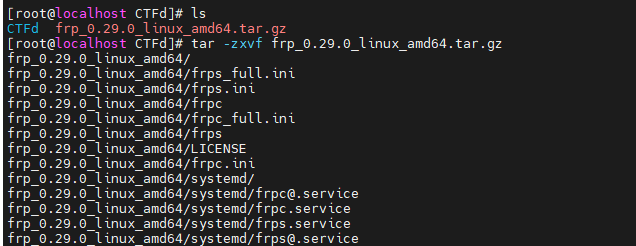 

### 1.3 下载插件 CTFd-Whale

>在`ctfd`一级目录下面继续下载

```bash
# 下载文件
git clone https://github.com/glzjin/CTFd-Whale.git
# 修改文件名为小写
mv CTFd-Whale/ ctfd-whale
```

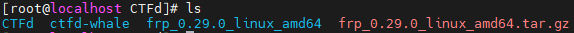 

### 1.4 下载docker版本的frps

>在`ctfd`一级目录下面继续下载

```bash
# 下载文件
git clone https://github.com/glzjin/Frp-Docker-For-CTFd-Whale
# 更名为小写
mv Frp-Docker-For-CTFd-Whale/ frp-docker-for-ctfd-whale
```

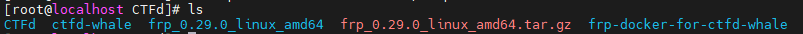 

## 2、CTFd 环境配置

### 2.1 Docker集群设置

#### 2.1.1 初始化集群

```bash
docker swarm init
```

注意：如果出现一下界面，说明环境里面初始过集群指令。重装或者误操作都会出现，这时候需要武力删除，执行完指令之后再执行初始化指令。

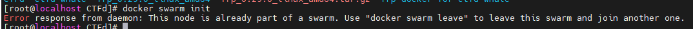 

**武力删除指令**

```dockerfile
docker swarm leave --force
```

成功界面：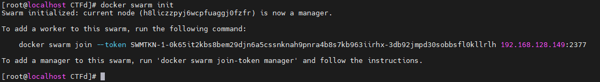

#### 2.1.2 将刚刚初始化的这个集群加入到节点当中

>返回的就是节点ID了，暂时不用管这个节点ID。注意这个`linux-1`在后面的插件配置地方有，名称不能错。

```bash
docker node update --label-add='name=linux-1' $(docker node l
```

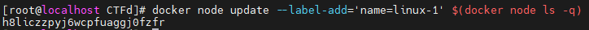 

### 2.2 将`ctfd-whale`插件放到`Ctfd`的插件下面

```bash
mv ctfd-whale/ CTFd/CTFd/plugins/
```

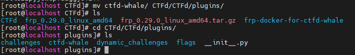 

### 2.3 启动docker版本的`frps`及`frps`配置

> 进入`frp-docker-for-ctfd-whale/`目录

启动docker

```bash
docker-compose up -d
```

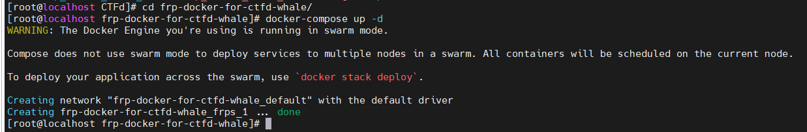 

接下来在当前目录下进入到`frp`看看`frp`里面的文件信息，建议不要随便改，后面配置有呼应。

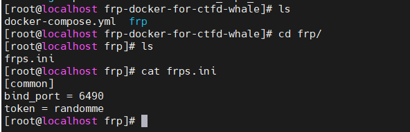 

### 2.4 将`frpc`传入`CTFd`中

>这一步骤实际上就是：将`frpc，frpc.ini，frpc_full.ini`，LICENSE这四个文件放在`CTFd/frpc`文件夹中。

#### 2.4.1在 `/root/ctfd/CTFd`中新建一个frpc文件夹

```bash
mkdir frpc
```

#### 2.4.2 进入`/root/ctfd/frp_0.29.0_linux_amd64`文件夹中，并将里面的`frpc，frpc.ini，frpc_full.ini`，LICENSE移动到新建的`frpc`文件夹中

```bash
mv frpc.ini ../CTFd/frpc/
mv frpc_full.ini ../CTFd/frpc/
mv frpc ../CTFd/frpc/
mv LICENSE ../CTFd/frpc/
```

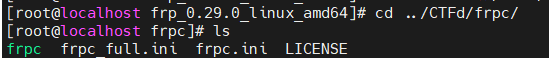 

#### 2.4.3 进入到刚刚新建的`frpc`目录下，修改`frpc.ini`目录下内容，直接替换

```
[common]
token = randomme
server_addr = 172.1.0.4
server_port = 6490
pool_count = 200
tls_enable = true

admin_addr = 172.1.0.3
admin_port = 7400
```

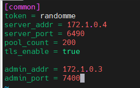 

### 2.5 编辑`Dockerfile`文件

```dockerfile
# 直接替换
FROM python:3.7-alpine
RUN sed -i 's/dl-cdn.alpinelinux.org/mirrors.ustc.edu.cn/g' /etc/apk/repositories && \
    apk update && \
    apk add linux-headers libffi-dev gcc make musl-dev py-pip mysql-client git openssl-dev
RUN adduser -D -u 1001 -s /bin/bash ctfd

WORKDIR /opt/CTFd
RUN mkdir -p /opt/CTFd /var/log/CTFd /var/uploads

COPY requirements.txt .

RUN apk add gcc
RUN apk add musl-dev
RUN apk add libxslt-dev
RUN apk add g++
RUN apk add make
RUN apk add libffi-dev
RUN apk add openssl-dev
RUN apk add libtool

RUN pip install -r requirements.txt -i https://mirrors.tuna.tsinghua.edu.cn/pypi/web/simple/

COPY . /opt/CTFd

RUN for d in CTFd/plugins/*; do \
      if [ -f "$d/requirements.txt" ]; then \
        pip install -r $d/requirements.txt -i https://mirrors.tuna.tsinghua.edu.cn/pypi/web/simple/ ; \
      fi; \
    done;

RUN chmod +x /opt/CTFd/docker-entrypoint.sh
RUN chown -R 1001:1001 /opt/CTFd
RUN chown -R 1001:1001 /var/log/CTFd /var/uploads

USER 1001
EXPOSE 8000
ENTRYPOINT ["/opt/CTFd/docker-entrypoint.sh"]
```

### 2.6 编辑 docker-compose.yml 

> 删除该文件，新建一个以下文件内容的同名文件。


 