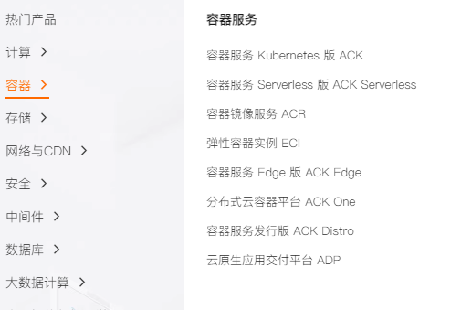
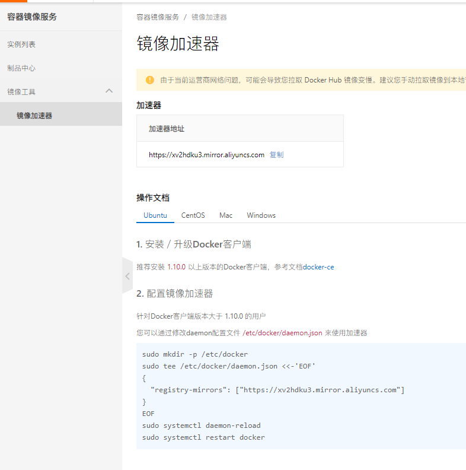
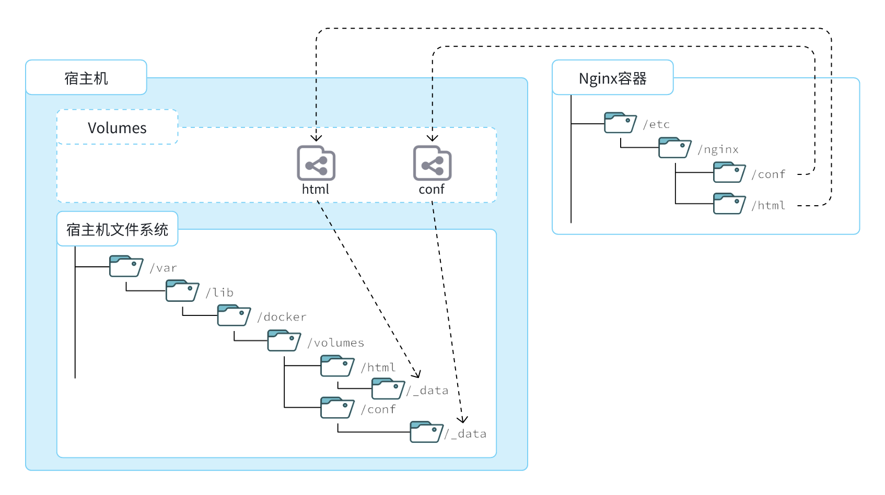

# 安装docker

## 1、配置Docker的yum库

### 1.1 安装yum工具

```bash
yum install -y yum-utils
```

### 1.2 安装成功后，执行命令，配置Docker的yum源

```bash
yum-config-manager --add-repo https://download.docker.com/linux/centos/docker-ce.repo
```

### 1.3 安装 Docker

```bash
yum install -y docker-ce docker-ce-cli containerd.io docker-buildx-plugin docker-compose-plugin --allowerasing
```

### 1.4 启动和校验

```bash
# 启动Docker
systemctl start docker
# 停止Docker
systemctl stop docker
# 重启
systemctl restart docker
# 设置开机自启
systemctl enable docker
# 执行docker ps命令，如果不报错，说明安装启动成功
docker ps
```

### 1.5 配置阿里云加速

https://www.aliyun.com/

 

 

```bash
sudo mkdir -p /etc/docker
sudo tee /etc/docker/daemon.json <<-'EOF'
{
  "registry-mirrors": [
    "https://docker.mirrors.ustc.edu.cn"
  ]
}
EOF
sudo systemctl daemon-reload
sudo systemctl restart docker
```

# 部署MySQL

> 当利用Docker安装应用时Docker:会自动搜索并下载应用**镜像(image)**。镜像不仅包含应用本身，还包含应用运行所需要的环境、配置、系统函数库。Docker会在运行镜像时创建一个隔离环境，称为**容器（container)**。
>
> Docker 官网维护了一个公共仓库：[Docker](https://hub.docker.com/#/)

```bash
docker run -d \
  --name mysql \
  -p 3306:3306 \
  -e TZ=Asia/Shanghai \
  -e MYSQL_ROOT_PASSWORD=123 \
  -v /root/mysql/data:/var/lib/mysql \
  -v /root/mysql/conf:/etc/mysql/conf.d \
  -v /root/mysql/init:/docker-entrypoint-initdb.d \
  --network hm-net\
  mysql
```

## 1、命令解读

- **`docker run -d`**：创建并运行一个容器，**-d **是让容器在后台运行
- **`--name`**：给容器一个名字，必须唯一
- **`-p 3306:3306`**：设置端口映射，宿主机端口:容器端口
- **`-e KEY:VALUE`**：设置环境变量，可以通过镜像文档进行查看，**Environment Variables**
- **`-v 数据卷:容器内目录`**：数据卷挂在
-  **`mysql`**：指定运行镜像名字，完整写法**`repository:tag`** repository：镜像名 tag：镜像版本，没有指定tag市，默认是latest，代表最新版本的镜像

# docker 基础

## 1、常见命令

> 官方文档：https://docs.docker.com/

### 1.1 本地镜像管理

- **`docker pull`**：下载镜像

- **`docker push`**：推送本地镜像到云仓库

- **`docker images`**：查看本地镜像

- **`docker rmi`**：删除本地镜像

- **`docker build`**：通过 **dockerfile** 构建自定义进项

- **`docker save`**：保存镜像到本地

  - ```bash
    docker save -o nginx.tar nginx:latest #将nginx:latest镜像打包成nginx.tar保存到本地
    ```

- **`docker load`**：加载本地镜像

### 1.2 容器管理

- **`docker run`**：创建容器

  - ```bash
    docker run -d --name nginx -p 80:80 nginx
    ```

  - 

- **`docker stop`**：停止容器内部进程

- **`docker start`**：运行停止的容器进程

- **`docker ps`**：默认查看运行中的容器

  - ```bash
    # 对输出的内容格式化
    docker ps --format "table {{.ID}}\t{{.Image}}\t{{.Ports}}\t{{.Status}}\t{{.Names}}"
    ```

  - **`-a`**：查看所有容器

- **`docker rm`**：删除容器

  - **`-f`**：强制删除

- **`docker logs`**：查看容器运行日志

  - **`-f`**：持续查看日志

- **`docker exec `**：进入容器

  - **`-it`**：添加一个可输入的终端
  - **`bash`**：通过bash进行交互

- **`docker inspect` **：查看容器详情

### 1.3  命令别名

> \# 修改/root/.bashrc文件，给docker 命令设置一个别名

```bash
[root@localhost ~]# vi /root/.bashrc
内容如下：
# .bashrc

# User specific aliases and functions

alias rm='rm -i'
alias cp='cp -i'
alias mv='mv -i'
alias dps='docker ps --format "table {{.ID}}\t{{.Image}}\t{{.Ports}}\t{{.Status}}\t{{.Names}}"'
alias dis='docker images'

# Source global definitions
if [ -f /etc/bashrc ]; then
        . /etc/bashrc
fi

[root@localhost ~]# source ~/.bashrc # 使更改生效
```

## 2、docker 数据卷

> **数据卷（volume）**是一个虚拟目录，是**容器内目录**与**宿主机目录**之间映射的桥梁

宿主机数据卷目录：`/var/lib/docker/volumes`，其下再根据数据卷名称创建新目录，格式为`/数据卷名/_data`



### 2.1 数据卷命令

- **`docker volume create `**：创建数据卷
- **`docker volume ls`**：查看所有数据卷
- **`docker volume rm`**：删除指定数据卷
- **`docker volume inspect 数据卷`** ：查看某个数据卷的详情
- **`docker volume prune`**：清除数据卷

### 2.2 数据卷挂载

- 在执行**`docker run`**创建容器时，使用**`-v 数据卷:容器内目录`**完成数据卷挂载
- 当创建容器时，如果要挂载的数据卷不存在，会自动创建数据卷

## 3、docker 本地目录挂载

>数据卷的目录结构较深，如果我们去操作数据卷目录会不太方便。在很多情况下，我们会直接将容器目录与宿主机指定目录挂载。挂载语法与数据卷类似：

```bash
# 挂载本地目录
-v 本地目录:容器内目录
# 挂载本地文件
-v 本地文件:容器内文件
# 本地目录或文件必须以 / 或 ./开头，如果直接以名字开头，会被识别为数据卷名而非本地目录名。
-v mysql:/var/lib/mysql # 会被识别为一个数据卷叫mysql，运行时会自动创建这个数据卷
-v ./mysql:/var/lib/mysql # 会被识别为当前目录下的mysql目录，运行时如果不存在会创建目录
```


## 4、自定义镜像

>自定义镜像本质就是依次准备好程序运行的基础环境、依赖、应用本身、运行配置等文件，并且打包而成。
>每一次操作其实都是在生产一些文件（系统运行环境、函数库、配置最终都是磁盘文件），所以**镜像就是一堆文件的集合**。
>镜像文件不是随意堆放的，而是按照操作的步骤分层叠加而成，每一层形成的文件都会单独打包并标记一个唯一id，称为**Layer**（**层**）。这样，如果我们构建时用到的某些层其他人已经制作过，就可以直接拷贝使用这些层，而不用重复制作。

### 4.1 Dockerfile 语法

>由于制作镜像的过程中，需要逐层处理和打包，比较复杂，所以Docker就提供了自动打包镜像的功能。我们只需要将打包的过程，每一层要做的事情用固定的语法写下来，交给Docker去执行即可。
>而这种记录镜像结构的文件就称为**Dockerfile**，其对应的语法可以参考[官方文档](https://docs.docker.com/engine/reference/builder/)：

|    **指令**    |                   **说明**                   |           **示例**           |
| :------------: | :------------------------------------------: | :--------------------------: |
|    **FROM**    |                 指定基础镜像                 |       `FROM centos:6`        |
|    **ENV**     |        设置环境变量，可在后面指令使用        |       `ENV key value`        |
|    **COPY**    |         拷贝本地文件到镜像的指定目录         | `COPY ./xx.jar /tmp/app.jar` |
|    **RUN**     |  执行Linux的shell命令，一般是安装过程的命令  |    `RUN yum install gcc`     |
|   **EXPOSE**   | 指定容器运行时监听的端口，是给镜像使用者看的 |         EXPOSE 8080          |
| **ENTRYPOINT** |     镜像中应用的启动命令，容器运行时调用     | ENTRYPOINT java -jar xx.jar  |

例如，要基于Ubuntu镜像来构建一个Java应用，其Dockerfile内容如下：

```Dockerfile
# Dockerfile文件
# 指定基础镜像
FROM ubuntu:16.04
# 配置环境变量，JDK的安装目录、容器内时区
ENV JAVA_DIR=/usr/local
ENV TZ=Asia/Shanghai
# 拷贝jdk和java项目的包
COPY ./jdk8.tar.gz $JAVA_DIR/
COPY ./docker-demo.jar /tmp/app.jar
# 设定时区
RUN ln -snf /usr/share/zoneinfo/$TZ /etc/localtime && echo $TZ > /etc/timezone
# 安装JDK
RUN cd $JAVA_DIR \
 && tar -xf ./jdk8.tar.gz \
 && mv ./jdk1.8.0_144 ./java8 
# 配置环境变量
ENV JAVA_HOME=$JAVA_DIR/java8
ENV PATH=$PATH:$JAVA_HOME/bin
# 指定项目监听的端口
EXPOSE 8080
# 入口，java项目的启动命令
ENTRYPOINT ["java", "-jar", "/app.jar"]
```

### 4.2 构建镜像

>当Dockerfile文件写好以后，就可以利用命令来构建镜像了。

首先，我们将课前资料提供的`docker-demo.jar`包以及`Dockerfile`拷贝到虚拟机的`/root/demo`目录：

 

```bash
# 进入镜像目录
cd /root/demo
# 开始构建
docker build -t docker-demo:1.0 .
```

命令说明：

- `docker build `: 就是构建一个docker镜像
- `-t docker-demo:1.0` ：`-t`参数是指定镜像的名称（`repository`和`tag`）
- `.` : 最后的点是指构建时Dockerfile所在路径，由于我们进入了demo目录，所以指定的是`.`代表当前目录，也可以直接指定Dockerfile目录：

## 5、Docker 网络

> 在默认情况下，所有容器都是以bridge方式连接到Docker的一个虚拟网桥上
> 但是，容器的网络IP其实是一个虚拟的IP，其值并不固定与某一个容器绑定，如果我们在开发时写死某个IP，而在部署时很可能MySQL容器的IP会发生变化，连接会失败。

所以，我们必须借助于docker的网络功能来解决这个问题，[官方文档](https://docs.docker.com/engine/reference/commandline/network/)：

|         **命令**          |         **说明**         |                         **文档地址**                         |
| :-----------------------: | :----------------------: | :----------------------------------------------------------: |
|   docker network create   |       创建一个网络       | [docker network create](https://docs.docker.com/engine/reference/commandline/network_create/) |
|     docker network ls     |       查看所有网络       | [docs.docker.com](https://docs.docker.com/engine/reference/commandline/network_ls/) |
|     docker network rm     |       删除指定网络       | [docs.docker.com](https://docs.docker.com/engine/reference/commandline/network_rm/) |
|   docker network prune    |     清除未使用的网络     | [docs.docker.com](https://docs.docker.com/engine/reference/commandline/network_prune/) |
|  docker network connect   | 使指定容器连接加入某网络 | [docs.docker.com](https://docs.docker.com/engine/reference/commandline/network_connect/) |
| docker network disconnect | 使指定容器连接离开某网络 | [docker network disconnect](https://docs.docker.com/engine/reference/commandline/network_disconnect/) |
|  docker network inspect   |     查看网络详细信息     | [docker network inspect](https://docs.docker.com/engine/reference/commandline/network_inspect/) |

举例：

```bash
# 1.首先通过命令创建一个网络
docker network create hmall

# 2.然后查看网络
docker network ls
# 结果：
NETWORK ID     NAME      DRIVER    SCOPE
639bc44d0a87   bridge    bridge    local
403f16ec62a2   hmall     bridge    local
0dc0f72a0fbb   host      host      local
cd8d3e8df47b   none      null      local
# 其中，除了hmall以外，其它都是默认的网络

# 3.让dd和mysql都加入该网络，注意，在加入网络时可以通过--alias给容器起别名
# 这样该网络内的其它容器可以用别名互相访问！
# 3.1.mysql容器，指定别名为db，另外每一个容器都有一个别名是容器名
docker network connect hmall mysql --alias db
# 3.2.db容器，也就是我们的java项目
docker network connect hmall dd

# 4.进入dd容器，尝试利用别名访问db
# 4.1.进入容器
docker exec -it dd bash
# 4.2.用db别名访问
ping db
# 结果
PING db (172.18.0.2) 56(84) bytes of data.
64 bytes from mysql.hmall (172.18.0.2): icmp_seq=1 ttl=64 time=0.070 ms
64 bytes from mysql.hmall (172.18.0.2): icmp_seq=2 ttl=64 time=0.056 ms
# 4.3.用容器名访问
ping mysql
# 结果：
PING mysql (172.18.0.2) 56(84) bytes of data.
64 bytes from mysql.hmall (172.18.0.2): icmp_seq=1 ttl=64 time=0.044 ms
64 bytes from mysql.hmall (172.18.0.2): icmp_seq=2 ttl=64 time=0.054 ms
```

## 6、docker-compose

其中，OPTIONS和COMMAND都是可选参数，比较常见的有：

| **类型** |                        **参数或指令**                        |                           **说明**                           |
| :------: | :----------------------------------------------------------: | :----------------------------------------------------------: |
| Options  |                              -f                              |                 指定compose文件的路径和名称                  |
|    -p    | 指定project名称。project就是当前compose文件中设置的多个service的集合，是逻辑概念 | 指定project名称。project就是当前compose文件中设置的多个service的集合，是逻辑概念 |
| Commands |                              up                              |                  创建并启动所有service容器                   |
|   down   |                   停止并移除所有容器、网络                   |                   停止并移除所有容器、网络                   |
|    ps    |                      列出所有启动的容器                      |                      列出所有启动的容器                      |
|   logs   |                      查看指定容器的日志                      |                      查看指定容器的日志                      |
|   stop   |                           停止容器                           |                           停止容器                           |
|  start   |                           启动容器                           |                           启动容器                           |
| restart  |                           重启容器                           |                           重启容器                           |
|   top    |                        查看运行的进程                        |                        查看运行的进程                        |
|   exec   |                 在指定的运行中容器中执行命令                 |                 在指定的运行中容器中执行命令                 |

```Bash
# 1.进入root目录
cd /root

# 2.删除旧容器
docker rm -f $(docker ps -qa)

# 3.删除hmall镜像
docker rmi hmall

# 4.清空MySQL数据
rm -rf mysql/data

# 5.启动所有, -d 参数是后台启动
docker-compose up -d
# 结果：
[+] Building 15.5s (8/8) FINISHED
 => [internal] load build definition from Dockerfile                                    0.0s
 => => transferring dockerfile: 358B                                                    0.0s
 => [internal] load .dockerignore                                                       0.0s
 => => transferring context: 2B                                                         0.0s
 => [internal] load metadata for docker.io/library/openjdk:11.0-jre-buster             15.4s
 => [1/3] FROM docker.io/library/openjdk:11.0-jre-buster@sha256:3546a17e6fb4ff4fa681c3  0.0s
 => [internal] load build context                                                       0.0s
 => => transferring context: 98B                                                        0.0s
 => CACHED [2/3] RUN ln -snf /usr/share/zoneinfo/Asia/Shanghai /etc/localtime && echo   0.0s
 => CACHED [3/3] COPY hm-service.jar /app.jar                                           0.0s
 => exporting to image                                                                  0.0s
 => => exporting layers                                                                 0.0s
 => => writing image sha256:32eebee16acde22550232f2eb80c69d2ce813ed099640e4cfed2193f71  0.0s
 => => naming to docker.io/library/root-hmall                                           0.0s
[+] Running 4/4
 ✔ Network hmall    Created                                                             0.2s
 ✔ Container mysql  Started                                                             0.5s
 ✔ Container hmall  Started                                                             0.9s
 ✔ Container nginx  Started                                                             1.5s

# 6.查看镜像
docker-compose images
# 结果
CONTAINER           REPOSITORY          TAG                 IMAGE ID            SIZE
hmall               root-hmall          latest              32eebee16acd        362MB
mysql               mysql               latest              3218b38490ce        516MB
nginx               nginx               latest              605c77e624dd        141MB

# 7.查看容器
docker-compose ps
# 结果
NAME                IMAGE               COMMAND                  SERVICE             CREATED             STATUS              PORTS
hmall               root-hmall          "java -jar /app.jar"     hmall               54 seconds ago      Up 52 seconds       0.0.0.0:8080->8080/tcp, :::8080->8080/tcp
mysql               mysql               "docker-entrypoint.s…"   mysql               54 seconds ago      Up 53 seconds       0.0.0.0:3306->3306/tcp, :::3306->3306/tcp, 33060/tcp
nginx               nginx               "/docker-entrypoint.…"   nginx               54 seconds ago      Up 52 seconds       80/tcp, 0.0.0.0:18080-18081->18080-18081/tcp, :::18080-18081->18080-18081/tcp
```