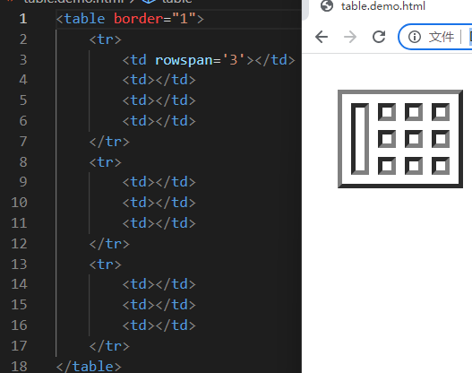
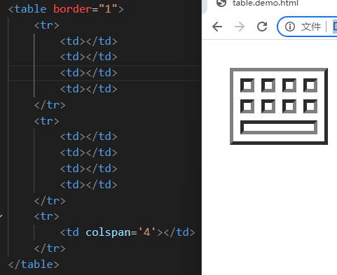
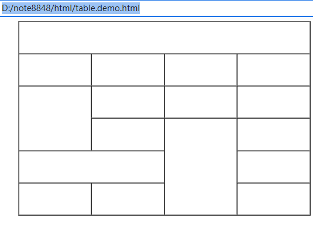

# 标题和段落标签

- 标题标签：<h1\~6></h1\~6>
  - html中有六个等级标题标签
- 段落标签：<p></p>
- 浏览器语言中的空格代码为：&nbsp

# 图片标签

## 语法

```html

```

- alt提示会占据文本空间
- title提示不占据文本空间

## 网页开发支持的图片格式

- bmp：常用于登录验证码
- webp：专门针对谷歌浏览器的图片格式

# 超链接

## 页面跳转链接

```html
<标签 href="链接" target="定义链接页面的打开方式"></标签>
//标签加href属性实现超链接
```

### target属性

1. _self:在当前页面打开
2. _blank:在空白页面打开

## 锚点链接

> 用于同一个页面中不同区域的跳转

### 跳转目标定义

```html
<标签 id="1"></标签>  /给标签定义一个id属性值，不能重复定义
```

### 锚点定义

```html
<标签 href="#对应跳转目标的id属性值"></标签>
```

# 文本修饰

## 文本加粗

### b标签

```html
<b>加粗文本</b>
```

### strong标签

```html
<strong>加粗文本</strong>
```

### 区别

- b标签仅仅加粗显示文本
- strong标签语义化更强，表示该文本比较重要

## 文本倾斜

### i标签

```html
<i>倾斜文本</i>
```

### em标签

```html
<em>倾斜文本</em>
```

### 区别

- i标签仅仅加粗显示文本
- em标签语义化更强，表示该文本比较重要

## 删除线

```html
<del>删除线文本</del>
```

## 下划线

```html
<u>下划线文本</u>
```

## 角标

### 上角标

```html
<sup>上角标文本</sup>
```

下角标

```html
<sub>下角标文本</sub>
```

# 列表

## 有序列表

这是一个有序列表：

1. 第一
2. 第二
3. 第三

### 语法

```html
<ol type="顺序样式" start="开始字符">  // order list 有序列表
    <li>第一</li>  // list item 列表
    <li>第二</li>
    <li>第三</li>
</ol>
```

#### type属性

1. `A`：大写英文字母顺序
2. `a`：小写英文字母顺序
3. `I`：大写罗马字母顺序
4. `i`：大写英文字母顺序
5. `1`：阿拉伯数字顺序

## 无序列表

```html
<ul typle="项目符号样式">
    <li>抱孩子</li>
    <li>接电话</li>
    <li>关煤气</li>
</ul>
```

### type样式

- disc：实心圆

  - circle空心圆

    - square：实心方块

      ​	none：无样式

## 自定义列表

```html
<dl>
    <dt>标题</dt> //dt标签不能放入dd内
    <dd>列表内容</dd> //dd标签不能放入dt0内
</dl>
```

# 表格

## 基础结构

> 一个<tr>标签为一行，一个<td>标签为一列

```html
<table>
    <tr>  // table row 表格行
    	<td>table data cell 表格数据单元</td> // 每一个<tr>中的<td>数量是相等的
    </tr>
</table>
```

## 表格属性

```html
<table  border='定义表格边框' wideth='50' height='150' cellspacing='定义单元格之间的距离' cellpadding='定义单元格边框和文本之间的举例' algin='定义表格在浏览器中的水平位置'> //
    <tr>
    	<th>文字加粗的单元格</th>
    </tr>
</table>
```

## 表格行属性

```html
<table>
    <tr height='50' algin='水平对齐方式' valign='垂直对齐方式'>  // table row 表格行
    	<td>table data cell 表格数据单元</td> // 每一个<tr>中的<td>数量是相等的
    </tr>
</table>
```

## 单元格属性

```html
<table>
    <tr>  // table row 表格行
    	<td width='' height='' algin='' valign=''>table data cell 表格数据单元</td> // 每一个<tr>中的<td>数量是相等的
    </tr>
</table>
```

## 合并单元格

```html
//横向合并
<table>
    <tr>
    	<td rowspan='3'></td> // rowspan='跨多少行'
    	<td></td>
    	<td></td>
    	<td></td>
    </tr>
    <tr>
    	<td></td>
    	<td></td>
    	<td></td>
    </tr>
    <tr>
    	<td></td>
    	<td></td>
    	<td></td>
    </tr>
</table>
//纵向合并
<table>
    <tr>
    	<td></td> // rowspan='合并多少行'
    	<td></td>
    	<td></td>
    	<td></td>
    </tr>
    <tr>
    	<td></td>
    	<td></td>
    	<td></td>
        <td></td>
    </tr>
    <tr>
    	<td colspan='4'></td> //合并多少列
    </tr>
</table>
```



### 案例

```html
<table border="1" width="1500" height="1000" cellspacing="0" align="center">
    <tr>
        <td colspan="4"></td>
    </tr>
    <tr>
        <td></td>
        <td></td>
        <td></td>
        <td></td>
    </tr>
    <tr>
        <td rowspan="2"></td>
        <td></td>
        <td></td>
        <td></td>
    </tr>
    <tr>
        <td></td>
        <td rowspan="3"></td>
        <td></td>
    </tr>
    <tr>
        <td colspan="2"></td>
        <td></td>
    </tr>
    <tr>
        <td></td>
        <td></td>
        <td></td>
    </tr>
</table>
```

 
