# 一、MySQL简介

## 1.1 数据库介绍 

- 数据库概念 术语介绍 

## 1.2 MySQL数据库 

- 下载、安装、配置、卸载 
- MySQL客户端⼯具的安装及使用 

## 1.3 SQL 结构化查询语⾔ 

- 什么是SQL 
- SQL操作数据（CRUD操作：添加、查询、修改、删除） 

## 1.4 SQL ⾼级 

- 存储过程 
- 索引
-  触发器、视图

##  1.5 数据库设计 

- 数据库设计步骤
-  数据库设计范式
-  E-R图 
- PowerDesigner建模⼯具、PDMan     

## 1.6 数据库事务 

- 什么是事务 
- 事务特性ACID 
- 事务隔离级别 
- 事务管理

# 数据库介绍

## 数据库概念

数据库，就是存放数据的仓库

数据库（DataBase,简称DB）是长期存储在计算机内部结构的、大量的、共享的数据集合

- 长期存储：持久存储

- 有结构：

- - 类型：数据库不仅可以存放数据，而且存放的数据还是有类型的
  - 关系：存储数据与数据之间的关系

- 大量：大多数数据库都是文件系统的，也就是说存储在数据库中的数据实际上就是存储在磁盘文件中

- 共享：多个应用程序可以通过数据库实现数据的共享

  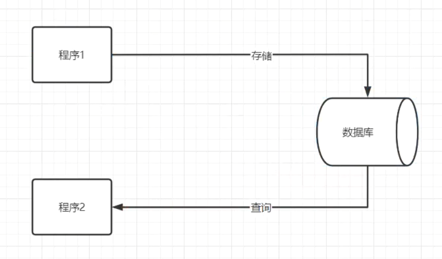.

## 关系型数据库与非关系型数据库

- 关系型数据库：

采用了关系模型来组织数据的存储，以行和列的形式存储数据并记录数据与数据之间的关系-->将数据存储在表格中，可以通过建立表格与表格之间的关联，来维护数据与数据之间的关系。

- 非关系型数据库：

采用键值对的模型来存储数据，只完成数据的记录，不会记录数据与数据之间的关系。

在非关系型数据库中基于特定的存储结构来解决一些大数据应用的难题

NoSQL（Not onlt SQL)数据库来指代非关系型数据库

## 常见的数据库产品

### 关系型数据库产品

- MySQL 免费

- - MariaDB
  - Percona Server

- PostgreSQL

- Oracle 收费（功能最齐全）

- SQL Server

- Access

- Sybase

- 达梦数据库

### 非关系型数据库产品

- 面向检索的列式存储 

- - HaBase （Hadoop子系统）
  - BigTable （Google）

- 面向高并发的缓存存储     Key-Value

- - Redis

- - MemcacheDB

- 面向海量数据访问的文档存储

- - MongoDB

- - CouchDB

## 数据库术语

数据库（DataBase）：存储的数据的集合

数据（Data）：实际上指的是描述事物的符号记录仪

数据库管理系统（Database Management System，DBMS）：位于用户与操作系统之间的一层数据管理软件


数据库管理员（Database Anministrator，DBA）：负责数据库创建、使用及维护的专⻔⼈员

数据库系统（Database System，DBS）：数据库系统管理员、数据库管理系统及数据库组成整个单元

# MySQL环境

## MySQL版本及下载

### 版本

- MySQL是Oracle的免费的关系型数据库，官网 https://www.mysql.com/
- .

- 在企业项目中主流版本：5.7     -- 8.0.26

- MySQL     8.x新特性

- - 性能：8.x比5.7数度快2倍
  - 支持NoSQL存储：5.7开始提供了对NoSQL的⽀持，8.0.x做了更进⼀步的改进
  - 窗⼝函数
  - 索引：隐藏索引、降序索引
  - 可用性、可靠性

## 下载

- 官网下载：https://dev.mysql.com/downloads/
- 镜像filehorse下载：https://www.filehorse.com/search?q=mysql

## 安装

傻瓜式（直接点击下一步）

### 安装类型选择

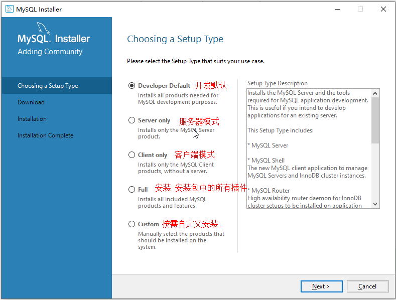.

### 若选择 Developer Default 模式安装

此模式会安装开发⼈员需要的常用组件；在安装这些组件时需要对应的环境依赖，我们要暂停，先去安装依赖的环境：

.

安装visual studio时一定要勾选.net


### 选择⾃定义Custom 安装

只保留需要的插件

.

## MySQL配置

### 端口配置：3306


### 账号密码设置

我的密码123456@

或123456

.

### 服务名称设置

.

### 结束

.

### MySQL服务的启动与停止

.

#### 或

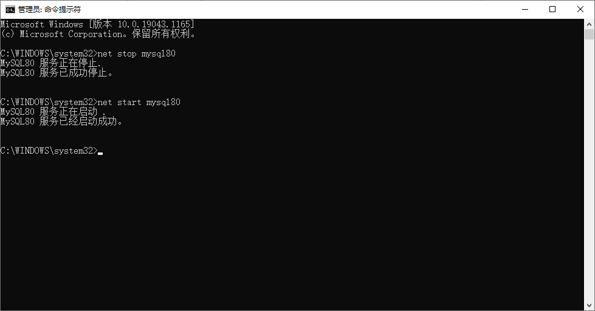.

## MySQL卸载

- 关闭服务

- 卸载软件

  - .

- - MySQL的安装⽬录： C:\Program Files      (x86)\MySQL
  - MySQL的数据⽂件⽬录(默认隐藏)：      C:\ProgramData\MySQL (如果不允许删除，强制删除)

- 删除注册表

- - 打开注册表： win+r --- 输⼊regedit ---回⻋
  - 删除      HKEY_LOCAL_MACHINE\SYSTEM\ControlSet001\Services\MySQL80
  - 删除搜索mysql 的相关项（⾮必须）

## MySQL的管理工具

用户是通过DBMS⼯具来对MySQL进行操作的

安装完成之后默认包含了管理工具mysql Commcand line Client，一命令行形式执行

通常我们会单独安装可视化的DBMS⼯具：

- SQLyog
- Navicat for MySQL

### MySQL Command line Client使用

.

- 打开MySQL     Command line Client : 开始菜单 --- MySQL --- MySQL 8.0 Command line Client
- 连接MySQL : 输⼊密码即可     （如果密码错误或者mysql服务没有启动，窗⼝会闪退）
- .

## 可视化⼯具Navicat使用

Navicat⼯具下载及安装

傻⽠式安装

创建连接

.

# MySQL逻辑结构

## MySQL中的数据需要按照特定的结果进行存储

.

.

## 记录/元组 


# MySQL数据类型

==指数据表中的列中支持存放的数据的类型==

## 数值类型

在MySQL中有多种数据类型可以存放数值，不同的类型存放的数值的方位或者形式是不同的

| **类型**        | **内存大小**    | **范围**                                    | **说明**                                         |
| --------------- | --------------- | ------------------------------------------- | ------------------------------------------------ |
| tinyint         | 1byte           | 有符号 -128 ~ 127  ⽆符号 0 ~ 255           | 特小型整数（年龄）                               |
| smallint        | 2byte （16bit） | 有符号  -32768 ~ 32767  ⽆符号 0 ~ 65535    | 小型整数                                         |
| mediumint       | 3byte           | 有符号  -2^31 ~ 2^31 - 1  ⽆符号 0 ~ 2^32-1 | 中型整数                                         |
| **int/integer** | 4byte           |                                             | 整数                                             |
| **bigint**      | 8byte           |                                             | ⼤型整数                                         |
| float           | 4byte           |                                             | 单精度                                           |
| double          | 8byte           |                                             | 双精度                                           |
| decimal         | 第⼀参数+2      |                                             | decimal(10,2)   表示数值⼀共有10位   ⼩数位有2位 |

整型中默认使用**int**，当int不够装使使用**bigint**，极少使用**tinyint、smallint、mediumint**

浮点型中默认使用double

## 字符串类型

存储字符序列的类型

| **类型**     | **字符序列的长度范围** | **说明**                                                     |
| ------------ | ---------------------- | ------------------------------------------------------------ |
| **char**     | 0 ~ 255 字节           | 定长字符串，最多可以存储255个字符；当指定数据表字段为char(n)  此列中的数据最长为n个字符，如果添加的数据少于n，则补"\u0000"至n长度 |
| **varchar**  | 0 ~65535 字节          | 可变长度字符串，此类型的类最大长度为65535，                  |
| tinyblod     | 0 ~ 255 字节           | 存储二进制字符串                                             |
| blod         | 0 ~ 65535 字节         | 存储二进制字符串                                             |
| mediumbold   | 0 ~ 1677215 字节       | 存储二进制字符串                                             |
| longblod     | 0 ~ 4694967295 字节    | 存储二进制字符串                                             |
| tinytext     | 0 ~ 255 字节           | 文本数据（字符串）                                           |
| text         | 0 ~ 65535 字节         | 文本数据（字符串）                                           |
| mediumtext   | 0 ~ 1677215 字节       | 文本数据（字符串）                                           |
| **longtext** | 0 ~ 4294967295 字节    | 文本数据（字符串）                                           |

## 日期类型

可以使用字符串来存储时间，但是如果需要基于时间字段进行查询操作（查询在某个时间段内的数据）就不便于查询实现

| **类型**     | **格式**            | **说明**                    |
| ------------ | ------------------- | --------------------------- |
| **date**     | 2021-09-13          | ⽇期，只存储年⽉⽇          |
| time         | 11:12:13            | 时间，只存储时分秒          |
| year         | 2021                | 年份                        |
| **datetime** | 2021-09-13 11:12:13 | ⽇期+时间，存储年⽉⽇时分秒 |
| timestamp    | 20210913 111213     | ⽇期+时间 （时间戳）        |

# SQL结构化查询语言

## SQL概述

==SQL（Structured Query Language）结构化查询语⾔，用于存取、查询、更新数据以及管理关系型数据库系统==

### SQL发展

- SQL是在1981年由IBM公司推出，基于其简洁的语法成为主流数据库的通用规范

- SQL由ANSI组织确定规范

- 在不同的数据库产品中遵守SQL的通用规范，但是也对SQL有⼀些不同的改进，形成了⼀些数据库的专有指令

- - MySQL: limit
  - SQLServer ： top
  - Oracle：rownum

## SQL分类

根据SQL指令完成的数据库操作的不同，可以将SQL指令分为四类：

- **DDL Data Definition Language 数据定义语⾔**

- - 用于完成对数据库对象（数据库、数据表、视图、索引等）的创建、删除、修改

- **DML Data Manipulation     Language 数据操作/操纵语⾔**

- - 用于完成对数据表中的数据的添加、删除、修改操作
  - 添加：将数据存储到数据表
  - 删除：将数据从数据表移除
  - 修改：对数据表中的数据进行修改

- **DQL Data Query Language 数据查询语⾔**

- - 用于将数据表中的数据查询出来

- **DCL Data Control Language 数据控制语⾔**

- - 用于完成事务管理等控制性操作

SQL语句不区分大小写

## SQL基本语法

==在MySQL Command Line Client 或者navicat等⼯具中都可以编写SQL指令==

- SQL指令不区分大小写
- 每条SQL语句结束之后都以   **;**      进行结尾
- SQL指令以 ***空格*** 进行分割
- SQL之间可以不限制换行（有空格的地方就可以有换行）

## DDL数据库操作

### DDL-数据库操作

==使用DDL语句可以创建数据库、查询数据库、修改数据库、删除数据库==

#### 创建数据库 关键字：create

```mysql
mysql> create database <dbName>; # 创建数据库 dbName(数据库名)可以自定义
```

.

```mysql
mysql> create database if not exists <dbName>;  # 创建一个数据库，当指定名称的数据库不存在时创建
```

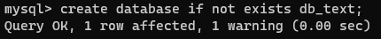.

```mysql
mysql> create database <dbName> character set utf8;  # 创建一个数据库，并指定字符集（字符集：数据存储在数据库中采用的编码格式)
```

.

#### 删除数据库 关键字：drop

```mysql
mysql> drop database <dbName>; # 删除指定数据库
```

.

```mysql
mysql> drop database if exists <dbName>; # 当指定数据库存在时删除该数据库
```

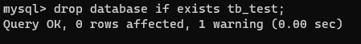.

#### 修改数据库 关键字 alter

```mysql
mysql> alter database <dbName> character set gbk; #修改指定数据库的字符集
```

.

#### 查询数据库 关键字：show

```mysql
mysql> show databases;  # 显示数据库列表
```

.

```mysql
mysql> show create database <dbName>; # 显示指定数据库的创建的SQL指令
```


#### 使用/切换数据库 关键字：use

```mysql
mysql> use <dbName> 
```

.

### DDL数据表操作

==数据表是一个二维的表格，一个表格是由多列组成，表格中的每一列称为一个字段==

#### 数据类型

| char(num)    | 不可变长度字符串 | num：长度     |
| ------------ | ---------------- | ------------- |
| varchar(num) | 可变长度字符串   | num：最大长度 |
| int          | 整形             |               |

#### 创建数据表 create

##### 举例

```mysql
create table <table_name>(
 stu_num char(8) not null unique,
 stu_name varchar(20) not null,
 stu_gender char(2) not null,
 stu_age int not null,
 stu_tel char(11) not null unique,
 stu_qq varchar(11) unique
);
```

注意：字段自建以**逗号**隔开，最后一个字段没有逗号

##### 运行

.

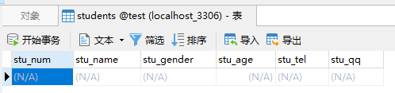.

#### 查询数据表

##### 查询所有数据表 show

```mysql
mysql> show tables;
```

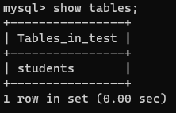.

##### 查询数据表结构 desc 

```mysql
mysql> desc <table_name>;
```

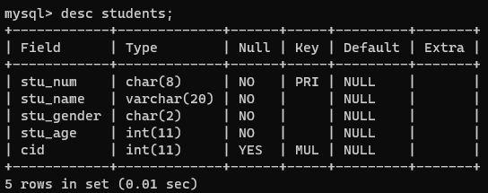 

#### 删除数据表 drop

```mysql
mysql> drop table students; # 删除数据表
mysql> drop table if exists students; #如果数据表存在则删除表
```


#### 修改数据表 alter

##### 修改数据表名 rename

```mysql
mysql> alter table <table_name> rename to <new_table_name>;
```

.

##### 修改数据表字符集 character set

==数据表默认字符集与数据库一致==

```mysql
mysql> alter table <table_name> character set 字符集;
```

.

##### 添加字段 add

```mysql
mysql> alter table <table_name> add <字段名> <数据类型>;
```

##### 修改字段名字与类型 change

```mysql
mysql> alter table <table_name> change <字段名> <新字段名> <新字段类型>;
```

.

##### 修改字段类型 modify

```mysql
mysql> alter table <table_name> modify <字段名> <新的字段类型>;
```

.

#### 删除字段 drop

```mysql
mysql> alter table <table_name> drop <字段名>;
```

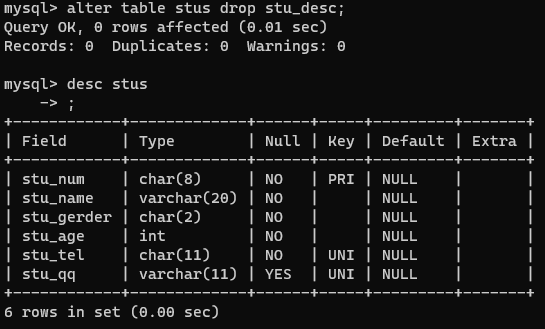.

### 字段约束

#### 简介

==在创建数据表的时候，指定的对数据表的列的数据限制性的要求（对表的列中的数据进行限制）==

#### 原因

- 保证数据的有效性
- 保证数据的完整性
- 保证数据的正确性

#### 常见的字段约束

- 非空约束（not null）：限制此列的值必须提供，不能为null
- 唯一约束（unique）：在表中的多条数据，此列的值不能重复
- 主键约束（primary  key）：非空+唯一，能够唯一标识数据表中的一条数据
- 外键约束（foreign  key）：建立不同表之间的关联关系

#### 非空约束

==简介：限制数据表中此列的值必须提供==

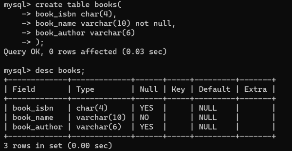.

##### 创建数据表books

- ```mysql
  mysql> create table books(
  	-> book_isbn char(4),
  	-> book_name varchar(10) not null, #  设置图书表
  	-> book_author varchar(6)
  -> );
  
  ```

##### 添加值

.

#### 唯一约束

##### 简介

==在表中的多条数据，此列的值不能重复==

##### 实践

- 创建表：设置图书表的book_isbn为unique

```mysql
mysql> create table books(
  -> book_isbn char(4) unique,
  -> book_name varchar(10) not null,
  -> book_author varchar(6)
  -> );
```

- 添加值
  - .

#### 主键约束

==简介:使用频率较低==

能够唯一标识数据表中的一条数据

在一张表中只能有一个主键（主键可以是一个列，也可以是多个列的组合）

当一次字段声明为主键之后，添加数据时：

- 此字段不能为null
- 此字段数据不能重复

##### 创建主键的方法

- ###### 创建表时定义主键

- -  ```mysql
     create table books(
     	book_isbn char(4) primary key,
     	book_name varchar(10) not null,
     	book_author varchar(6)
     );
     ```

  - 或者

  - ```mysql
    create table books(
    	book_isbn char(4) ,
    	book_name varchar(10) not null,
    	book_author varchar(6),
    	primary key(book_isbn)
    );
    ```

- ###### 创建表之后添加主键约束

- - ```mysql
    alter table books modify book_isdn char(4) primary key
    ```

##### 删除数据表主键约束

```mysql
alter table books drop primary key
```

##### 主键数据增长

###### 作用：

在我们创建⼀张数据表时，如果数据表中有列可以作为主键（例如：学⽣表的学号、图书表的isbn）我们可以直接这是这个列为主键；

> 当有些数据表中没有合适的列作为主键时，我们可以额外定义⼀个与记录本身无关的列（ID）作为主键，此列数据⽆具体的含义主要用于标识⼀条记录，在mysql中我们可以将此列定义为int，同时设置为`自动增⻓` ，当我们向数据表中新增⼀条记录时，⽆需提供ID列的值，它会⾃动⽣成。

###### 例如：

###### 定义：

```mysql
定义int类型字段⾃动增⻓： auto_increment
```

.

注意：自动增长从1开始，每添加一条记录，自动增长的列会自动+1，当我们把某条记录删除之后再添加数据，⾃动增⻓的数据也不会重复⽣成（⾃动增⻓只保证唯⼀性、不保证连续性）

##### 联合主键

###### 简介

将数据表中的多列组合在⼀起设置为表的主键

将两列的值同时确定时，可以在表中确定唯一的记录

.

###### 定义

```mysql
create table grades(
    stu_num char(8),
    course_id int,
    score int,
    primary key(stu_num,course_id)
);
```

### 外键约束

多表关联部分

# DML数据操纵语言

## 插入数据 insert into

### 语法

```mysql
insert into <tableName>(columnName,columnName . . . . . ) values();
```

### 示例

#### 数据表结构

.

#### 向数据表中指定的列添加数据，（不允许为空的列必须添加数据）

.

#### 添加数据时列的顺序可以不与数据表保持一致（但是values中值的顺序必须一致）

.

#### 当给表中所有字段添加数据时，后面的字段列表可以省略，但是values中的值的顺序要与数据表定义的字段保持一致；

不过在项目开发中，即使要想所有列添加数据，也建议将列名的列表显式写出来（增强SQL的稳定性）

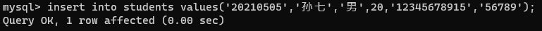.

#### 结果

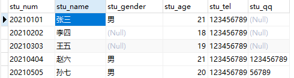.

## 删除数据 delete

### 作用

从数据表中删除满足特定条件（所有）数据

### 语法

- ```mysql
  delet from <tableName> ; (删除整张表的数据)
  ```

- ```mysql
  delet from <tableName> where conditions;(删除满足特定条件的数据)
  ```

### 示例

#### 当前数据表数据

.

#### 删除数据表中 stu_num='20210201'的数据

.

#### 删除后数据表数据

.

#### 删除数据表中 stu_age>20的数据删除数据表中 stu_age>20的数据

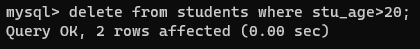 

#### 删除后数据表数据

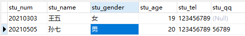 

## 修改/更新数据 update

### 作用

对数据表中已添加的记录进行修改

### 语法

```mysql
update <tableName> set columnName=value(修改整列)
update <tableName> set columnName=value where conditions(修改符合条件的数据)
```

#### 示例

##### 当前数据表

 

##### 将学号为20210105的学生姓名修改为“孙七”

 

##### 修改后的数据表

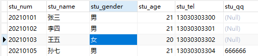.

##### 将学号为20210103的学生 性别修改为'男'，同时将QQ修改为'7777777'（修改多列）

修改多个字段中间用 , (英文逗号)隔开 

.

##### 修改后的数据表

.

##### 根据主键修改其他所有列根据主键修改其他所有列

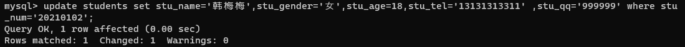.

#### 修改后的数据表

.

# DQL 数据查询语言

## 作用

==从数据表中提取满足特定条件的记录==

## 查询方式

- 单表查询
- 多表联合查询

## 关键字

**`select`**

## 查询基础语法

### 语法

```mysql
select [colnumName1,colnumName2,colnumName3,colnumName4 , . . .] from <tableName>
# selece 关键字后指定要显示查询到的数据的哪些列
```


### 如果要查询所有列用 * 表示（不建议使用）

.

## DQL-where语句

### 作用

==在删除、修改及查询的语句后都可以添加where⼦句（条件），用于筛选满⾜特定的添加的数据进行删除、修改和查询操作。==

### 语法

```mysql
delete from tableName where conditions;  //删除符合条件的数据
update tabeName set ... where conditions;  // 修改符合条件的数据
select .... from tableName where conditions;  // 查询符合条件的数据
```

### 条件查询

#### ## = 等于

```mysql
select * from stus where stu_num = '20210101';
```

#### ## !=  <> 不等于

```mysql
select * from stus where stu_num != '20210101';
select * from stus where stu_num <> '20210101';
```

#### ## > 大于

```mysql
select * from stus where stu_age>18 
```

#### ## < 小于

```mysql
select * from stus where stu_age<20;
```

#### ## >= 大于等于

```mysql
select * from stus where stu_age>=20;
```

#### ## <= 小于等于

```mysql
select * from stus where stu_age<=20;
```

#### ## between and 区间查询 between v1 and v2 [v1,v2]

```mysql
select * from stus where stu_age between 18 and 20;
```

### 多条件查询

在where⼦句中，可以将多个条件通过逻辑预算(and or not )进行连接，通过多个条件来筛选要操作的数据。

#### ## and 并且 筛选多个条件同时满足·的记录

```mysql
select * 
```

#### ## or 或者 筛选多个条件中至少满足⼀个条件的记录

```mysql
select * from stus where stu_gender='⼥' or stu_age<21;
```

#### ## not 取反

```mysql
select * from stus where stu_age not between 18 and 20;
```

## LIKE 子句

### 作用

==在where⼦句的条件中，我们可以使用like关键字来实现模糊查询==

### 语法

```mysql
select * from tableName where columnName like 'reg';
```

- 在like关键字后的reg表达式中

- - %      表示任意多个字符 [%o% 包含字⺟o]
  - _      表示任意⼀个字符 [_o% 第⼆个字⺟为o]

### 示例

#### # 查询学生姓名包含字母o的学生信息

```mysql
select * from stus where stu_name like '%o%';
```

#### # 查询学生姓名第一个字为张的学生信息

```mysql
select * from stus where stu_name like '张%';
```

#### # 查询学生姓名最后一个字母为o的学生信息

```mysql
select * from stus where stu_name like '%o';
```

#### # 查询学生姓名中第二个字母为o的学生信息

```mysql
select * from stus where stu_name like '_o%';
```

## 查询结果处理

#### 声明显示查询结果的指定列

```mysql
select colnumName1,columnName2,... from stus where stu_age>20;
```

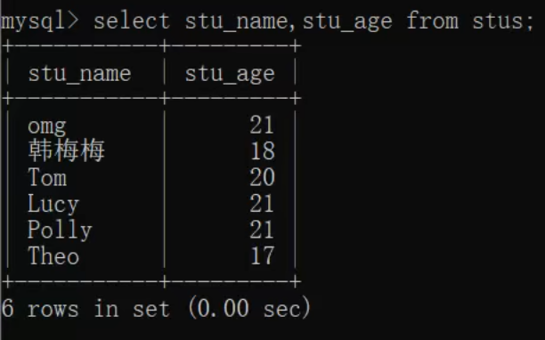  

#### 计算列（）

==对从数据表中查询的记录的列进行⼀定的运算之后显示出来==

 

#### as 字段取别名

==我们可以为查询结果的列名取⼀个语义性更强的别名 (如下案例中as 关键字也可以省略)==

.

.

#### distinct 消除重复行

从查询的结果中将重复的记录消除 distinct

  

## 排序-order by

### 作用

> 将查询到的满⾜条件的记录按照指定的列的值升序/降序排列（默认按照主键顺序排列）

### 语法

```mysql
select * from tableName where conditions order by columnName asc|desc;
```

- order by columnName     表示将查询结果按照指定的列排序

- - asc 按照指定的列升序（默认）
  - desc 按照指定的列降序
  - 多字段排序，先满足第一个排序规则

## 聚合函数

==SQL中提供了一些可以对查询的记录的列进行计算的函数==

### count

==统计函数==

.

### max

==计算最⼤值，查询满⾜条件的记录中指定列的最⼤值==

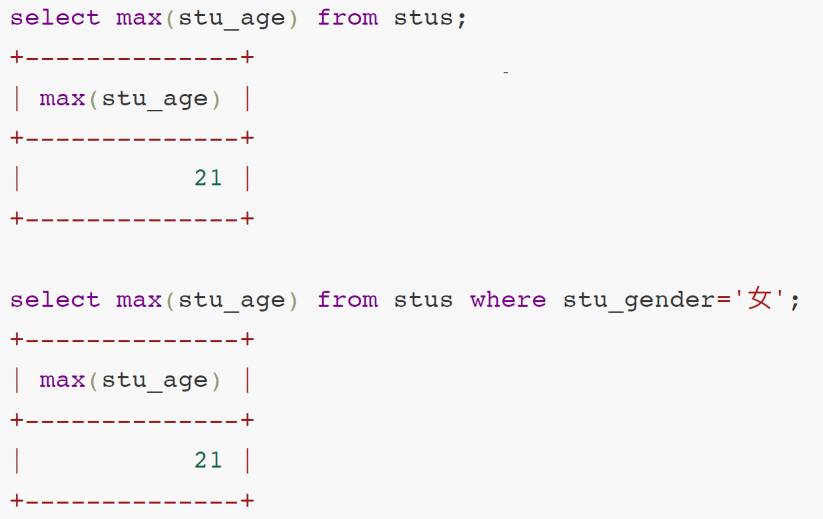.

### min

==计算最⼩值，查询满⾜条件的记录中指定列的最⼩值==

### sum

==计算和，查询满⾜条件的记录中 指定的列的值的总和==

### avg

==求平均值，查询满⾜条件的记录中 计算指定列的平均值==

## 日期函数

### 日期函数

> 当我们向⽇期类型的列添加数据时，可以通过字符串类型赋值（字符串的格式必须为yyyy-MM-dd hh:mm:ss）
>
> 如果我们想要获取当前系统时间添加到⽇期类型的列，可以使用**`now()`** 或者 **`sysdate()`**

.

### 通过now和sysdate获取当前系统时间

.

## 字符串函数

### 作用

==就是通过SQL指令对字符串进行处理==

### 示例

#### concat(colnum1,colunm2,...)

拼接多列

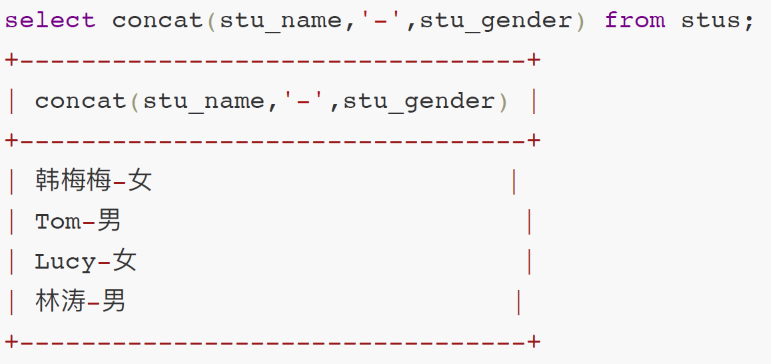.

#### upper(column)

将字段的值转换成大写

.

#### lower(column)

将指定列的值转换成⼩写

#### substring(column,start,len)

```mysql
从指定列中截取部分显示 start从1开始
mysql> select stu_name,substring(stu_tel,8,4) from stus; # 索引从1开始,从第八位开始，截取4位
```

.

.

## 分组查询-group by

==分组：就是将数据表中的记录按照指定的类进行分组==

### 语法

```mysql
select 分组字段/聚合函数 from 表名 [where 条件] group by 分组列名 [having 条件] [order by 排序字段]
select 分组字段/聚合函数
from 表名
[where 条件]
group by 分组列名 [having 条件]
[order by 排序字段]
```

- select 后使用`*`显示对查询的结果进行分组之后，显示每组的第⼀条记录（这种显示通常是⽆意义的）
- select 后通常显示分组字段和聚合函数(对分组后的数据进行统计、求和、平均值等)
- 语句执行顺序：
  1. 先根据where条件从数据库查询记录
  2. group  by对查询记录进行分组
  3. 执行having对分组后的数据进行筛选

### 示例

.

.

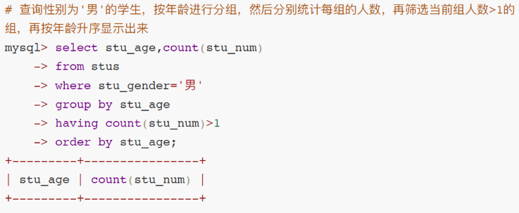.

.

## 分页查询-limit

### 分页查询-limit

==当数据表中的记录⽐较多的时候，如果⼀次性全部查询出来显示给用户，用户的可读性/体验性就不太好，因此我们可以将这些数据分页进行展示。==

### 语法

```mysql
select ...
from ...
where ...
limit param1,param2
```

- param1 int ,     表示获取查询语句的结果中的第⼀条数据的索引（索引从0开始）
- param2 int,     表示获取的查询记录的条数（如果剩下的数据条数<param2，则返回剩下的所有记录）

### 示例

对数据表中的学⽣信息进行分⻚显示，总共有10条数据，我们每页显示3条

总记录数: count 10

每⻚显示: pageSize 3

总⻚数：pageCount = count%pageSize==0 ? count/pageSize : count/pageSize +1;  //三元运算符

#### # 查询第一页： 

.

#### # 查询第二页：

.

### 分页查询中通用表达式

\# pageNum表示查询的⻚码

\# pageSize表示每⻚显示的条数

```mysql
select * from <tableName> [where ...] limit (pageNum-1)*pageSize,pageSize;
```

# 关联关系

## 介绍

==MySQL是⼀个关系型数据库，不仅可以存储数据，还可以维护数据与数据之间的关系一 一通过在数据表中添加字段建⽴外键约束==

 

## 四种关联关系

- 一对一关联
- 一对多关联
- 多对一关联
- 多对多关联

## 一对一关联

### 举例

- 人 -- 身份证
- 学生 -- 学籍
- 用户 -- 用户详情

### 方案一

==主键关联——两张数据表中主键相同的数据为相互对应的数据==

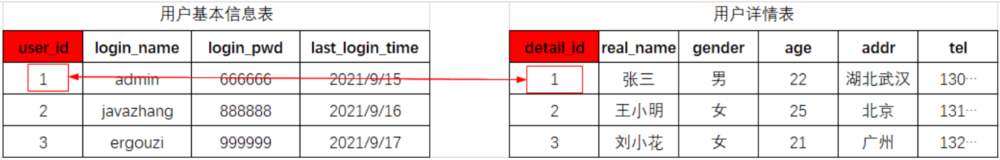

### 方案2

==唯⼀外键—— 在任意⼀张表中添加⼀个字段添加外键约束与另⼀张表主键关联，并且将外键列添加唯⼀约束==


## 一对多，多对一

### 案例

- 班级 -- 学生（一对多） 
- 学生 -- 班级（多对一）

### 方案

==在多的⼀端添加外键 ，与⼀的⼀端主键进行关联==


## 多对多关联

学生--课程 `一个课程可以有多个学生，一个学生可以选多门课`

### 方案

> 额外创建一张关系表来维护多对多关联
>
> ==在关系表中定义两个外键，分别于两个数据表的主键进行关联==


## 外键约束

> 将一个列添加外键约束，与另一张表的主键（或唯一列）进行关联之后，**这个外键约束的列添加的数据必须要在关联的主键字段中存在**

### 案例：学生表 与 班级表 

**1.先创建班级表**

```mysql
create table classes(
 class_id int primary key auto_increment,
 class_name varchar(40) not null unique,
 class_remark varchar(200)
);
```

**2.创建学生表（在学生表中添加外键与班级表的主键进行关联**）

```mysql
# 方式一 创建表的时候，定义cid字段，并添加外键约束
create table students(
 stu_num char(8) primary key,
 stu_name varchar(20) not null,
 stu_gender char(2) not null,
 stu_age int not null,
 cid int,
 constraint FK_STUDENTS_CLASSES foreign key(cid) // constraint FK_STUDENTS_CLASSES 创建一个名为FK_STUDENTS_CLASSES的约束
 references classes(class_id) // foreign key(cid)设置cid列为外键 references classes(class_id)与classes表中的class_id字段关联
); 
# 方式二 创建表的时候，定义cid字段，并添加外键约束
alter table students add constraint FK_STUDENTS_CLASSES foreign key(cid) references classes(class_id)
# 删除外键约束
alter table students drop foreign key FK_STUDENTS_CLASSES; 
```

**3.向班级表添加数据**

```mysql
insert into classes(class_name,class_remark)
values('Java2104','...');
insert into classes(class_name,class_remark)
values('Java2105','...');
insert into classes(class_name,class_remark)
values('Java2106','...');
insert into classes(class_name,class_remark)
values('Python2106','...');
select * from classes;
+----------+------------+--------------+
| class_id | class_name | class_remark |
+----------+------------+--------------+
| 1 	   | Java2104   | ...		   |
| 2 	   | Java2105   | ... 		   |
| 3 	   | Java2106   | ... 		   |
| 4 	   | Python2106 | ... 		   |
+----------+------------+--------------+
```

**4.向学生表中添加数据**

```mysql
insert into students(stu_num,stu_name,stu_gender,stu_age,cid)
values('20210102','李斯','⼥',20, 4 );
# 添加学⽣时，设置给cid外键列的值必须在其关联的主表classes的classs_id列存在
insert into students(stu_num,stu_name,stu_gender,stu_age,cid)
values('20210103','王五','男',20, 6 ); 
```

### 外键约束-级联

> 当一个表中的某条记录被关联到另一张表的信息时，不能对该表的这条记录进行修改和删除，例如：
>
> 当学⽣表中存在学⽣信息关联班级表的某条记录时，就不能对班级表的这条记录进行修改ID和删除操作

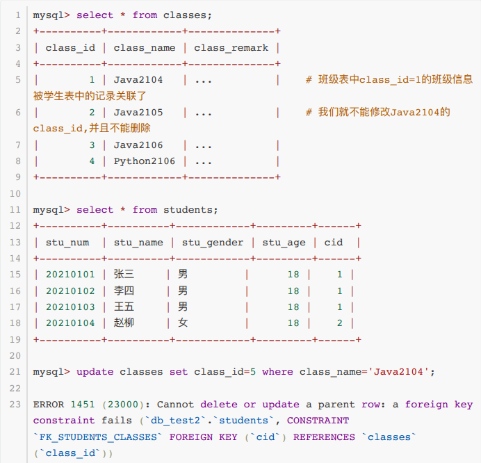 

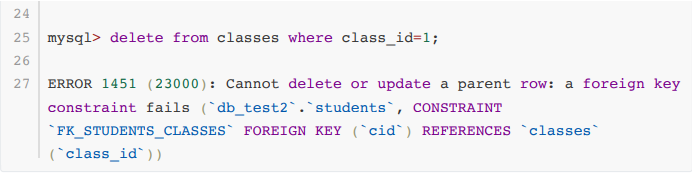 

如果一定要修改

- 将引用Java2104班级id的学⽣记录中的cid修改为 NULL 
- 在修改班级信息表中Java2104记录的 class_id
- 将学⽣表中cid设置为NULL的记录的cid重新修改为 Java2104这个班级的新的id

 

#### 级联操作

**1. 在添加外键时，设置级联修改 和 级联删除**

```mysql
# 添加外键，并设置级联修改和级联删除
alter table students add constraint FK_STUDENTS_CLASSES foreign
key(cid) references classes(class_id) ON UPDATE CASCADE ON DELETE CASCADE
```

**2. 测试级联修改**

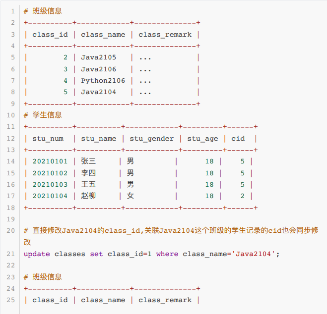 

**3. 测试级联删除**

 

# 连接查询

> 需要从多张表中查询数据
>
> 在MySQL中可以使用join实现多表的联合查询 -- 连接查询
>
> - inner join 内连接
> - left join 左连接
> - right join 右连接

## 数据准备

```sql
select * from classes;
+----------+------------+--------------+
| class_id | class_name | class_remark |
+----------+------------+--------------+
|        1 | Java2104   | ...          |  // 包含三个学生信息
|        2 | Java2105   | ...          |  // 包含两个学生信息
|        3 | Java2106   | ...          |  // 没有对应的学生信息
|        4 | Python2105 | ...          |
+----------+------------+--------------+
select * from students;
+----------+----------+------------+---------+------+
| stu_num  | stu_name | stu_gender | stu_age | cid  |
+----------+----------+------------+---------+------+
| 20210101 | 张三     | 男         |      20 |    1 |  // 张三、李四属于班级1
| 20210102 | 李四     | 女         |      20 |    1 |
| 20210103 | 王五     | 男         |      20 |    1 |  
| 20210104 | 赵柳     | 女         |      20 |    2 |  // 赵柳、孙七属于班级2
| 20210105 | 孙七     | 男         |      20 |    2 |
| 20210106 | 小红     | 女         |      20 | NULL |  //小明、小红没有设置班级信息
| 20210107 | 小明     | 男         |      20 | NULL |
+----------+----------+------------+---------+------+
```

## 内连接 inner join

### 语法

```sql
select ... from tableName inner join tableNamer2;
```

### 笛卡尔积

- 笛卡尔积（A集合&B集合）：使用A中的每个记录⼀次关联B中每个记录，笛卡尔积的总数=A总数*B总数

### 实例

 

### 内连接条件

> 笛卡尔积中很多数据无意义，需要筛选出有意义的数据  -- 添加两张表进行连接查询时的条件
>
> 只获取两张表中匹配条件成立的数据

#### 使用where 连接过滤条件

```sql
SELECT * FROM students INNER JOIN classes WHERE students.cid = classes.class_id; // 先生成笛卡尔积，再过滤数据，效率较低
```

#### 使用on 连接过滤条件

```sql
SELECT * FROM students INNER JOIN classes ON students.cid = classes.class_id; // 先判断连接条件是否成立，再组合生成记录
```

## 左连接

> 显示左表中的所有数据，如果在有右表中存在与左表记录满⾜匹配条件的数据，则进行匹配；如果右表中不存在匹配数据，则显示为Null

### 案例

> 需求：查询出所有的学⽣信息，如果学⽣有对应的班级信息，则将对应的班级信息也查询出来

```sql
SELECT * FROM students LEFT JOIN classes ON students.cid = classes.class_id;
```

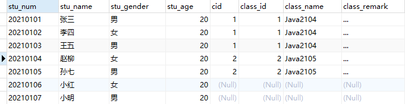  

## 右连接

>显示右表中的所有数据，如果在有左表中存在与右表记录满⾜匹配条件的数据，则进行匹配；如果左表中不存在匹配数据，则显示为Null

### 案例

```sql
SELECT * FROM students RIGHT JOIN classes ON students.cid = classes.class_id;
```

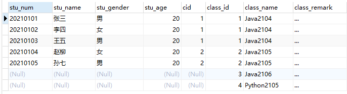 

# 子查询

> 嵌套查询-第一次查询的结果作为第二次查询的源

## 案例1

```sql
// 查询班级名称为‘Java2104’班级中的学生信息 单行单列（子查询返回单个值）
SELECT * FROM students WHERE cid = (SELECT class_id FROM classes WHERE class_name='Java2104')
```

## 案例2

```sql
// 查询所有Java班级中的学生信息 多行单列（子查询返回多个值）
SELECT * FROM students WHERE students.cid IN (SELECT class_id FROM classes WHERE class_name LIKE 'Java%');

```

## 案例3

```sql
-- 查询cid=1的班级中性别为男的学生信息 多行多列（子查询返回多个值）
SELECT * FROM (SELECT * FROM students WHERE cid=1) t WHERE t.stu_gender='男'; -- t作为虚拟表的别名，虚拟表必须要有别名
```

# 存储过程 

## 存储过程介绍

### SQL指令执行过程

 

### 存储过程

> 将能过完成特定功能的SQL指令进行封装，编译之后存储在数据库服务器上，并且为之取一个名字
>
> 当客户端需要执行这个功能时，直接通过这个名字完成调用


## 创建存储过程 procedure

### 语法

```mysql
-- 存储过程有输入参数和输出参数
CREATE PROCEDURE <proc_name> ([IN/OUT]) -- IN为输入参数，OUT为输出参数 参数后面需指定数据类型
BEGIN
	SET c = a + b;
END
```

### 示例

```mysql
-- 使用存储过程实现一个加法运算
CREATE PROCEDURE proc_test1 ( IN a INT, IN b INT, OUT c INT ) 
BEGIN
	SET c = a + b;
END;
```

## 调用存储过程

```mysql
-- 输出参数的值需为一个变量
-- 定义变量
set @m=0;
-- 调用存储过程
call proc_test1(3,2,@m);
-- 显示变量值
SELECT @m FROM DUAL;
```

## 存储过程中变量的使用

> 存储过程中的变量分为两种：局部变量和用户变量

### 局部变量

`定义在存储过程中的变量，只能在存储过程内部使用，要定义在存储过程中，而且必须定义在存储过程开始的位置`

#### 定义语法

```mysql
declare <attr_name> <type> [defult value];
```

#### 示例

```mysql
CREATE PROCEDURE proc_test2 ( IN a INT, OUT c INT ) 
BEGIN
	DECLARE x INT DEFAULT 0;  -- 定义局部变量 x int类型 默认值为0
	DECLARE y INT DEFAULT 1;
	SET x = a*a;
	SET y = a/2;
	SET r = x+y;
END;
```

 

### 用户变量

> 用户变量相当于全局变量，定义的用户变量可以通过`SELECT @attrName FROM DUAL`进行查询
>
> 用户变量会存储在MySQL数据库的数据字典中（dual），用户变量定义使用set关键字定义，变量名要以@开头

### 变量的使用

使用`INTO`关键字将查询结果赋值给变量

#### 示例

```mysql
SET @n=1;
CREATE PROCEDURE proc_test3 (OUT c INT ) 
BEGIN
	SELECT COUNT(stu_num) INTO c FROM students;
END;
CALL proc_test3(@n);
SELECT @n FROM DUAL;
```

 

#### 注意事项

- 在开发过程中尽量少使用用户变量，用户变量过多会导致程序不易理解，难以维护

## 存储过程参数

> 存储过程参数有：IN \ OUT \ INOUT

### IN 输入参数

在调用存储过程中传递数据给存储过程的参数（在调用过程必须具有实际值的`变量`或者`常量`

#### 示例

```sql
CREATE PROCEDURE `proc_test4`(IN snum CHAR(8),IN sname VARCHAR(20),IN gender CHAR(2),IN age INT,IN cid INT,IN remark VARCHAR(255))
BEGIN
	INSERT INTO students(stu_num,stu_name,stu_gender,stu_age,cid,remark)
	VALUES(snum,sname,gender,age,cid,remark);
END 	
CALL proc_test4('20210108','小丽','女',20,1,'aaa')
```

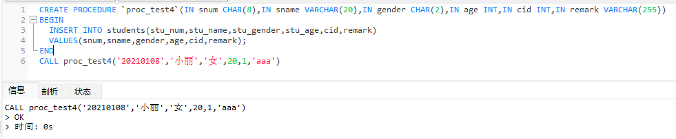 

### OUT输出参数

将存储过程中产生的数据返回给过程调用者，相当于函数的返回值，但一个存储过程中可以有多个输出参数

#### 示例

```mysql
-- 根据学号查询学生姓名
CREATE PROCEDURE `proc_test5`(IN snum CHAR(8),out sname VARCHAR(20))
BEGIN
	SELECT stu_name INTO sname FROM students WHERE stu_num = snum;
END;
SET @name = '';
CALL proc_test5('20210104',@name);
SELECT @name FROM DUAL;
```

 

### INOUT输入输出参数

#### 示例

```mysql
-- 根据学号查询学生姓名
CREATE PROCEDURE `proc_test6`(INOUT str VARCHAR(20))
BEGIN
	SELECT stu_name INTO str FROM students WHERE stu_num = str;
END;
SET @name = '20210104';
CALL proc_test6(@name);
SELECT @name FROM DUAL;
```

 

## 存储过程中流程控制语句

### 分支语句

#### if then-else

##### 单分支

```mysql
IF 条件 THEN  -- 如果条件成立则执行SQL语句
	-- SQL语句
END IF;
```

###### 案例

```mysql
SELECT * FROM classes;
CREATE PROCEDURE proc_test7 ( IN a INT ) 
BEGIN
	IF a = 1 THEN
		INSERT INTO classes(class_name,class_remark) VALUES('Java2109','test');
	END IF;
END;
CALL proc_test7(1);
SELECT * FROM classes;
```

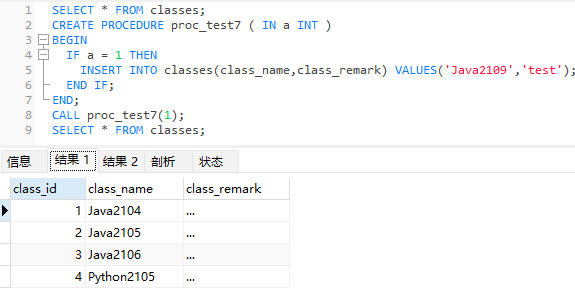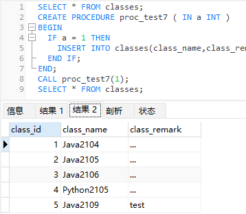

##### 双分支

```mysql
IF 条件 THEN  	-- 如果条件成立则执行SQL语句1
	-- SQL语句1
ELSE			-- 如果条件不成立则执行SQL语句2
	-- SQL语句2
END IF;
```

###### 案例

```mysql
-- 创建一个存储过程，如果参数输入的是1则添加一条班级信息，否则添加一条学生信息
CREATE PROCEDURE proc_test7 ( IN a INT ) 
BEGIN
	IF a = 1 THEN
		INSERT INTO classes(class_name,class_remark) VALUES('Java2109','test');
	ELSE
		INSERT INTO students(stu_num,stu_name,stu_gender,stu_age,remark) VALUES('20210110','小花','女',19,1,'...');
	END IF;
END;
CALL proc_test7(1);
```

##### 多分支

```mysql
IF 条件1 THEN  	-- 如果条件1成立则执行SQL语句1
	-- SQL语句1
ELSEIF 条件2 THEN	-- 如果条件2成立则执行SQL语句2
	-- SQL语句2
ELSE			  -- 如果条件1、2都不成立则执行SQL语句3
	-- SQL语句3
END IF;
```

###### 案例

```mysql
-- 如果参数输入的是1则添加一条班级信息，输入的参数是2则添加一条学生信息，输入的参数不是1也不是2则张三的remark = '...'
CREATE PROCEDURE proc_test7 ( IN a INT ) 
BEGIN
	IF a = 1 THEN
		INSERT INTO classes(class_name,class_remark) VALUES('Java2109','test');
	ELSEIF a=2 THEN
		INSERT INTO students(stu_num,stu_name,stu_gender,stu_age,cid,remark) VALUES('20210110','小花','女',19,1,'...');
	ELSE
		UPDATE students SET students.remark='...' WHERE stu_name='张三';
	END IF;
END;
CALL proc_test7(3);
```

####  case

##### 语法

```mysql
CREATE PROCEDURE proc_test8 ( IN a INT )
BEGIN
	CASE a
	WHEN 1 THEN
		-- SQL1
	WHEN 2 THEN
		-- SQL2
				.
				.
				.
				.
	ELSE
		-- SQLn  如果变量的值和所有when的值都不匹配，则执行else
END CASE;
END;
```

### 循环语句

#### while

##### 语法

```mysql
CREATE PROCEDURE proc_test9(IN num int)
BEGIN
	DECLARE i INT;
	SET i = 0;
	WHILE i<num DO -- 当i<num时重复执行SQL语句
		-- SQL
		SET i = i+1; -- 每循环一次i+1
	END WHILE;
END;
```

#### repeate

##### 语法

```mysql
CREATE PROCEDURE proc_test10 ( IN num INT ) BEGIN
	DECLARE i INT;
	SET i = 0;
	REPEAT
		-- SQL
		UNTIL i > num  -- 重复SQL语句知道i>numwei
	END REPEAT;
END;
```

#### loop

##### 语法

```mysql
CREATE PROCEDURE proc_test11(IN num INT)
BEGIN
	DECLARE i INT;
	SET i = 1;
	myloop:loop
		-- SQL
		IF i=num THEN
			LEAVE myloop;
		END IF;
	END loop;
end;
```

## 存储过程管理

### 查询存储过程

> 存储过程时术语当前数据库中，存储过程只能在当前数据库调用

#### 查询语法 show

```mysql
SHOW PROCEDURE STATUS [where db='<databasename>']; -- 根据数据库名查询数据库中的存储过程
show create procedure <databasename>.<procedurename>; -- 查询存储过程的创建语句
```

### 修改存储过程

> 修改存储过程指的是修改存储过程特征/特性

#### 修改语法 alter

```mysql
ALTER PROCEDURE <proc_test1> 特征1 [特征2 特征3 …………] -- 修改多个特征时特征之间用空格隔开
```

##### 存储过程的特征参数

- `CONTAINS SQL` 表示子程序包含 SQL 语句，但不包含读或写数据的语句
- `NO SQL` 表示子程序中不包含 SQL 语句
- `READS SQL DATA` 表示子程序中包含读数据的语句
- `MODIFIES SQL DATA` 表示子程序中包含写数据的语句
- `SQL SECURITY { DEFINER |INVOKER }` 指明谁有权限来执行
  - `DEFINER` 表示只有定义者自己·才能够执行
  - `INVOKER` 表示调用者可以执行
- `COMMENT 'string'` 表示注释信息

### 删除存储过程

> 删除数据库中的对象 数据库、数据表、列、存储过程、试图、触发器、索引……

##### 删除语法 drop

```mysql
 drop procedure <procedurename>
```

## 存储过程案例

### 数据准备

```mysql
-- 创建图书信息表
CREATE TABLE books(
	book_id INT PRIMARY KEY auto_increment,
	book_name VARCHAR(50) NOT NULL,
	book_author VARCHAR(20) NOT NULL,
	book_price DECIMAL(10,2) NOT NULL,
	book_stock INT NOT NULL,  -- 库存
	book_desc varchar(200)
);

-- 添加图书信息
INSERT INTO books(book_name,book_author,book_price,book_stock,book_desc)
VALUES('Java程序设计','亮亮',38.80,12,'亮亮老师带你学Java');
INSERT INTO books(book_name,book_author,book_price,book_stock,book_desc)
VALUES('Java王者之路','威哥',44.40,9,'威哥，Java王者领路人');

-- 创建学生信息表
CREATE TABLE students(
	stu_num char(8) PRIMARY KEY,
	stu_name VARCHAR(20) NOT NULL,
	stu_gender CHAR(2) NOT NULL,
	stu_age INT NOT NULL
);

-- 添加学生信息
INSERT INTO students(stu_num,stu_name,stu_gender,stu_age) VALUES('1001','张三','男',20);
INSERT INTO students(stu_num,stu_name,stu_gender,stu_age) VALUES('1002','李四','女',20);
INSERT INTO students(stu_num,stu_name,stu_gender,stu_age) VALUES('1003','王五','男',20);

-- 创建ji's's记录表
CREATE TABLE records(
	rid INT PRIMARY KEY auto_increment,
	snum CHAR(4) NOT NULL,
	bid INT NOT NULL,
	borrow_num INT NOT NULL,
	is_return INT NOT NULL, -- 0表示未归还，1表示已归还
	borrow_date date NOT NULL,
	CONSTRAINT FK_RECORDS_STUDENTS FOREIGN KEY(snum) REFERENCES students(stu_num),
	CONSTRAINT FK_RECORDS_BOOKS FOREIGN KEY(bid) REFERENCES books(book_id)
);
```

### 创建存储过程

> 那个学生借了哪本书，借了多少本
>
> 操作：
>
> - 保存借书记录
> - 修改图书库
>
> 条件：
>
> - 判断学生是否存在
> - 判断图书是否存在

#### 实现借书业务

```mysql
-- 创建存储过程
-- 实现结束过程
CREATE PROCEDURE proc_borrow_book(IN a CHAR(4),IN b INT,IN m INT,OUT b_state INT) -- a:学号，b:图书编号，m:借书数量，state:借书状态（-- 1借书成功，2学号不存在，3图书不存在，4库存不足）
BEGIN
	DECLARE stu_count INT DEFAULT 0;
	DECLARE book_count INT DEFAULT 0;
	DECLARE stock INT DEFAULT 0;
	-- 判断学号是否存在：根据参数a到学生信息表查询是否有stu_num=a的记录
	SELECT COUNT(stu_num) INTO stu_count FROM students WHERE stu_num=a;
	IF stu_count>0 THEN
		-- 学号存在
		-- 判断图书ID是否存在
		SELECT COUNT(book_id) INTO book_count FROM books WHERE book_id=b;
		IF book_count>0 THEN
			-- 图书存在
			-- 判断库存是否充足
			SELECT book_stock INTO stock from books WHERE book_id=b;
			IF stock>=m THEN
				-- 库存充足
				-- 执行借书
				-- 在借书记录表中添加记录
				INSERT INTO records(snum,bid,borrow_num,is_return,borrow_date) VALUES(a,b,m,0,SYSDATE());
				-- 修改图书库存
				UPDATE books SET book_stock = stock-m WHERE book_id=b;
				-- 借书成功
				SET b_state=1;
			ELSE
				-- 库存不足
				SET b_state=4;
			END IF;
		ELSE
			-- 图书不存在
			SET b_state=3;
		END IF;
	else
		-- 学号不存在
		SET b_state =2;
	END IF;
END;
```

#### 实现还书业务

```mysql
-- 创建存储过程实现还书业务
CREATE PROCEDURE proc_return_book(IN a CHAR(4),IN b INT,IN m INT,OUT r_state INT) -- a:学号，b:图书编号，m:借书数量，state:借书状态（-- 1借书成功，2学号不存在，3图书不存在，4库存不足，5已归还）
BEGIN
	DECLARE stu_count INT DEFAULT 0;
	DECLARE book_count INT DEFAULT 0;
	DECLARE stock INT DEFAULT 0;
	DECLARE re INT;
	-- 判断学生是否有借书：根据参数a到借书记录表查询是否有snum=a的记录
	SELECT COUNT(snum) INTO stu_count FROM records WHERE snum=a;
	IF stu_count>0 THEN
		-- 学号存在
		-- 判断图书ID是否存在
		SELECT COUNT(bid) INTO book_count FROM records WHERE bid=b;
		IF book_count>0 THEN
			-- 图书存在
			-- 判断图书是否已归还
			SELECT is_return INTO re FROM records WHERE snum=a AND bid=b;
			IF re=0 THEN
				-- 判断还书数量是否充足
				SELECT borrow_num INTO stock from records WHERE bid=b;
				IF stock=m THEN
					-- 还书数量充足
					-- 执行还书
					-- 在借书记录表中添加记录
					UPDATE records SET is_return=1 WHERE snum=a AND bid=b;
					-- 修改图书库存
					UPDATE books SET book_stock = book_stock+m WHERE book_id=b;
					-- 还书成功
					SET r_state=1;
				ELSE
					-- 库存不足
					SET r_state=4;
				END IF;
			ELSE
				SET r_state=5;
			END IF;
		ELSE
			-- 图书不存在
			SET r_state=3;
		END IF;
	else
		-- 学号不存在
		SET r_state =2;
	END IF;
END;
```

## 游标

> 用于依次取出查询结果集中的每一条数据--逐条读取结果集中的记录

### 游标的使用

#### 声明游标

##### 语法

```mysql
DECLARE cursor_nanme CURSOR FOR select_statement; -- cursor_nanme游标名字，select_statement查询语句
```

##### 示例

```mysql
declare mycursor cursor for select book_name,book_author,book_price from books;
```

#### 打开游标

##### 语法

```mysql
open cursor_nanme;
```

#### 使用游标（结合循环语句）

##### 示例

```mysql
CREATE PROCEDURE proc_test1(OUT result VARCHAR(200))
BEGIN
	DECLARE bname VARCHAR(20);
	DECLARE bauthor VARCHAR(20);
	DECLARE bprice DECIMAL(10,2);
	DECLARE num INT;
	DECLARE i INT;
	DECLARE str VARCHAR(50);
	-- 此查询语句执行之后返回的是一个结果集（多条记录），使用游标可以来遍历查询结果集
	DECLARE mycursor CURSOR FOR SELECT book_name,book_author,book_price FROM books;  -- 声明游标
	SELECT  COUNT(1) INTO num FROM books;  -- 统计books表中的记录数
	OPEN mycursor;  -- 打开游标
	SET i=0;
	WHILE i<num DO
		FETCH mycursor INTO bname,bauthor,bprice; -- 使用FETCH提取游标当前指向的记录（提取之后，游标自动下移）
		SET i = i+1;
		SET str=CONCAT_WS('~',bname,bauthor,bprice);
		SET result = CONCAT_WS(',',result,str);
	END WHILE;
	CLOSE mycursor; -- 关闭游标
END;
```

#### 关闭游标

##### 语法

```mysql
CLOSE cursor_name
```

# 触发器

> 触发器是一种特殊的存储过程，能够完成特定功能、存储在数据库服务器上的SQL片段，但是触发器无需调用。
>
> 当对数据表中的数据执行DML操作时自动触发这个SQL片段的执行，无需手动调用
>
> 在MySQL中，只有执行insert\delete\update操作才能触发触发器的执行

**示例**

```mysql
-- 学生信息操作日志表
create table stulogs(
	id int primary key auto_increment,
	time TIMESTAMP,
	log_text varchar(200)
);
-- 当向students表中添加学生信息时，同时要在 stulogs表中添加一条操作日志
insert into students(stu_num,stu_name,stu_gender,stu_age)
values('1004','夏利','女',20);
-- 手动进行记录日志
insert into stulogs(time,log_text) values(now(),'添加1004学生信息');
```

## 触发器的使用

### 创建触发器

#### 语法

```mysql
create trigger tri_name
<before|after>			-- 定义触发时机
<insert|delete|update>	-- 定义DML类型
on <table_name>
[FOR EACH ROW]			-- 声明为行级触发器（只要操作一条记录就触发触发器执行一次）
[begin]
	SQL语句	-- 当SQL语句只有一句时，可以省略begin、end
[end;]
```

#### 示例

```mysql
-- 创建触发器，当students表发生添加操作时，则向stulogs表中添加一条日志
CREATE TRIGGER tri_test1
AFTER INSERT ON students
FOR EACH ROW
INSERT INTO stulogs(time,log_text) VALUES(NOW(),CONCAT('添加',NEW.stu_num,'学生信息'));
```

### 查看触发器

#### **语法**

```mysql
show triggers;
```

### 删除触发器

#### 语法

```mysql
drop trigger <tri_name>;
```

## NEW与OLD

>触发器用于监听数据表中数据的insert、delete、update操作，触发器通常处理DML的关联操作；
>
>可以通过`NEW`与`OLD`关键字在触发器中获取触发这个触发器的DML操作的数据

- NEW: 在触发器中用于获取insert操作中添加的数据，update操作修改后的记录
- OLD:  在触发器中用于获取delete操作删除前的数据、update操作修改前的记录

## 触发器使用总结

### 优点

- 触发器时自动执行的
- 触发器可以实现表中数据的级联操作（关联操作），有利于保证数据的完整性；
- 触发器可以对DML操作的数据进行给更为复杂的合法性校验；

### 缺点

- 使用触发器实现的业务逻辑如果出现问题将难于定位，后期维护困难
- 大量使用触发器容易导致代码结构杂乱，增加程序的复杂性
- 当触发器操作的数据量较大时，执行效率大大降低

**使用建议**：

- 在互联网项目中因避免使用触发器
- 对于并发量不⼤的项⽬可以选择使用存储过程，但是在互联⽹引用中不提倡使用存储过程
- 原因：存储过程时将实现业务的逻辑交给数据库处理，⼀则增减了数据库的负载，⼆则不利于数据库的迁移）

# 视图

>由数据库中一张表或者多张表根据特定的条件查询出的数据构造成的`虚拟表`

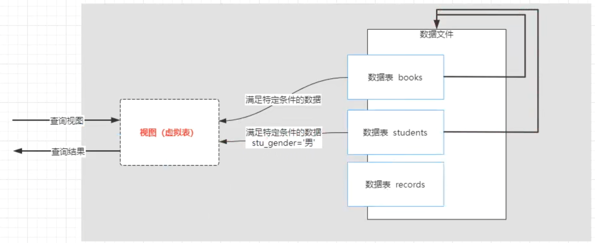 

## 作用

- 安全性：如果我们直接将数据表授权给用户操作，那么用户可以CRUD数据表中所有数据，加⼊我们想要对数据表中的部分数据进行保护，可以将公开的数据⽣成视图，授权用户访问视图；用户通过查询视图可以获取数据表中公开的数据，从⽽达到将数据表中的部分数据对用户隐藏。
- 简单性：如果我们需要查询的数据来源于多张数据表，可以使用多表连接查询来实现；我们通过视图将这些连表查询的结果对用户开放，用户则可以直接通过查询视图获取多表数据，操作更便捷。

## 创建视图

### 语法

```mysql
CREATE VIEW view_name 
AS
select_statement -- 查询语句
```

#### 示例

```mysql
-- 创建视图实例1：将学生表中性别为男的学生生成一个视图
CREATE VIEW view_test1
AS
SELECT * FROM students WHERE stu_gender='男';
-- 查询视图
SELECT * FROM view_test1;

-- 创建视图实例2：将学生表中性别为男的学生生成一个视图
```

## 视图数据的特性

> 视图是`虚拟表`，查询视图的数据是来源于数据表的。

**查询操作**：如果在数据表中添加新的数据，而且这个数据满足创建视图时查询语句的条件，通过查询视图也可以查询出新增的数据，当删除原表中满足查询条件的数据时，也会从视图中删除。

**添加操作**：如果在视图中添加数据，数据会被添加到原数据表

**删除操作**：如果在视图中删除数据，原数据表中的数据也会被删除

**修改操作**：如果通过视图中删除数据，原数据表中的数据也会被修改

**注意**：对复杂查询简化操作，并且不会对数据进行修改的情况下才使用视图，多表查询的视图不允许对视图进行添加、修改、删除操作

## 视图操作

### 查询视图结构

```mysql
desc vivew_name;
```

### 修改视图结构

```mysql
-- 方式一
CREATE OR REPLACE VIEW view_name
AS
select_statement; -- 查询语句
-- 方式二
ALTER VIEW view_name 
AS
select_statement; -- 查询语句
```

###  删除视图

```mysql
DROP VIEW view_name;  -- 删除视图时不会影响原数据表
```

# 索引

> 在互联网应用中可以通过索引提高数据库的查询效率，索引将数据表中某一列/某几列的值取出来构成便于查找的结构进行存储，生成数据表的`目录`
>
> 简单理解：索引就是数据表的目录

##  数据准备

```mysql
-- 创建数据表
create table tb_testindex(
   fid int primary key, -- 主键
	 sid int unique,			-- 唯一键
	 tid int,  					  -- 普通字段
	 name varchar(20),
	 remark varchar(20)
);
-- 数据准备
create procedure proc_readydata()  -- 创建五百万条数据
begin
	declare i int default 1;
	while i<=5000000 do
	    insert into tb_testindex(fid,sid,tid,name,remark) values(i,i,i,'test_name','text_remark');
			set i=i+1;
	end while;
end;
-- 调用存储过程
call proc_readydata();
```

## 索引分类

根据创建索引的列的不同，可以分为：

- 主键索引：在数据表的主键字段创建的索引
- 唯一索引：在数据表中的唯一列创建的索引(unique)，此列的所有值只能出现一次，可以为NULL
- 普通索引：在普通字段上创建的索引，没有唯一性的限制
- 组合索引：两个及以上字段的索引

**说明**：在创建数据表时，将字段声明为主键/唯一键（添加主键约束/唯一约束），会自动在主键字段创建主键/唯一索引

## 创建索引

### 唯一索引

```mysql
CREATE UNIQUE INDEX index_name ON tableName(colnumName); -- 要求：创建唯一索引的列的值不能重复
```

### 普通索引

```mysql
CREATE INDEX index_name ON tableName(colnumName);
```

### 创建组合索引

```mysql
CREATE INDEX index_name ON tableName(colnum1Name,colnum2Name ···);
```

## 全文索引

> MySQL5.6 版本新增的索引，通过次索引进行全文检索操作。因为MySQL全文检索不支持中文，因此这个全文索引不被关注，在应用开发中通常是通过搜索引擎（数据库中间件）实现全文检索

## 索引的使用

> 索引创建完成后无需调用，当根据创建索引的列尽心查询时，索引会自动使用；
>
> 组合索引也需要根据创建索引的所有字段进行查询时触发

在命令行窗口中可以查看查询语句的查询规划

```mysql
explain select * from tableName where 条件\G
```

## 索引操作

### 查看索引

```mysql
SHOW CREATE TABLE tableName\G -- 查看索引创建语句，命令行下
```

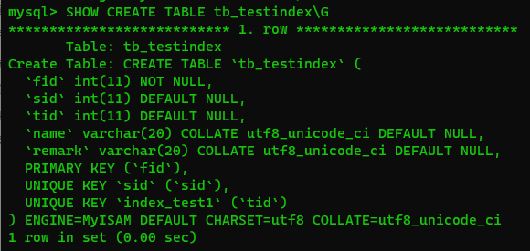 

```mysql
show indexes from tableName; -- 查看当前表下的所有索引
show keys from tableName; -- 查看当前表下的所有索引
```

### 删除索引

```mysql
drop index indexName on tableName -- 删除指定表下的指定索引
```

## 索引的注意事项

### 优点

- 降低数据库服务器在执行查询操作时扫描的速度
- 避免服务器对数据进行排序、将随机IO编程顺序IO

### 缺点

- 索引是根据数据表列的创建的，当数据表中数据发生DML操作时，索引也需要更新
- 索引文件会占用磁盘空间

### 使用规范

- 数据表中数据不多时，全表扫描可能更快
- 数据量大但是DML操作很频繁、不建议使用索引
- 不能在数据重复度高的列上创建索引（例如：性别）
- 创建索引之后，要注意查询SQL语句的编写

# 数据库事务

> 完成特定业务的多个数据库DML操作步骤为一个事务
>
> 事务就是完成同一个业务的多个DML操作语句

**案例**

```mysql
-- 借书业务
-- 操作1：在借书记录表中添加记录
INSERT INTO records(snum,bid,borrow_num,is_return,borrow_date) VALUES(a,b,m,0,SYSDATE());
-- 操作2：修改图书库存
UPDATE books SET book_stock = stock-m WHERE book_id=b;
```

## 数据库事务特性

> ACID特性

**原子性**(Atomicity)：一个事务中的多个DML操作，要么同时执行成功，要么同时执行失败（回滚）

**一致性**(Consistency)：事务执行之前和事务执行之后，数据库的数据是一致的，完整性和一致性不能被破坏

**隔离性**(Isolation)：数据库允许多个事务同时执行，多个并行的事务之间不能相互影响

**持久性**(Durability)：事务完成之后，对数据的操作时永久的

## MySQL事务管理

### 自动提交与手动提交

- 在MySQL中，默认DML指令的执行是自动提交的，当我们执行一个DML指令之后，自动同步到数据库中

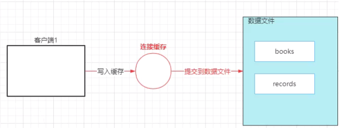 

### 开启事务

> 当开启事务时，会关闭自动提交

- 在开始事务第⼀个操作之前，执行`start transaction`开启事务
- 依次执行事务中的每个DML操作
- 如果在执行的过程中的任何位置出现异常，则执行`rollback`回滚事务
- 如果事务中所有的DML操作都执行成功，则在最后执行`commit`提交事务

```mysql
-- 借书业务
-- 【开启事务】（关闭自动提交---手动提交）
start transaction;

-- 操作1：在借书记录表中添加记录
insert into records(snum,bid,borrow_num,is_return,borrow_date) values('1007',4,2,0,sysdate());
-- select aaa;
-- 【事务回滚】（清除连接缓存中的操作,撤销当前事务已经执行的操作）
-- rollback;
-- 操作2：修改图书库存
update books set book_stock=book_stock-2 where book_id=4;
-- 【提交事务】（将连接缓存中的操作写如数据文件）
commit;
```


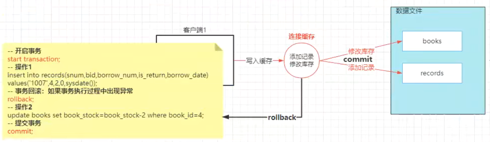

## 事务的隔离级别

> 数据库允许多个事务并行，多个事务之间是隔离的、互相独立的；
>
> 如果事物之间不互相隔离并且操作同一数据时，可能会导致数据的一致性被破坏;

**MySQL事务的隔离级别**：

1. **读未提交**（read uncommitted）：T2可以读取T1执行但未提交的数据，可能会导致出现脏读

   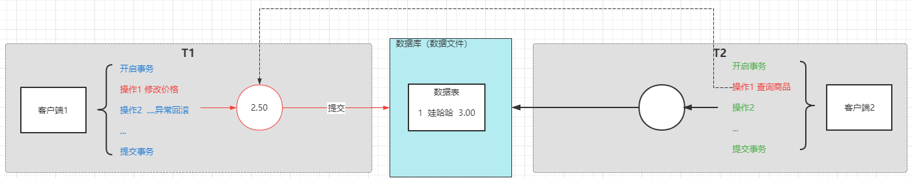

2. **读已提交**（read committed）：T2只可以读取T1已经提交的数据，可能会导致不可重复读（虚读）

   1. > T2进⾏第⼀次查询之后在第⼆次查询之前，T1修改并提交了数据，T2进⾏第⼆次查询时读取到的数据和第⼀次查询读取到数据不⼀致。

   

3. **可重复读**（repeatable read）：T2执⾏第⼀次查询之后，在事务结束之前其他事务不能修改对应的数据（但是可以新增数据），可能会导致幻读

   1. >T2对数据表中的数据进⾏修改然后查询，在查询之前T1向数据表中新增了⼀条数据，就导致T2以为修改了所有数据，但却查询出了与修改不⼀致的数据（T1事务新增的数据）

   

4. **串行化**（serializable）：同时只允许⼀个事务对数据表进⾏操作；避免了脏读、虚读、幻读问题

   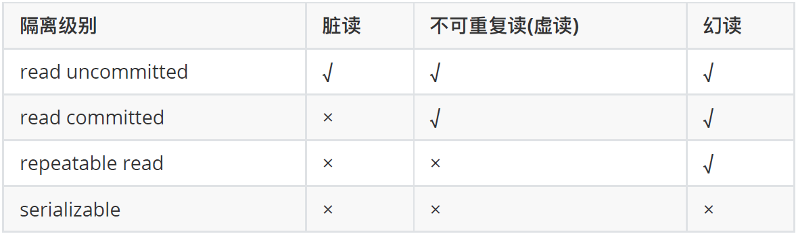
   

### 设置事务的隔离级别

> 通过设置数据空默认的事务隔离级别来控制事务之间的隔离性，也可以通过客户端与数据库连接设置来设置事务间的隔离性
>
> MySQL数据库默认的隔离级别为`可重复读`

#### 查看MySQL默认的隔离级别

```mysql
-- 在MySQL8.0.3 之前
select @@tx_isolation;

-- 在MySQL8.0.3 之后
select @@transaction_isolation;
```

#### 设置MySQL默认隔离级别

```mysql
set session transaction isolation level <read committed>;
```

