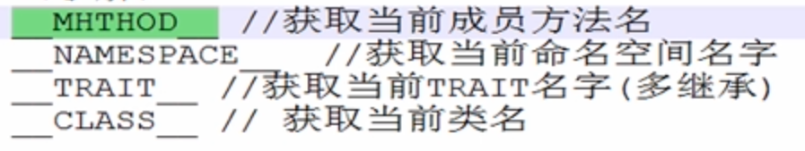
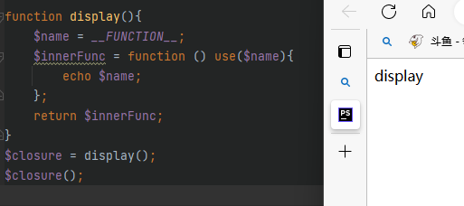
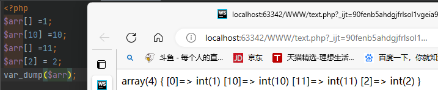

# 前导（内存）

.

# PHP简介

> PHP是运行在服务器端的HTML脚本/编程语言，用于书写动态的网页

# 网站的基本概念

## 服务器

> 能够提供服务的机器，取决于机器上所安装的软件（服务软件）

## 域名

> 是由一串用点分隔的名字组成的Internet上某一台计算机或计算机组名称

# Web程序的访问流程

## 宽泛流程

1. 浏览器发起访问
2. DNS解析域名
3. 服务器电脑
4. 服务软件

## 静态网站访问流程

.

## 动态网站访问


Apache 夹在PHP模块

# PHP基础

## 语法

==PHP是一种运行在服务器端的脚本语言，可以嵌入到HTML中==

==PHP是模块化的，需要使用什么就要开启哪个模块==

### PHP代码标记

在PHP历史发展中，可以使用多种标记来区分PHP脚本

- ASP标记：<% php 代码 %>

- 短标记：<? php代码 ?>

  - 以上两种基本弃用

- 脚本标记：<script language="php">php代码</script>

- 标准标记（常用）：

  - ```
    <?php  echo 2222;  ?>
    ```

### PHP注释

### 行注释

```
// 注释
```

### 块注释

```
/*
    注释
*/
```

## 变量

### 变量的命名方式

==PHP变量命名必须以$符开始==

```php
<?php
    $x = 1;
    $y = 2;
```

### 命名规则

- 不能以数字或特殊字符开头（下划线不是特殊字符）
- 不能含有特殊字符
- 起名要有意义，基本遵循驼峰命名方法
- 严格区分大小写
- 允许中文变量（不建议使用）

### 预定义变量

==系统提前定义的变量，存储许多需要用到的数据（预定义变量都是数组）==

- **$_GET**: 获取所有表单以 get 方式提交的数据
- **$_POST**: POST 提交的数据都会保存再次
- **$_REQUEST**: GET 和 POST提交的都会保存
- $GLOBALS: PHP 中的所有全局变量
- **$_SERVER**: 服务器信息
- **$_SEESSION**: session 会话数据
- **$_COOKIE**: cookie 会话数据
- $_ENV: 环境信息
- $_FILES: 用户上传的文件信息

### 变量函数

- 判断变量是否存在：==isset();==
- 销毁变量：==unset();==

### 可变变量

==如果一个变量保存的值刚好是另外一个变量的名字，那么可以直接通过访问一个变量的到另外一个变量的值：在变量前面多家一个$符==

```php
$a = 'b';
$b = 'bb';
exho $$a; // 输出 'bb'
```

.

### 变量传值

==定义：将一个变量传值给另一个变量==

变量传值的两种方式

- 值传递：复制变量的值，将新值给另外一个变量保存（新旧变量指针指向不同）

  - ```php
    $新变量 = $老变量
    ```

-  引用传递：将变量保存所在的内存地址，传递给另外一个变量（新旧变量指针指向相同）

  - ```php
    $新变量 = &$老变量
    ```

## 单引号和双引号

### 区别

- 单引号不解析变量，双引号解析变量

  - ```php
    $name = '张三'
    echo 'name' // 输出：name
    echo "name" // 输出：张三
    ```

- 双引号解析转译字符,单引号不解析转译  \n   \r   \t   \

- 单引号执行转译   \\ \    和     \\' 

- 字符串与变量一起时通过 . 去连接

  - ```php
    echo $name.'李四'   // 张三李四
    ```

- 双引号里面插入单引号，单引号里面插入变量，变量会解析" '$a' "

  - ```php
    $a = 'a'; echo "'$a'";  // 输出 'a'
    ```

- 单引号效率比双引号块，能用单引号尽量使用单引号

- 如果再双引号里面插入变量，请在变量后面加上 空格 或 , 号

## 数据类型

> datdatype，在PHP中值得是存储数据本身的类型，而不是变量的类型

###  标量（数值类型） scalar

- 整形 integer
  - 整数（正整数和负整数），4个字节存储数据，最大32位，最大数值为4294967295，
  
  - 在php中默认是有符号类型（区分正负数）
  
  - ```php
    //php中提供4种整形的定义方式：十进制定义、二进制定义、十六进制定义
    //php输出数值默认转换为十进制
    $a = 120; // 10 进制 110 dec
    $a = 0b110; // 2进制 6 bin
    $a = 0120; // 8进制 72 oct
    $a = 0x120; // 16 进制 272 hex
    ```
  
  - ### 进制转换
  
    - 通过进制的组合可以对不同进制进行转换，前面的进制转换为后面的进制 例如：
    - hexdec(十六进制转换为十进制)
    - decbin(十进制转二进制)
    - decoct(十进制转八进制)
    - dec2hex(十进制转十六进制)
    - bindec(二进制转十进制)
  
- 浮点型 double
  - 小数
  
  - 超过整型所能存储范围的整数（不保证精度）
  
  - ```php
    // 浮点型定义的两种方法
    $a = 1.23;
    $a = 1.23e10;  // 科学计数法，其中e表示底10，1.23*10^10
    ```
  
- 布尔型 
  - True / False
  - empty()：判断数据的值是否为“空”，不是NULL，为空则返回true
  - isset()：判断数据存储出的变量本身是否存在
  
- 字符串 str
  - 用引号引起来的都是字符串

### 混合类型

- 数组

  - ```php
    @$arr = [1,2,3,4]
    ```

- 对象

  - object

### 特殊类型

- 空
  - null
- 资源
  - resource
  - 图片、视频、网络请求等等都是资源

## 数据类型转换

### 获取数据类型

```php
gettype($arr)
```

### 自动转换

==系统根据需求判定，自己转换==

```php
$a ='abc.1.1.1';
$b = '1.1.1abc';
echo $a + $b; //算术+运算，系统先转换成数值类型（整形和浮点型），然后运算
```

### 标量转换

**强制类型转换时需注意**

==空转为整形等于 0，空转为浮点型等于浮点型的0，空转为字符串等于""(没有任何东西)==

==整形/浮点型如果后面有字符串，只会留下前面的数字==

| 原类型   | 目标类型 | 语法           |
| -------- | -------- | -------------- |
| 任意类型 | 整形     | intval($arr)   |
| 任意类型 | 浮点型   | floatval($arr) |
| 任意类型 | 字符串   | strval($arr)   |
| 任意类型 | 布尔类型 | boolval($arr)  |

### 判断数据类型常用函数

- is_数据类型（判断是否为该数据类型，返回值时布尔类型）
  - 例如：is_array();  is_string();  is_bool();is_scalar(是否为标量);
- gettype(); //获取数据类型
- var_dump(); //输出值和数据类型
- Bool类型不能使用echo来查看，可以使用var_dump()查看

## 常量

==常量(const/constant)是程序运行的时候是不可以改变的量==

### 语法

```php
//使用define函数定义
define('常量名字'，'常量的值');
//使用const关键字定义
const 常量名=常量值;
区别：访问权限的区别
```

### 注意事项

1. 不能重复定义
2. 常量的名字一般用大写字母
3. 常量的值只能是标量
4. 常量的作用域是全局的
5. 输出的时候没有$符号
6. 常量不能写到字符串中

### 判断常量是否被定义

```php
defined('常量名')  // 返回值是布尔值
```

### 系统常量

-  \__FILE__
  - 输出当前文件位置
- \__LINE__
  - 输出当前代码时第几行
- PHP_VERSION
  - 获取当前PHP版本号
- PHP_OS
  - 获取系统信息
- \__DIR__
  - 当前文件所在路径
- \__FUNCTION__
  - 获取函数名
- M_PI
  - 圆周率
-  PHP_INT_MAX
  -  php中最大的整型数值


了解即可

.

## 运算符

### 优先级


### 赋值运算符

a = b : 表示将右边的结果（可以是变量、数据、常量和其他运算出来的结果）保存到内存的某个位置，然后将内存地址赋值给左侧的变量（常量）

### 算数运算符

| 符号 | 释义      |
| ---- | --------- |
| +    | 加        |
| -    | 减        |
| *    | 乘        |
| /    | 除        |
| %    | 求模/取余 |

### 比较运算符

| 符号 | 释义                           |
| ---- | ------------------------------ |
| >    | 大于                           |
| <    | 小于                           |
| >=   | 大于等于                       |
| <=   | 小于等于                       |
| ==   | 是否相等（值是否相等）         |
| ===  | 决对等于（数据类型是否也相等） |
| !=   | 不等于                         |
| !==  | 绝不等于                       |

### 逻辑运算符

| 符号 | 释义 |
| ---- | ---- |
| &&   | 与   |
| \|\| | 或   |
| !    | 取反 |

#### 短路运算

> 如果第一个表达式的结果已经满足条件，那么就不会运行逻辑运算符后面的表达式
>
> 在书写代码时，尽量将出现概率最高的（能够直接判断出结果）的表达式放到第一位

### 链接运算符

> PHP中将多个字符串拼接的一种符号

- . ：将两个字符串连接到一起
- .= ：复合运算，将左边的内容如右边的内容连接起来，然后重新赋值给左边的变量

### 错误抑制

> 错误抑制符：@

#### 使用方法

```php
// 在有可能出错的表达式前面使用@符号
$a = 10;
$b = 0;
@($a % $b)
```

错误抑制符通常在生产环境（上线）会用到，在开发的时候不会使用：系统本身最好没有任何错误

### 三目运算

> 有三个表达式参与的运算(是一个简单的分支结构的缩写)

#### 语法

```php
//表达式1 ? 表达式2 : 表达式3;
$a = 2;
$b = $a == 2 ? true : flase;  //如果a == 2那么b=true 如果a != 2那么b=flase
// 作用：如果表达式1成立，那么执行表达式2，否则执行表达式3
//表达式1 ? (表达式2.1 ? 表达式2.2 : 表达式2.3) : (表达式3.1 ? 表达式3.2 : 表达式3.3);
```

==注意：如果表达式本身比较复杂，建议使用括号包起来，三目运算中的表达式2和3可以是另外一个三目运算==

### 自增/自减运算符

==i++自增/i--自减==

- ++：在原来的值上+1

  - ```php
    $a++; = $a = $a + 1;
    ```

  - 在PHP中，++可以放在变量前或变量后

    - 前置自操作：先改变自己，再把==改变后的值==给别人
    - 后置自操作：先把自己所保存的值留下来，然后改变自己，给别人的值是==原来的值==

- 在原来的基础上 -1

- 

#### 衍生符号：类似自操作

1. +=：左边的结果与右边的结果相加，然后赋值到左边
2. -=：左边的减去右边的结果，然后赋值给左边
3. *=：左边的乘右边的结果，然后赋值给左边
4. /=：左边的除右边的结果，然后赋值给左边
5. %=：左边的取余右边的结果，然后赋值给左边

## 位运算符

### 计算机码

> 计算机在实际存储数据的时候，采用的编码规则（二进规则）

#### 计算机码

==数值本身最左边的以为是用来充当符号位：正数为0，负数为1==

- 原码
  - 数据本身从十进制转换成二进制得到的结果
    - 正数：左边符号位为0
    - 负数：左边符号位为1
- 反码：针对负数
  - 符号位不变，其他位取反
  - 正数的反码是它本身
- 补码：针对负数
  - 反码+1
  - 正数的补码就是它本身

- 源码：
  - +0：00000000（系统中存储的0）
  - -0：10000000 
  - -5：10000101
  - +5：00000101（系统中存储的5）
- 反码
  - 11111111（-0的反码）
  - 11111010（-5的反码）
- 补码
  - 00000000（-0的补码，+1后溢出）系统中存储的0
  - 11111011（-0的补码）系统中存储的-5

### 位运算符

> 位运算：取出计算机中最小单位（位bit）进行运算

位运算符

- `&`：按位与
  - 两个位都为1，结果为1，否则为0
- `|`：按位或
  - 两个位有一个位1，结果为1
- `~`：按位非
  - 一个位如果为1则变成0，为0则变成1
- `^`：按位异或
  - 两个相同则为0，不同则为1
- ``<<``：按位左移，乘以2的操作
  - 整个位（默认32位），向左移动，右边补0
- `>>``：按位右移
  - 整个位（默认32位），向右移动，左边补符号位对应内容（正数补0负数补1）
- 注意
  - 系统进行任何位运算时都是使用==补码==
  - 运算使用之后都必须转换成==原码==，才是显示的数据


### 举例

- ```php
  // & 按位与
  5:		00000101;
  -5:		11111011; //计算机中存储的补码
  5 & -5:	00000001; //最终结果，显示的数据为1
  // 转换：判断符号位，0表示正数，1表示负数（补码）
  ```

  -  

- ```php
  // | 按位或
  5:		00000101;
  -6:		11111010;
  5 | -6:	11111111; //最终结果
  //因为符号位为1，需进行转换
  $补码->反码 111111110;
  $反码->原码 100000001;//符号位不变，显示的数据为-1
  ```

  -  

- ```php
  // ~ 按位非
  5:	00000101;
  ~ 5:11111010;//最终结果
  //因为符号位为1，需进行转换
  $补码->反码 11111001;
  $反码->原码 10000110;//符号位不变，显示的数据为-6
  ```

  -  

- ```php
  // ^ 按位异或
  -6:		10000110;//源码
  		11111001;//反码
          11111010;//补码
  5:		00000101;
  5 ^ -6:	11111111;//最终结果
  //因为符号位为1，需进行转换
  $补码->反码 11111110;
  $反码->原码 10000001;//符号位不变，显示的数据为-1
  ```

  -  

- ```php
  // >> 按位右移
  5:		00000101;
  5 >> 1:	00000010; // 左移1位，最终结果，显示数据为2
  ```

  -  

- ```php
  // << 按位左移
  -5:		11111011;
  -5 << 1	11110110;//最终结果
  //因为符号位为1，需进行转换
  $补码->反码 11110101;
  $反码->原码 10001010;//符号位不变，显示的数据为-10
  ```

  -  

## 为false的情况

1. 整形/浮点型为0为假，其他都为真
2. 空字符（空格也没有）、字符串 '0' 为假，但是字符串'0.0'为真 
3. 空数组 $arr=[] 为假
4. null 为假
5. 

## 流程控制

> 把握代码执行的方向

### 控制分类

- 顺序结构
  - 代码从上往下，顺序执行
  - 所有代码默认顺序执行
- 分支结构
  - 给定一个条件，同时又多种可执行的代码（块），然后根据条件执行某一段代码
  - if分支或switch分支
- 循环结构
  - 在某个条件控制的范围内，指定代码（块）可以重复执行

### if单分支

```php
if (条件) {
    真区间
}
```

### if双分支

```php
if (条件) {
    真区间
}else {
    假区间
}
```

### if多分支

```php
if (条件1) {
    代码1
} else if (条件2) {
    代码2
} else if (条件3) {
    代码3
} else {
    代码n
}
```

**释义**：

- 先判断条件1，满足条件1就执行条件1，其他不执行
- 若不满足条件1则向下判断条件2，满足则执行代码2，其他不执行
- 若依然不满足则继续往下，以此类推
- 若以上条件都不满足，执行else里的代码n
- 注意：可以写N个条件

### switch流程控制语句

```php
switch (条件表达式) {
	case 值1:
		代码1
		break
	case 值2:
		代码2
		break
	default:
		代码n
		break
}
```

注意：==如果条件匹配成功，那么系统就不会再次匹配条件，会自动顺序执行向下的所有代码，需要中断执行==

### 释义

- 找到跟小括号里数据**全等**的case值，并执行里面对应的代码
- 若没有全等 === 的则执行default里的代码

==注意：一定要加上break==

### if多分支与switch的应用范围

- switch...case语句通常处理case为比较**确定值**的情况，而if...else..语句更加灵活，通常用于**范围判断**
- switch 语句进行判断后直接执行程序语句，效率更高，if...else语句有几种判断情况，就判断几次
- switch 一定要注意 必须是 === 全等（**数据类型**），注意**break**

## 循环语句

> 代码段在一定的控制下，可以多次执行

### for循环

> 通过条件、起始和种植执行判断

```php
for (变量起始值(可以有多个，用逗号隔开); 终止条件; 变量变化量){
    //循环体
}
// 示例
for ($i = 0;$i<3;$i++) {
    echo $i. '<br />';
}
```

.

### while循环

> 通过判断条件终止

```php
$i = 1
while($i<=3){ //终止条件
    echo("我会循环{$i}次");
    i++;  //变量变化量
}
```

.

### do ...  while

>至少会执行一次

```php
$i = 0;
do {
    echo $i."<br />";
    $i++;
} while ($i<3)
```


.

### do ... while和while的区别

while 循环首先检查条件是否满足，如果满足则执行循环体，否则跳过循环体，直接结束循环。因此，while 循环有可能一次也不执行。

相比之下，do-while 循环首先执行循环体，然后再检查条件是否满足。因此，do-while 循环至少会执行一次循环体。

### for循环案例:九九乘法表

```php
for ($i = 1; $i <= 9; $i++) {
    echo '<tr>';
    for ($j = 1; $j <= $i; $j++) {
        echo '<td>' . $j . '*' . $i . '=' . $i * $j . '</td>';
    }
    echo '</tr>';
}
echo '</table>';
```

## break和continue

- 循环结束：
  - break：退出循环
  - continue：结束本次循环，继续下次循环
- 区别：
  - break：退出整个循环，一般用于结果已经得到，后续的循环不需要时
  - continue：退出整个循环，一般用于结果已经得到，后续的循环不需要的时候可以使用\

## 流程控制替代语法

> 当PHP嵌入HTML中，需要判断或循环的结构语法

### 语法

> PHP在HTML中应只做数据输出，输出通常伴有条件判断和循环操作

#### 模式

- 左大括号`{`使用冒号`:`替代
- 右大括号`}`使用`end`+对应的起始标记替代
  - if：		if():			endif;
  - switch：switch:()	endswitch;
  - for
  - while
  - 

### 举例

> 使用原始PHP代码非常不美观
>
> 可以使用`:`代替`{`，使用`endfor`代替`}`

```php+HTML
<table border=1>
    <?php for ($i = 1; $i < 10; $i++) { ?>
        <tr>
            <?php for ($j = 1; $j <= $i; $j++) { ?>
                <td>
                    <?php echo $i . ' * ' . $j . '=' . $i * $j; ?>
                </td>
            <?php } ?>
        </tr>
    <?php } ?>
</table>
```


### 修改后

```php+HTML
<table border=1>
    <?php for ($i = 1; $i < 10; $i++) : ?>
        <tr>
            <?php for ($j = 1; $j <= $i; $j++) : ?>
                <td>
                    <?php echo $i . ' * ' . $j . '=' . $i * $j; ?>
                </td>
            <?php endfor; ?>
        </tr>
    <?php endfor; ?>
</table>
```


## 文件包含

> 在文件（1.php）中使用文件（2.php）里的函数，为了合作完成一件事情

### 作用

1. 向上包含（索要）：使用被包含文件中的内容，实现代码共享（重用）
   1. 当前脚本要用某个代码之前包含别的文件
2. 向下包含（给予）：含有给别的文件使用的内容，实现代码共享（重用）
   1. 当前脚本有某个东西时，需要别的脚本来显示
3. 最大的作用：分工写作，每个脚本功能不一样，让多个脚本共同完成一件事情

### 语法

#### include或require

##### 向上包含

> 先包含文件，然后使用文件中的内容

```php
//2.php
/*
function add()
{
	echo '数据库添加的方法';
}

function select()
{
    echo '这是数据库查询方法';
}
*/
/// 1.php
include ('2.php');
add(); // 输出'数据库添加方法'
require('2.php');
select(); // 输出'数据库查询方法'
```

##### 向下包含

> 先准备内容，然后包含另外的文件，在另外的文件中，使用当前的内容

```php+HTML
//include1.php
<table>
    <tr><?php echo $a;?></tr>
    <tr><?php echo PI;?></tr>
</table>
// include2.php
<?php
    $a =1;
    const PI = 3.14;
	include_once 'include1.php';
// 运行include2.php
```

### include和require的区别

include报警告错误并==执行后续代码==，require报语法错误==不会执行后续代码==

### include_once和require_once

> 是include和require的变体，它们会检查文件是否已经被引入过，如果是的话，就不会再次引入。这样可以避免重复引入文件导致的错误，比如函数重定义。
>
> include和require 系统碰到一次执行一次
>
> include_once和require_once 系统碰到多次也只会执行一次

### 文件嵌套包含

```php+HTML
// include1.php
<table>
    <tr><?php echo $a;?></tr>
    <tr><?php echo PI;?></tr>
</table>
// include2.php
<?php
    $a =1;
    const PI = 3.14;
    include_once 'text.php';
// include3.php
<?php
	include 'test2.php';
```

 

#### 注意

嵌套包含是容易出现相对路径出错的问题，尽量不要使用`./`或`../`


## 函数

> 函数必须通过调用才能运行，在一个脚本周期中不允许出现同名函数，通常在同一个

### 语法

```php
//声明
function name($参数……){
    函数体
    return 返回值
    // return后面的代码不会被执行
}
// 调用
name(参数) // 参数可以是变量或者其他有值的表达式，也可以是一个函数
```

### 函数的调用过程

1. 系统调用函数：去内存中寻找是否有add函数
2. 在栈区中开辟内存空间运行函数add
3. 系统会查看函数本身是否形参
4. 系统判断调用的时候是否有实参
5. 系统会默认将实参的值赋值给形参
6. 执行函数体
7. 返回函数的返回值

### 形参和实参

形参：不具有实际意义的参数，是在函数定义时使用的参数

实参：具有实际意义的参数，实在函数调用时使用的参数

PHP中允许实参多余形参（个数）：多出来的函数内部不用，但形参不能多余实参

### 当参数为数组时

==可以以`...`的形式将参数一一赋值给形参==

```php
function test1 (...$arr) 
{
    var_dump ($arr);
}
test1(1,2,3,4,5,6,7);

function test2 ($a,$b,$c)
{
	var_dump($a,$b,$c);   
}
$arr = [1,2,3];
test2(...$arr)
```


### 作用域

> 就是一个变量的作用的范围

#### 全局作用域

==做用于所有代码执行的环境==

- 整个script标签内部
- 一个独立的JS文件

#### 局部作用域

==作用域函数内的代码环境==

#### 超全局变量与全局变量与局部变量

==根据作用域的不同，变量可以分为：全局变量与局部变量==

- 超全局变量

  - 外部变量与内部变量是同一个ggg变量

  - ```php
    //超全局变量
    $_GET	$_POST	$_FILE	$_COOLIE	$_SESSION	$GLOBALS	$_SERVER
    ```

- 全局变量

  - 函数体外声明的变量
  - 外部变量在函数里面不能访问或修改

- 局部变量

  - 只能在当前函数内部访问和修改
  - 形参可以看作函数的局部变量

### global关键字

> 函数内部定义变量的一种防水

1. 如果`global`定义的变量名在外部存在

   那么系统在函数内部定义的变量直接指向外部全局变量所指向的内存空间（同一个变量）

2. 如果`global`定义的变量名在外部不存在，

   系统会自动在全局空间中定义一个与局部变量全部变量

#### 语法

```php
<?php
function name()
{
    global $abc;
    echo
}
$abc = 1;
```


### 引用传值

> 在函数内部拿到函数外部的值，并在函数内部进行改变
>
> 注意：在传入是参数时必须==传入变量==

#### 定义语法

```php
function name($a, &$b)
{
    $a = $a * $a;
    $b = $b * $b;
    echo 'a = ' . $a . '</br>' . 'b = ' . $b . '</br>';
}

$a = 10;
$b = 5;
name($a, $b);
echo $a . ',' . $b;
```

 

### 静态变量

> 用来实现跨函数共享数据的变量(同一个函数被多次调用)

#### 原理

PHP中的静态变量是在函数内部定义的变量，但是它们的值在函数调用之间保持不变。这种方法的好处是可以在函数调用之间保留变量值，而不必使用全局变量。

#### 语法

```php
function name()
{
    $local = 1;
    static $a = 1;
    echo $local++,' ',$a++,'</br>';
}
name();
name();
name();
```

 

##### 使用场景

1. 统计当前函数被调用的次数
2. 统筹函数多次调用得到的不同结果（递归） 

### 可变函数

>如果一个变量名后有圆括号，PHP将寻找与变量的`值`同名的函数，并尝试执行它

#### 使用语法

```php
function name() // 定义函数
{
    echo __FUNCTION__;
}
$func = 'name';  // 值与函数名相同
$func();  // 变量名+()进行调用
```

 

#### 使用场景

> 回调函数：指一段以参数的形式传递给其它代码的可执行代码

```php
function sys($arg1,$arg2){  //定义一个系统函数（假设）
    ## 第一个参数用于接收用户传入的函数，第二个参数用于接收用户传入函数的参数
    $arg2 += 10;  //用户传入函数的参数+10
    return $arg1($arg2);  //调用用户传入的函数
}
function user($num){  // 用户定义的函数
    return $num * $num * $num * $num;
}
$result = sys('user',10);  //调用系统函数，
##第一个参数为用户函数的函数名，第二个参数为用户函数的参数
echo $result;
```

 

### 匿名函数

> 匿名函数没有名字，声明时赋值一个变量，调用方式与普通函数一样，本质得到的是一个对象 

```php
// 声明
$test = function (){
    函数体
}
// 调用
$test();
```

###  闭包

> 闭包是指在声明函数时所定义的函数体内部所使用的变量和外部环境中的变量形成一个封闭的作用域，这种函数又被称为匿名函数
>
> 函数内部有一些局部变量（要执行的代码块）在函数执行之后没有被释放，是因为在函数内部还有对应的函数在引用（函数的内部函数为匿名函数）

```php
function display(){
    $name = __FUNCTION__;
    $innerFunc = function () use($name){
        echo $name;
    };
    return $innerFunc; // 返回的时候innerFunc这个字符串
}此时如果在调用innerFunc函数理论上会提示会提示
$closure = display();  //此时display函数运行结束，理论上局部变量$name已经被释放
## 此时如果在调用innerFunc函数理论上会提示会提示$name未定义
$closure();  // 可变函数，实际上相当于调用$innerFunc()
```

 

证明了局部变量$name在display函数运行结束后没有被释放，从而在外部调用内部匿名函数时可以被使用

### 常用函数

#### 数学函数

##### 数值

- print():类似echo输出提供的类容，本质是一种结构（不是函数），返回值是1，可以不需要使用括号
- print_r():类似var_dump，但不会输出数据的类型，只会输出值（常用于打印数值）

##### 随机

- rand：产生一个指定区间的随机数
- mt_rand： 与rand一样但效率更高

##### 小数

- floor：不大于该数的最大整数，向下取整
- ceil：不小于该数的最小整数，向上取整
- round：四舍五入法取整

##### 其他

- abs：绝对值
- pi：圆周率
- M.PI：常量，与pi()函数的返回值相同
- pow：指数表达式
- max：最大值
- min：最小值

### 有关函数的函数 

- function_exists()：判断指定的函数名字是否在内存中存在
- func_get_arg()：在自定义函数中去获取指定数值对应的参数
- func_get_args()：在自定义函数中获取所有的参数（数值）
- func_num_args()：获取当前自定义函数的参数数量

## 伪类型

> PHP中不存在的类型

mixed：混合型，可以是多种PHP中的数据类型

number：数值型， 可以是任意数值类型（整形和浮点型）

## 数组

>PHP中的数组实际上是一个有序映射，它可以把值关联到键。键可以是整数或字符串，值可以是任意类型。
>
>如果没有指定键，PHP将自动使用之前用过的最大整数键加上1作为新的键。

### 数组特点

1. 下标可以是整数或则字符串下标
   - 如果下标都为整数：索引数组
   - 如果数组下标都为字符串：关联数组
2. 不同下标可以混合存在：混合数组
3. 数组元素已放入顺序为准，与下标无关
4. 数字下标自增长，默认下标是从前面最大的一个开始
   -  
5. 特殊下标的自动转换：True = 1，False = 0，NULL=“”
   -  
6. PHP中数组元素没有类型限制

### 定义数组

#### 索引数组

```php
未指定情况下索引从0开始
$arr = [1,2,3,4,5,6]; //或
$arr = array(1,2,3,4,5,6);
// 定义索引
$arr = ['3' => 'a' ,'b' ,'c' ,'d'];  //下标从三开始，默认下标是从前面最大的一个开始
```

####  关联数组

> 类似于python的字典

```php
$arr = [
    '键' => '值'
    'java' => '大数据',
    'html' => '页面',
    'php' => 'mysql',
    'js' => '效果'
];
var_dump($arr);
/*
array(4) { 
			["java"]=> string(9) "大数据" 
			["html"]=> string(6) "页面" 
			["php"]=> string(5) "mysql" 
			["js"]=> string(6) "效果" 
}
*/
```

#### 二维数组

> 类似于python的列表嵌套列表，在实际开发中，尽量让数组规则化

```php
$arr = [
    ['name' => 'Jim','age' => 30],
    ['name' => 'Tom','age' => 28],
    ['name' => 'Lily','age' => 20]
];
var_dump($arr);
/*
Array ( 
    [0] => Array ( [name] => Jim [age] => 30 ) 
    [1] => Array ( [name] => Tom [age] => 28 ) 
    [2] => Array ( [name] => Lily [age] => 20 ) 
)
*/
```

#### 多维数组

> 类似于python的多重嵌套列表

### 数组操作

#### 查

```php
// 通过下标获取所对应的值
echo $arr[0];
```

#### 改

```php
// 通过下标修改对应值
$arr[0] = '新值';
```

#### 删

```php
// 通过unset()函数删除
unset($arr[2]);
```

#### 增

> 增加一个新值后，后续新增值的下标将会被延续

```php
// 通过下标增加对应值
$arr[] = '在数组末尾增加一个值'
$arr[3] = '增加的值';  //数组里面没有该下标会添加，有该下标将会修改
$arr[] = '此时新增值的下标为4'
```

#### 多维数组的操作

```php
$arr = [
    'php'=> [
        'html',
        'js',
        'css'
    ],
    'java',
    'JavaScript',
    'c#'
];
echo $arr['php'][0];
## 输出的值为 html
```

### 遍历数组

>遍历数值数组可以使用 for 循环，遍历关联数组可以使用 foreach 循环，遍历多维数组可以使用嵌套循环。

#### 索引数组遍历

```php
$arr = [1, 2, 3, 4, 5, 6, 7, 8];
for ($i = 0$len = count($arr); $i < $len;; $i++) { //$len = count($arr) 代码优化
    echo $arr[$i];
}
```

##### 案例索引数组求和

```php
$arr = [1, 2, 3, 4, 5, 6, 7, 8];
$sum = 0;
for ($i = 0,$len = count($arr); $i < $len; $i++) {
    $sum += $arr[$i];
}
echo $sum;
```

#### 关联数组遍历

##### foreach

> 数组内部有一颗指针，默认是只想数组元素的第一个元素，foreach就是利用指针获取数据，同时移动指针

```php
$arr = ['a' => 'aaa', 'b' => 'bbb', 'c' => 'ccc'];
// 输出下标  key为下标，value是值
foreach ($arr as $key=> $value) {
    echo $key;
}
//输出值
//第一种方法
foreach ($arr as $key => $value) { 
    echo $arr[$key];
}
//第二种方法
foreach ($arr as $value) {
    echo $value;
}
//同时输出键和值
//第一种方法
$arr = ['a' => 'aaa', 'b' => 'bbb', 'c' => 'ccc'];
foreach ($arr as $key => $value) {
    echo $key. '----->' . $value.'<br />';
}
```

#### 多维数组的遍历

```php
$arr = [
    ['name' => 'Jim', 'age' => 30],
    ['name' => 'Tom', 'age' => 28],
    ['name' => 'Lily', 'age' => 20]
];
foreach ($arr as $value){
    if ($value['name'] == 'Jim'){
        echo $value['name'],' age = ',$value['age'];
    }
}
```

 

#### while 配合 each 和 list遍历数组 each 和 list遍历数组

##### list

> list()函数的作用：是用数组中的元素为一组变量赋值，本质上是一种结构

```php
$arr = ['a', 'b', 'c', 'd', 'e', 'f'];
list($a, $b, $c, $d) = $arr;
echo $a, $b, $c, $d;
```

.

注意：只能接收下标为连续数字的索引数组值，且数字索引必须从0开始。

​			当遇到下标不是数字是会跳过

##### each

> **获取第一个元素的键和值并将指针向后移动一位；**
>
> each函数的作用是从数组中取出一个键值对，比如"a" => “apple”，然后把这个键值对转换成一个新的数组，这个新的数组有四个元素，分别是：
>
> - 0 => “a”，这个元素的键名是0，键值是原来的键名"a"。
> - 1 => “apple”，这个元素的键名是1，键值是原来的键值"apple"。
> - key => “a”，这个元素的键名是key，键值也是原来的键名"a"。
> - value => “apple”，这个元素的键名是value，键值也是原来的键值"apple"。
>
> each函数如果内部指针越过了数组范围，则函数将返回 FALSE


##### while 配合 list与each结合使用

```php
$arr = ['a', 'b', 'c', 'd', 'e', 'f'];
while (list($key, $val) = each($arr)) {  // each函数如果内部指针越过了数组范围，则函数将返回 FALSE
	echo $key . '--' . $val . '<br>'; 	// list()函数会按照索引下标的顺序赋值所以$key = Array[0] = 0 ; $v = Array[1] = a
}
// each()和list()结合使用可以实现数组的遍历，每次从数组中取出一个键值对，并赋值给变量。
```


##### 案例

```php
$arr = [
    ['name' => 'Jim', 'age' => 30],
    ['name' => 'Tom', 'age' => 28],
    ['name' => 'Lily', 'age' => 20]
];
while (list($key,$value) = each($arr)){
    if ($value['name'] == 'Jim'){
        echo $value['name'],' age = ',$value['age'];
    }
}
```

 

### 数组函数

1. 排序函数（注意：按照==ASCII==码进行比较）
   1. sort()：顺序排序（下标重排）
   2. rsort()：逆序排序（下标重排）
   3. asor()：顺序排序（下标保留）
   4. arsort()：逆序排序（下标保留）
   5. ksort()：顺序排序：按键名
   6. krsort()：逆序排序：按键名
   7. shuffle()：随机打断数组元素（下标重排）
2. 指针函数
   1. reset()：重置指针，将数组指针回到首位
   2. end()：重置指针，将数组指针回到末尾
   3. next()：指针下移，取得下一个元素的值
   4. prev()：指针上移，取得上一个元素的值
   5. current()：获取指针对应的元素值
   6. key()：获取当前那指针的下标值
3. 其他函数
   1. count()：统计数组中元素的数量
   2. array_push()：往数组中加入一个元素（数组末尾）
   3. array_pop()：从数组中删除一个元素（数组末尾）
   4. array_shift()：从数组中删除一个元素（数组首位）
   5. array_unshif()：往数组中加入一个元素（数组首位）
   6. array_reverse()：数组元素反过来
   7. in_array()：判断一个元素在数组中是否存在，返回值是一个布尔值
   8. array_keys()：获取一个数组的所有下标，返回值是一个索引数组
   9. array_values()：获取一个数组的所有值，返回值是一个索引数组

#### in_array()与array_search()

> `in_array()`检查数组中是否存在某个值
>
> ==注意：在array_search()，array_search()中任何值与0都相等==

```php
$test =[1,0];
var_dump(in_array("admin",$test));
echo '<br>';
var_dump(array_search("admin",$test));
```

 

### 数组排序算法

#### 冒泡排序

```php
$arr = [1, 22, 8, 23, 47, 2, 5];
$a = 0;
for ($i = 0; $i < count($arr); $i++) {
    for ($k = 0; $k < count($arr) - 1 - $i; $k++) {
        if ($arr[$k] > $arr[$k+1]) {
            $a = $arr[$k];
            $arr[$k] = $arr[$k+1];
            $arr[$k+1] = $a;
        }
    }
}
echo '<pre>';
print_r($arr);
```

#### 选择排序

```php
$arr = [1, 22, 8, 23, 47, 2, 5];
for ($i = 0; $i < count($arr); $i++) {
    $min = $i;
    for ($k = $i + 1; $k < count($arr); $k++) {
        if ($arr[$min] > $arr[$k]) {
            $min = $k;
        }
    }
    if ($min != $i) {
        $a = $arr[$i];
        $arr[$i] = $arr[$min];
        $arr[$min] = $a;
    }
}
echo '<pre>';
print_r($arr);
```

####  插入排序

>插入排序的基本思想是将一个记录插入到已经排好序的有序表中，从而得到一个新的、记录数增加1的有序表。

```php
$arr = [1, 22, 8, 23, 47, 2, 5];
for ($i = 0; $i < count($arr); $i++) {
    $temp = $arr[$i]; //$temp是当前取出的数
    $change =false;  // 优化
    for ($k = $i - 1; $k >= 0; $k--) { // 因为是$k--所以会不断的跟前面的比，知道$temp最小
        if ($arr[$k] > $temp) {  // 如果$temp的上一个数大于$temp
            $arr[$k + 1] = $arr[$k]; //那么将$temp向前移动一位
            // $arr[$k+1] = $temp; // 当$arr[$i]前面有多个比他大的数时每次都要进行交换
        } else {  // 如果$temp的上一个数小于$temp
            break; // 跳出循环
        }
    }
    if ($change){
        $arr[$k+1] = $temp; // 当$arr[$i]前面有多个比他大的数时只需要换最后一次
    }
}
echo '<pre>';
print_r($arr);
```

 

#### 快速排序

```php
$arr = [12, 22, 8, 23, 47, 2, 5];
function quick_sort($arr)
{
    if (count($arr) <= 1) return $arr;  // 确定递归出口
    $left = $right = []; // 定义左右空数组
    for ($i = 1; $i < count($arr); $i++) {  // 取出剩余的数组元素，循环与$arr[0]进行比较
        if ($arr[$i] < $arr[0]) { // 小的放入$left
            $left[] = $arr[$i];
        } else {
            $right[] = $arr[$i];  // 大的放入$right
        }
    }
    $left=quick_sort($left);  // 已$left作为实参传入到quick_sort()中
    $right=quick_sort($right); // 已$right作为实参传入到quick_sort()中
    return array_merge($left, [$arr[0]], $right);  // 返回一个拼接好数组
}
echo '<pre>';
print_r(quick_sort($arr));
```


 

#### 归并排序

```php
<?php
$arr = [12, 8, 5, 22, 47, 2];
function merge_sort($arr)
{
    $len = count($arr);
    if ($len <= 1) return $arr;
    $middle = floor($len / 2);
    $left = array_slice($arr, 0, $middle);
    $right = array_slice($arr, $middle);
    $left = merge_sort($left);
    $right = merge_sort($right);
    $m = [];
    while (count($left) && count($right)) {
        $m[] = $left[0] < $right[0] ? array_shift($left) : array_shift($right);
    }
    return array_merge($m, $left, $right);
}

//echo '<pre>';
print_r(merge_sort($arr));
```

### 数组查找算法

#### 顺序查找

```php
$arr = [12, 8, 5, 22, 47, 2];
function check_order($arr, $check)
{
    for ($i = 0; $i < count($arr); $i++){
        if ($arr[$i] == $check){
            return $i+1;
        }
    }
    return false;
}
var_dump(check_order($arr,22));
```

#### 二分查找算法

```php
$arr = [1, 3, 4, 5, 7, 8, 9, 10, 13, 14, 15, 17, 23, 178];

function check_order($arr, $check)
{
    $left = 0;
    $right = count($arr);
    while ($left <= $right){
        $middle = floor(($left+$right)/2);
        if ($arr[$middle] == $check){
            return $middle+1;
        }
        if ($arr[$middle] < $check){
            $left = $middle+1;
        }else{
            $right = $middle -1;
        }
    }
}

var_dump(check_order($arr, 1));
```


## 超全局数组

### $_GET

form表单中不写提交方式，默认为get

### $_POST

使用post方式提交必须使用post接受

### $_REQUEST

可以接受post与GET提交

### $_server


## 错误处理

### php中的错误

- notic：后续代码会继续执行
- Warning：后续代码会继续执行
- Fatel error：后续代码不会继续执行

### 错误代号

> 所有看到的错误代码在PHP中都被定义成了系统常量（可以直接使用）

1. 系统错误
   1. E_PARSE：编译错误，代码不会执行
   2. E_ERROR：fatal error，会导致代码不能正确执行（出错的位置断掉）
   3. E_WORNING：warning，警告错误
   4. E_NOTICE：通知错误，不会影响代码执行
2. 用户错误：E_USER_ERROR，E_USER_WORNING，E_USER_NOTICE
   1. 用户在使用自定义错误出发的时候，会使用到的错误代号（系统不会用到）
3. 其他错误
   1. E_ALL：代表所有从错误（通常在进行错误控制的时候使用）

### 错误触发

程序运行时触发：系统自动根据错误发生后，对比对应的错误信息，输出给用户

人为触发：知道某些逻辑会出错，从而使用对应的代码来触发响应的错误提示

```php
<?php
$b = 0;
$a = 10;
if ($b === 0) {
    trigger_error('除数不能为0');// 默认为notice，会继续执行
    trigger_error('除数不能为0',E_USER_ERROR); //代码不会继续执行
}
echo 'hello world';
```

### 错误抑制

### @

> 在产生notice/Warning错误的语句前 + @可以屏蔽

### 通过错误日志存储错误信息

```
// 在PHP.ini中修改error_log = on 开启错误日志
// 在PHP.ini中修改error_log = '路径' 设置路径
```


## 日期函数

### 时间戳函数 

#### time()

>时间戳是格林威治实践1970年01月01时00分00秒（北京时间1970年01月01日08时00分00秒）起至现在的总秒数

##### 使用

```php
echo time()
```

#### microtime()

> 当前时间转化为微秒

### date()函数

#### 使用

```php
$time = time();
echo date('Y-m-d H:i:s' , $time);  //以 年-月-日 时:分:秒 的方式显示格林威治时间
echo date('Y-m-d'); //以 年-月-日 的方式显示格林威治时间
echo date('H:i:s');//以 时:分:秒 的方式显示格林威治时间
```

.

#### 设置时区

```php
// 通过函数设置
date_default_timezone_set(); //中国：PRC
//修改配置文件设置
php.ini-> date.date.timezone = ''
```

## 字符串类型

- 单引号字符串

- 双引号字符串

- nowdoc字符串：没有单引号的单引号字符串

  - ```php
    $str2 = <<<'end'
        hello
        the second
        world
    end;
    ```

- heredoc字符串：没有双引号的双引号字符串

  - ```php
    //heredoc结构
    $str1 = <<<end
        hello
        the first
        world
    end;
    ```

-   对比单引号或双引号，nowdoc/heredoc会保留原本的结构

-  

### 字符串转义

#### 语法

通常为反斜杠+字符(单词)

#### 例如

- \\'：在单引号字符串中显示单引号
- \\"：在双引号字符串中显示双引号
- \\r：回车（理论上回到当前行的首位置）
- \\n：回车（新一行的首位置）
- \\t：类似tab键（四个空格）
- \\$：输出\$符

单引号字符串中只能够识别`\'`，单引号中不能解析变量

双引号中不能识别`\'`，双引号中可以解析变量

### 字符串长度

使用 `strlen()`函数得到字符串的字节数，中文在utf-8字符集下占3个字节

多字节字符串扩展模块：mbstring扩展

1. 加载PHPmbstring扩展
   1.  
2. 使用mb_strlen()
   1.  

### 字符串函数

#### 大小写转换

- strtolower：转换为小写
- strtiupper：转换为大写
- lcfirst：首字母小写
- ucfirst：首字母大写
- ucwords：每个单词首字母大写

#### 空格处理

- trim：去掉首未空白字符，也可以去除指定内容
- ltrim：去掉开头空白字符
- rtrim/chop：去掉结尾的空白字符

#### 查找定位

- strstr/strchr：返回首次出现到结尾的内容
- strrchr：返回最后一次出现到结尾的内容
- stristr：strstr忽略大小写的版本
- strpos：返回首次出现的位置
- strrpos：返回最后一次出现的位置
- stripos：strpos忽略大小写版本
- substr：字串提取，可以通过下标方式获取单个字符（$str , 开始, 长度)
- strpbrk：返回(字符列表中任意字符)首次出现到结尾的内容

#### 比较：

- strcmp：二进制比较字符串
- strcasecmp：strcmp忽略大小写
- strnatcmp：自然顺序比较
- strnatcasecmp：strnatcmo忽略大小写版本

#### 顺序：

- str_shuffle：打乱顺序
- strrev：逆序字符串
- str_reprat()：重复某个字符串N次

#### 转换

- chr：将ASCII码值转换为字符
- implode(连接方式, 数组)：将数组中的元素按照某个规则连接成一个字符串
- explode(分隔字符, 目标字符串)：将字符串按照某个规则分割成一个数组
- str_split()：将字符串按照某个规则进行分离
- str_replac('被替换' , '替换' , $str)：将目标字符串中部分字符串进行替换

#### 格式换函数

- printf/sprintf(输出字符串有占位符,顺序占位内容..)：格式化输出数据

# 表单传值

> 表单传值即浏览器通过表单元素将用户的选择或者输入的数据提交给后台服务器语言

## 表单传值的方式

### GET传值

1. form表单

   1. `<form method="GET">表单元素\</form>`

2. a标签

   1. `<a href="www.itcst.cn/index.php?id=值"></a>`

3. location对象的href属性

   1. `<script>location.href="www.itcst.cn/index.php?id=值"</script>`

4. location对象的assign()方法

   1. `<script>location.assign("www.itcst.cn/index.php?id=值")</script>`

### post传值

1. POST表单方式的基本设定
   1. \<form method="POST">表单元素\</form>

### POST方式和get方式的区别

1. GET主要用于获取数据，不改变服务器上的资源
2. POST主要用于增加数据，改变服务器上资源
3. POST必须使用form表单，get可以使用form表单和URL
4. GET传输数据可以在URL中对外可见，而post不可见
5. get最大传输2K数据，POST理论无限制(事实上，GET和POST本身没有数据长度的限制，但是浏览器厂家做了一些限制)

## PHP接收数据的三种方式

==\$\_GET、\$\_POST、$_REQUEST为PHP的超全局预定义数组==

表单元素的`name`属性的值作为数组的下标，而`value`属性对应的值就是数组的元素值

- $_GET：接收GET方式提交的数据
- $_POST：接收POST方式提交的数据
- $_REQUEST：POST或GET提交的数据：将\$\_GET与\$\_POST合并存储到一个数组
  - 如果GET和POST中有同名数组元素，POST会覆盖GET

 


## PHP处理复选框数据

> 复选框：通常是将一类内容以同样（同名）的形式传递给后台，数据库存储通常是一个字段

### 复选框表单项的命名方式

#### 问题前提

1. 在浏览器端，checkbox的`name`属性的值不论是什么都会被浏览器毫无保留的他i叫
2. 在PHP中\$\_GET和\$\_POST都会对同名的name属性进行覆盖

#### 解决方案

浏览器不认为`[]`有特殊性，但PHP认为`[]`是数组的形式，所以PHP会自动将同名且带有`[]`的元素组合到一起形成一个数组

```php+HTML
<form method="post" action="test2.php">
	<input type="checkbox" name="hobby[]" value="basketball">basketball
    <input type="checkbox" name="hobby[]" value="football">basketball
    <input type="checkbox" name="hobby[]" value="pingpong">pingpong
    <input type="submit" name="btn" value="提交"/>
</form>
```

#### 复选框在后台的接收形式

 

### 复选框数据的常见处理

#### 单选按钮的数据处理

**`radio`** button

1. 表单中使用的`name`属性，使用同名即可
2. 后台接收数据也不需要额外处理
3. 数据库存储的话只需要一个字段存储普通数据即可
4. PHP拿到数据之后，组织SQL直接存储到数据表即可

#### 多选按钮的数据处理

1. 表单中`name`属性使用：名字[]

2. 后台接收到数据之后是一个数组（不能直接存储到数据库）

3. PHP需要将数组转换成指定格式的字符串：使用分隔符形成字符串 `implode('分隔符',数组)`，反之取出时使用`explode('分隔符',数组)`

   1. ```php
      echo '<pre>';
      $hobby_arr = $_POST['hobby'];
      $hobby_str = implode(',',$hobby_arr);
      echo $hobby_str,'<br>','<br>';
      print_r($hobby_arr);
      echo '<pre>';
      $gender = $_POST['gender'];
      print_r($gender);
      ```

   2.  

4. PHP组织SQL直接存储到数据库

### 复选框细节

当复选框没有选中，那么浏览器不会提交。因此PHP接收复选框或单选框数据时，应该先判断是否存在该数据

# 文件上传

> 文件从用户本地电脑通过传输方式(web表单)保存到服务器所在电脑指定的目录下

1. 增加文件上传的表单：浏览器请求一个服务器的HTML脚本（包含文件上传的表单）
2. 用户从本地选择一个文件
3. 用户点击上传：文件会通过互联网传输到服务器上
4. 服务器操作系统会将文件保存到临时目录
5. 服务器脚本开始工作：判断文件是否有效
6. 服务器脚本将有效文件从临时目录移动到指定的目录下


## 文件上传表单

> 文件上传的表单提交方式必须为POST，enctype属性：主要用于管饭表单数据的编码方式

 

```php+HTML
<form method="post" enctype="multipart/form-data" action="test2.php">
    <input type="file" name="image">
    <input type="submit" name="btn" value="上传">
</form>
```

 

 

## $_FILES变量详解

> 在PHP中，有一个预定义变量$_FILES是专门用来存储用户上传的文件


1. name：文件在用户（浏览器端）实际存在的名字
2. tmp_name：文件上传到服务器后，服务器操作系统保存的临时路径
3. type：MIME（多功能互联网邮件扩展）类型，用来在计算机中客户端识别文件类型
4. error：文件上传的代号，用于告知PHP在文件过程中出现的问题（PHP后期根据代码进行文件判断）
   1. `0`文件上传成功
   2. `1`上传文件超过了PHP.ini中`upload_max_filesize`选项限制的值
   3. `2`上传文件超过了HTML表单中`MAX_FILE_SIZE`选项指定的值
   4. `3`文件只有部分被上传（通常由于网络不稳定）
   5. `4`没有文件被上传（用户没有选中文件）
   6. `6`找不到临时文件操作系统对应的临时文件夹不存在
   7. `7`文件写入失败（PHP没有权限将临时文件移动到指定目录）
5. szie：文件大小

## 移动临时文件到目标位置

> 文件上传之后会保存到\$\_FILES中，那么访问文件信息的形式就是\$\_FILES\['表单的name属性']['元素信息']

**步骤**

1. 判断文件是否为上传的文件
2. 移动上传文件

### 示例

```php+HTML
// HTML部分
<body>
  <form method="post" enctype="multipart/form-data" action="test2.php">
    <input type="file" name="image">
    <input type="submit" name="btn" value="上传">
  </form>
</body>
// PHP部分
<?php
$file = $_FILES['image'];
//判断是否为上传文件
if (is_uploaded_file($file['tmp_name'])){
    //是上传文件
    //移动上传文件
    if (move_uploaded_file($file['tmp_name'],'uploads/'. $file['name'])){
        echo '文件保存成功！';
    }else {
        echo '文件保存失败！';
    }
}else{
    //不是上传文件
    echo '文件上传失败!';
}
```

### 多文件上传

#### 针对同一内容不同文件

> 批量上传为同名表单是，将表单形成一个多维数组，而且同时将文件对应的五个要素都形成对应数量的数组

```php+HTML
// HTML部分
<form method="post" enctype="multipart/form-data" action="test.php">
    <input type="file" name="image1">
    <input type="file" name="image2">
    <input type="file" name="image3">
    <input type="submit" name="btn" value="批量上传">
</form>
// PHP部分
<?php
$file = $_FILES['image'];
echo '<pre>';
print_r($file);
```


#### 针对不同内容的多个文件

> 每个文件都会形成一个属于自己独立的5个元素的数组

```php+HTML
// HTML部分
<form method="post" enctype="multipart/form-data" action="test2.php">
  <input type="file" name="head">
  <input type="file" name="body">
  <input type="file" name="foot">
  <input type="submit" name="btn" value="批量上传">
</form>
// PHP部分
<?php
$file = $_FILES['image'];
echo '<pre>';
print_r($file);
```

 

#### 对多文件信息的遍历和读取

##### 不同名多文件上传处理方式

> 在明确知道表单有多少文件上传的情况下：按照表单名字从$_FILES中取出使用
>
> 在不确定表单中有多少文件上传的情况下：可以通过遍历$_FILES数组，挨个取出实现文件上传

```php
<?php
foreach ($_FILES as $file) {
    if (is_uploaded_file($file['tmp_name'])){
        move_uploaded_file($file['tmp_name'],'uploads/'.$file['name']);
    }
}
echo '<pre>';
var_dump($_FILES);
```

##### 同名多文件上传处理方式

> 得到一个文件对应的五个元素数组

```php
$file = $_FILES['image'];
// 判断元素存在而且时数组
if (isset($file['name'])&& is_array($file['name'])) {
    // 以$file['name'](上传的图片数量)为长度构造一个循环
    for($i=0;$i<count($file['name']);$i++){
        if (is_uploaded_file($file['tmp_name'][$i])){ // 判断临时文件是否为上传的文件
            move_uploaded_file($file['tmp_name'][$i],'uploads/'.$file['name'][$i]); //移动临时文件到指定根目录
        }
    }
}
```

## 封装文件上传函数

> 实现上传功能代码的重复利用：封装文件上传函数

**条件**

1. 需要上传的文件信息，（五个元素的数组）
2. 判断文件类型是否合适（外部指定MIME类型）
3. 文件存储到什么位置，外部指定
4. 文件格式限制（文件后缀），外部限定
5. 文件大小限制，外部制定

**结果**:实现文件上传

1. 成功：能够在以后看到：需要将文件的路径和文件名字返回（存储到数据库）
2. 失败：返回false，指定作物原因（引用参数）

### 示例

```php
// php调用
<?php
include_once 'fun_fileupload.php';
$file = $_FILES['image'];
$path = 'uploads';
$allow_type =array('image/jpg','image/jpeg','image/gif','image/pjpeg');
$allow_format = array('jpg','gif','jpeg');
$max_size = 8000000;

if ($filename = upload_single($file, $allow_type, $path, $error, $allow_format, $max_size)){
    echo $filename;
}else{
    echo $error;
}
```


```PHP
// 文件上传函数封装
<?php
// 文件长传功能封装函数
/*
 * 实现文件上传（单）
 * @param1 array $file                      需要上传的文件信息($_FILES的数组信息)
 * @param2 array $allow_type                允许上传的MIME类型
 * @param3 string $path                     存储的路径
 * @param4 string &$error                   如果出现错误的原因
 * @param5 array $allow_format = array()    允许上传的文件格式
 * @param6 int $max_size = 2000000          允许上传的最大值
 */
function upload_single($file, $allow_type, $path, &$error, $allow_format = array(), $max_size = 2000000)
{
    // 判断文件是否有效
    if (!is_array($file) || !isset($file['error'])) {
        // 文件无效
        $error = '不是一个有效的上传文件！';
        return false;
    }
    // 判断文件存储路径是否有效
    if (!is_dir($path)) {
        //路径不存在
        $error = '文件存储路径不存在';
        return false;
    }
    // 判断文件上传过程时候出错‘
    switch ($file['error']) {
        case 1:
        case 2:
            $error = '文件超出服务器允许大小';
            return false;
        case 3:
            $error = '文件上传过程中出现问题，只上传一部分';
            return false;
        case 4:
            $error = '用户没有选中要上传的文件！';
            return false;
        case 6:
        case 7:
            $error = '文件保存失败！';
            return false;
    }
    // 判断MIME类型
    if (in_array($file['type'], $allow_format)) {
        $error = '当前文件不允许上传';
        return false;
    }
    // 判断后缀是否允许
    // 取出后缀
    $ext = ltrim(strrchr($file['name'], '.'), '.'); // ltrim() 删除左边某个字符，strrchr() 切割字符串
    if (!empty($allow_format) && !in_array($ext, $allow_format)) {
        // 不允许上传
        $error = '当前文件格式不允许上传！';
        return false;
    }
    // 判断当前文件是否满足需求
    if ($file['size'] > $max_size) {
        // 文件过大
        $error = '当前上传的文件大于' . $max_size . '字节!';
        return false;
    }
    // 移动到指定目录
    // 构造文件名字：类型_年月日+随机字符串.$ext
    $fullName = strstr($file['type'], '/', true) . date('Ymd');  // strstr()返回$file['type'] ‘/’ 前的文字
    for ($i = 0; $i < 4; $i++) {
        $fullName .= chr(mt_rand(65, 90));  // 生成随机字符串
    }
    $fullName .= '.' . $ext; // 拼接后缀名
    if (!is_uploaded_file($file['tmp_name'])) {
        // 文件不是上传文件
        $error = '该文件不是上传文件';
        return false;
    }
    if (move_uploaded_file($file['tmp_name'], $path . '/' . '文件名字')) {
        return $file['name'];
    } else {
        $error = '文件上传失败！';
        return false;
    }
}
```

# 数据库

## 链接数据库的步骤

1. 链接数据库

   1. ```php
      //默认连接端口时3306
      $link = mysqli_connect ('localhost:3306',<username>,<password>);
      // mysqli_connect 返回值是一个资源类型，默认也是超全局，任何地方都可以使用该资源进行数据库的其他操作
      ```

2. 判断是否连接成功

   1. ```php
      if (!$link) {
          exit('数据库链接失败');
      }
      ```

3. 设置字符集

   1. ```php
      mysqli_set_charset($link , 'utf8');
      ```

4. 选择数据库

   1. ```php
      mysql_select_db($link , <datebase_name>);
      ```

5. 准备sql语句

   1. ```php
      $sql = "select * from database_name"
      ```

6. 发送sql语句

   1. ```php
      $res = mysqli_query($link,$sql); // 输出查询结果集
      var_dump($res); // 结果是一个对象
      ```

   2. 结果输出

       

7. 处理结果集

   1. ```php
      $result = mysqli_fetch_assoc($res); // 每写一次读一行数据
      var_dump($result);  // 输出的结果是一个关联数组
      ```

   2. 结果输出

      

8. 关闭数据库（释放资源）

   1. ```php
      mysqli_close($link);
      ```

## 执行增删改操作

> msqli_query函数执行结果返回的时true或者false，true代表执行成功，false代表执行失败
>
> 失败原因：1、SQL指令本身语法错误	2、执行失败

### 编写初始文件

```php
header('Content-type:text/html;charset=utf-8');
// 连接认证
$link = mysqli_connect('localhost:3306','root','root') or die('数据库连接失败');
// 设定字符集
mysqli_query($link,'set names utf8');
// 选择数据库
mysqli_query($link,'use News');
```

### 增 mysqli_query('insert ···');

```php
// 引入初始文件
include_once 'database.php';
// 组织SQL指令
$pub_time = time();
$sql = "insert into n_news values(null,'itcast黑马程序员',1,'黑马程序员好样的','itcaster',{$pub_time})";
// 执sql指令
if (mysqli_query($link,$sql)){
    // 操作成功
    echo '数据插入成功！';
}else{
    // 操作失败
    echo '数据插入成功!';
}
```

### 改 mysqli_query('update ···');

```php
// 引入初始文件
include_once 'database.php';
// 组织SQL指令
$pub_time = time();
$sql = "update n_news set isTop=2 where id=2";
// 执sql指令
if (mysqli_query($link, $sql)) {
    // 操作成功
    echo '数据更新成功！';
} else {
    // 操作失败
    echo '数据更新失败!';
};
```

### 删 mysqli_query('delect ···');

```php
// 引入初始文件
include_once 'database.php';
// 组织SQL指令
$pub_time = time();
$sql = "delete from n_news where id=2";
// 执sql指令
if (mysqli_query($link, $sql)) {
    // 操作成功
    echo '数据删除成功！';
} else {
    // 操作失败
    echo '数据删除失败!';
};
```

## 查询操作

### 执行查询语句 mysql_query("select ···")

> 执行结果处理：执行成功fan'hui结果集，如果查询结果本身为空返回也是true，失败为false：SQL指令有错误
>
> 结果集是一种资源，转换为布尔值时永远为true

```php
// 引入初始文件
include_once 'database.php';
// 组织SQL指令
$pub_time = time();
$sql = "select * from n_news where id=4";
// 执sql指令
$res = mysqli_query($link,$sql);
echo "<pre>";
print_r($res);
```

 

### 获取结果集数据条数

```php
// 获取结果集数据条数：多少行记录
print_r(mysqli_num_rows($res));
print_r(mysqli_affected_rows($link));
```

  

### 解析结果集

> 结果集资源（PHP不能直接使用），需要转换成一种PHP能够解析的数据格式
>
> 通过从结果集中（结果集指针），按照结果集指针所在位置取出对应的一条记录，返回一个数组，同时指针下一，直到移出结果集

1. **mysqli_fetch_assoc()**：获取`关联`数组，表的字段名作为`数组下标`，元素值作为数组元素值

   1. ```php
      // mysqli_fetch_row()
      include_once "database.php";
      $sql = "select * from n_news";
      $res = mysqli_query($link,$sql);
      echo "<pre>";
      print_r(mysqli_fetch_assoc($res));
      print_r(mysqli_fetch_assoc($res));
      print_r(mysqli_fetch_assoc($res));
      print_r(mysqli_fetch_assoc($res));
      ```
   2.  

2. **mysqli_fetch_row()**：获取`索引`数组，数组的下标从0开始，元素值作为数组元素值

   1. ```php
      include_once "database.php";
      $sql = "select * from n_news";
      $res = mysqli_query($link,$sql);
      echo "<pre>";
      print_r(mysqli_fetch_row($res));
      print_r(mysqli_fetch_row($res));
      print_r(mysqli_fetch_row($res));
      print_r(mysqli_fetch_row($res));
      print_r(mysqli_fetch_row($res));
      ```
   2.  

3. **mysqli_fetch_array(结果集 , MYSQLI_NUM/MYSQLI_ASSOC/MYSQLI_BOTH)**：获取关联或索引数组，默认为同时存在：一个记录取两次，形成一组关联数组，一组索引数组；可以通过参数来决定获取方式

   1. ```php
      include_once "database.php";
      $sql = "select * from n_news";
      $res = mysqli_query($link,$sql);
      echo "<pre>";
      print_r(mysqli_fetch_array($res,MYSQLI_BOTH));
      ```

   2.  

### 循环取出所有数据

```php
while ($rows = mysqli_fetch_assoc($obj)){
    var_dump($rows);
}
```


## 数据库函数

### 有关字段的函数

**mysqli_num_fields()**：获取一个指定结果集中所有的字段数

 

**mysql_field_name(结果集,int,)**：获取一个指定结果集中指定位置字段的名字（已被弃用）,索引从0开始


### 有关出错信息的函数

**mysqli_error($link)**：获取出错对应的提示信息

**mysqli_errno($link)**：获取出错对应的提示代号

**错误的判断**：基于Mysqli_query这个函数执行的结果：结果返回false

```php
include_once "database.php";
$sql = "seletct * from n_news";
$res = mysqli_query($link,$sql);
echo "<pre>";
if(!$res){
    //代表结果为false
    echo 'SQL指令执行出错，错误编号为：'. mysqli_errno($link) .'<br>';
    echo 'SQL指令执行出错，错误信息为:'. mysqli_error($link);
    exit();
}
```

 

### 其他函数

**mysqli_insert_id()**：获取上次操作所产生的自增长ID，没有则返回0

 

## 案例

### 用户管理系统

**要求：对用户信息进行删除或修改**

#### 连接数据库

```php
<?php
header('Content-type:text/html;charset=utf-8');
// 连接认证
$link = mysqli_connect('localhost:3306','root','root') or die('数据库连接失败');
// 设定字符集
mysqli_query($link,'set names utf8');
// 选择数据库
mysqli_query($link,'use bbs');
```

#### 首页

```php
<?php
// 连接数据库
include_once "database_connect.php";
// 查询用户表数据
$sql = "select * from bbs_user";
$obj = mysqli_query($link, $sql); //返回结果集对象
//$res = mysqli_fetch_assoc($obj);
//print_r($res);
//HTML部分
echo '<table width="600" border="1" align="left" >';
echo '<th>编号</th><th>用户名</th><th>地址</th><th>性别</th><th>年龄</th><th>操作</th>';
while ($res = mysqli_fetch_assoc($obj)) {
    echo '<tr>';
    echo '<td>' . $res['id'] . '</td>';
    echo '<td>' . $res['username'] . '</td>';
    echo '<td>' . $res['address'] . '</td>';
    echo '<td>' . ($res['sex'] == 1 ? '男' : '女') . '</td>';
    echo '<td>' . $res['age'] . '</td>';
    echo '<td>' . '<a href="delete.php?id=' . $res['id'] . '">删除</a>/<a href="update.php?id=' . $res['id'] . '">修改</a>';
    echo '</tr>';
}
echo '</table>';
mysqli_close($link);
```

#### 删除

```php
<?php
include_once "database_connect.php";
echo '这是删除id为' . $_GET['id'] . '的界面';
$sql = 'delete from bbs_user where id='.$_GET['id'];
$obj = mysqli_query($link,$sql);
if ($obj){
    exit("<script>alert('删除id为成功!');location.href='".$_SERVER["HTTP_REFERER"]."';</script>");
}else{

}
mysqli_close($link);
```

#### 修改

```php
<?php
include_once "database_connect.php";
echo '请在此执行修改操作';
$id = $_GET['id'];
$sql = "select * from bbs_user where id = $id";
$obj = mysqli_query($link, $sql);
$rows = mysqli_fetch_assoc($obj);
var_dump($rows);

?>

<html>
<form action="doupdate.php">
    <input type="hidden" value="<?php echo $id;?>" name="id">
    用户名：<input type="text" value="<?php echo $rows['username']; ?>" name="username"><br>
    地址：<input type="text" value="<?php echo $rows['address']; ?>" name="address"><br>
    性别：<input type="text" value="<?php echo $rows['sex']; ?>" name="sex"><br>
    年龄：<input type="text" value="<?php echo $rows['age']; ?>" name="age"><br>
    <input type="submit" value="执行修改">
</form>
</html>
```

#### 执行修改

```php
<?php
//获取update.php的传值
$id = $_POST['id'];
$username = $_POST['username'];
$address = $_POST['address'];
$sex = $_POST['sex'];
$age = $_POST['age'];
echo $sex;
//连接数据库
include_once 'database_connect.php';
//编写sql语句
$sql = "update bbs_user set username ='$username' , address = '$address' , sex=".($sex==='男'?1:0) .", age=$age where id=$id";
$obj = mysqli_query($link, $sql);
echo $sql;
if ($obj) {
    exit("<script>alert('修改成功!');location.replace('userlist.php')</script>");

}else{
    echo '删除失败';
    echo mysqli_error($link);
}
```

#### 添加

```html
<html>
    <head>
        <title></title>
        <meta charset="utf-8">
    </head>
    <body>
        <form action="doadd.php">
            用户名：<input type="text" value="" name="username" /><br/>
            密码：<input type="password" value="" name="password" /><br/>
            地址：<input type="text" value="" name="address" /><br/>
            性别：<input type="text" value="" name="sex" /><br/>
            年龄：<input type="text" value="" name="age" /><br/>
            <input type="submit" value="提交">
        </form>
    </body>
</html>
```

#### 执行添加

```php
<?php
//获取add.php的传值
$username = $_GET['username'];
$password = $_GET['password'];
$address = $_GET['address'];
$sex = $_GET['sex'];
$age = $_GET['age'];
// 连接数据库
include_once 'database_connect.php';
$sql = "insert into bbs_user(username,password,address,sex,age)values('$username','$password','$address'," . ($sex === '男' ? 1 : 0) . ",'$age')";
$obj = mysqli_query($link, $sql);
$result = mysqli_insert_id($link);
$id = $result;
if ($id) {
//    exit("<script>alert('修改成功!');</script>");
    echo "<form action='userlist.php'><input type='submit' value='返回用户列表'></form>";
} else {
    echo '修改失败';
    echo mysqli_error($link);
}
?>
```

#### 分页查询

##### 笔记

```
总共13条数据，每页显示5条，ceil(总条数/每页显示数) 3
select * from bbs_user limit 0 , 5 这是第一页 1
select * from bbs_user limit 5 , 5 这是第一页 1
select * from bbs_user limit 10 , 5 这是第一页 1
公式：($page(当前页) -1 * $num(每页显示数))
```

