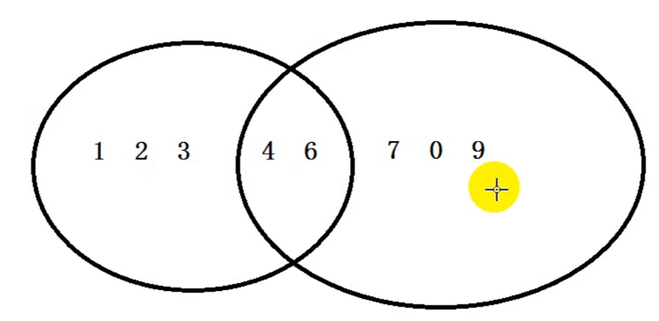

[速查宝典]: https://fishc.com.cn/forum.php?mod=forumdisplay&amp;fid=360&amp;filter=typeid&amp;typeid=768

# 一、变量和数据类型

## 1、变量

### 1.1变量的命名规则

1. 字母，数字（数字不能在开头），下划线其他特殊符号不行
2. 不能使用关键字
3. 严格区分大小写

见名知义：get_name_by_line(在python中更建议用下划线)

驼峰式：

1. 小驼峰：getNameByLine (开头第一个单词全部小写)
2. 大坨峰：GetNameByLine  面向对象：类名 每个单词的首字母大写

## 2、数据类型

### 2.1数据类型

 

 ==通过type（变量名）输出变量类型==，通过input输入的数据都是字符串

### 2.2类型转换

a=9.49(小数），flag=True

| `类型转换`        | `方法`        | `结果`    |
| ----------------- | ------------- | --------- |
| `str  --> int`    | `int(a)`      | `报错`    |
| `str  --> folat`  | `float(a)`    | `9.49`    |
| `int  --> str `   | `str(a)`      | `9.49`    |
| `float  --> str ` | `str(a)`      | `9.49`    |
| `int  --> float`  | `float(a)`    | `9.49`    |
| `float --> int`   | `int(a)`      | `9`       |
| `flag  = True`    | `int(flag)`   | `1`       |
| `flag  = False`   | `int(flag)`   | `0`       |
| `flag  = True`    | `float(flag)` | `1.0`     |
| `flag  = False`   | `float(flag)` | `0.0`     |
| `flag  = True`    | `str(flag)`   | `'True'`  |
| `flag  = False`   | `str(flag)`   | `'False'` |

bool(a)

只有当a=0或空字符串时为False，只要变量有值则为True

# 二、输出格式化

## 1、对照表

| **格式符号** | **转换**             |            |
| ------------ | -------------------- | ---------- |
| **%s**       | **字符串**           | **string** |
| **%d**       | **整数**             | **digit**  |
| **%f**       | **浮点数**           | **float**  |
| **%c**       | **字符**             |            |
| **%u**       | **无符号十进制整数** |            |
| **%o**       | **八进制整数**       |            |

## 2、示例

```python
name = '蔡徐坤'
age = 26
money = 999.95
#  我喜欢听26岁的蔡徐坤唱歌
# 26岁的蔡徐坤一首歌挣了999.95块钱
print('我喜欢听%d岁的%s唱歌' % (age, name))
print('%d岁的%s一首歌挣了%.2f块钱' % (age, name, money))
print('%s岁的%s一首歌挣了%s块钱' % (age, name, money))
```


# 三、运算符

## 1、算数运算符

| 运算符 | 含义                           |
| :----- | :----------------------------- |
| +      | 相加                           |
| -      | 相减                           |
| *      | 相乘                           |
| /      | 除以                           |
| %      | 取模（余）                     |
| //     | 整除  （取比结果小的最大整数） |
| **     | 指数                           |

## 2、赋值运算符

| 运算符 | 含义    |
| ------ | ------- |
| +=     | a = a+  |
| -=     | a = a-  |
| *=     | a = a*  |
| /=     | a = a/  |
| %=     | a = a%  |
| //=    | a = a// |
| **=    | a= a**  |

## 3、关系运算符

> 在使用关系运算符时：如果都是str类型时比较ASCII码

| 运算符 | 含义                 |
| ------ | -------------------- |
| >      | 大于                 |
| <      | 小于                 |
| >=     | 大于等于             |
| <=     | 小于等于             |
| ==     | 等于                 |
| !=     | 不等于               |
| is     | 判断内存地址是否一致 |

## 4、逻辑运算符

==not，取当前值的相反值==

| and(与)                   | or(或)                    |
| ------------------------- | ------------------------- |
| True and True --> True    | True and True --> True    |
| True and False --> False  | True and False --> True   |
| False and False --> False | False and False --> False |
| False and False --> False | False and Ture --> Ture   |

### 4.1 逻辑短路

> 从左往右，只有当地一个操作数的值无法确定逻辑运算的结果时，才对第二个操作数进行求值

```python
1 or 2 ==> 1
1 and 2 ==> 2
0 or 1 ==> 1
0 and 1 ==> 0
```

### 4.2 运算符优先级

 

# 四、分支语句

### 1、if语句

### 1.1 if 语句格式

```python
result = input('请输入（y/n）：')
if result == 'y':
	print(4)
```

### 1.2 if……else

```python
import random

ran = random.randint(1, 20)
print(ran)
guess = int(input('请输入一个整数：'))
if guess == ran:
    print('恭喜你猜对了')
else:
    print('很遗憾猜错了')
```

### 1.3 if……elif……else

```python
if 条件1:
    条件1True，执行语句
elif 条件2:
    条件2True，执行语句
elif 条件3:
    条件3True，执行语句
 ……
else
	1,2,3 ……条件都不满足，执行语句
```

### 1.4 if 条件表达式

> 条件成立时执行的语句 if 条件 else 条件不成立时执行的语句

```python
a = 3 ; b = 5
small = a if a < b else b
print(small) ==> 3
```

# 五、循环语句

## 1、while循环

### 1.1 语法

```python 
while 条件
	需要循环的代码
```

### 1.2案例

> 计算1~100的和

```python
a = 1
sum = 0
while a <= 100:
    sum += a
    a += 1
print(sum)
```

## 2、for 循环

### 2.1 语法

```python
for(while) i in range(n): // range(n):默认从0开始到n-1结束 range(star,stop):[start,stop) 
                          // range(start,stop,step):默认从strat(包含)开始到stop(不包含)结束，step为步长
	循环体
else：
如果上面的for(while)循环没有被中断，那么将执行此语句
```

### 2.2 案例

```python
# 寻找2~100之间的素数
for i in range(2, 101):
    for j in range(2, i):
        if i % j == 0:
            break
    else:
        print(i, end=" ")
```


## 3、跳出语句

break：跳出当前循环结构

continue：跳过本次循环（后面的语句不执行了）进入下一次循环

## 4、嵌套循环

在一个循环体中运行另外一个循环体

```python
// 九九乘法表
for i in range(1, 10):
    for j in range(1, 10):
        if i <= j:
            print("%d*%d=%d" % (i, j, i * j), end=' ')
    print()
```

# 六、列表

> 序列

## 1、语法

```python
name = [1,2,3,4,5]  # 每个元素之间用逗号隔开
```

## 2、列表操作

### 2.1访问列表元素

可以通过索引访问列表元素，python索引从**`0`**开始，最后一个元素的下标索引值可以是 **`-1`**

 

### 2.2 列表切片

通过**索引**对列表进行切片，使用切片时要注意step的**方向**，**正数**位从左到右，**负数**位从右到左

```python
list1 = [1, 2, 3, 4, 5, 6]
list2 = list1[0:3] # list[start,stop,step]:默认从strat(包含)开始到stop(不包含)结束，step为步长
print(list2) ==> [1, 2, 3]
```

### 2.3 列表添加

1. **append()**：在末尾添加
   1.  
2. **+** ：合并
   1.  
3. **extend()**：在末尾添加可迭代对象
   1.  
4. **insert(索引,元素)**：在指定索引位置插入元素
   1.  

### 2.4 列表删除

1. **remove(value)**：根据元素==值==进行删除，当元素不存在时报错。如果列表中存在多个同值的元素，只删除遇到的第一个
2. **pop(index)**：根据==下标==删除列表中的元素，当下标未指定时，默认从后往前依次删除
3. **del**：
   1. **del list[index]**：删除列表中该下标的元素
   2. **del list**：删除该列表
4. **clear**：清空列表元素
5. del与clear的区别：
   1. del：删除该列表包括其内存地址
   2. clear：清空该列表内元素，内存地址还在


### 2.5 列表修改

1. list[index] = 元素

   1. ```python
      list[3] = 2
      ```

### 2.6 列表查找

1. **list.index(value, start,end)**：查找该元素在列表中的索引（下标），返回该元素的下标位置，如果没有此元素则报错,。
   1. start,end参数：指定查找的开始和结束位置
2. 判断元素是否在列表中：in
   1. 元素 in 列表 表示元素是否在列表中？返回值：布尔类型
   2. 元素 not in 列表 查找元素是否不存在列表中

## 3、列表拷贝

### 3.1浅拷贝

> 浅拷贝只拷贝外层对象，当拷贝的对象为嵌套列表时，拷贝的嵌套对象只是其引用

#### 3.1.1 copy

```python
y = list.copy(x) # copy 方法拷贝整个列表对象，并非对变量内存地址的引用
```

改变 x 中的元素并不会对 y 造成改变

#### 3.1.2 切片

```python
y = x[:] # x列表从开始到末尾被赋值给y形成一个列表，此时改变 x 中的元素并不会对 y 造成改变
y = x # y引用x列表的内存地址，此时改变 x 中的元素会同步 改变 y 
```

### 3.2 深拷贝

> 深拷贝在进行拷贝时，也将对象中所引用的子对象一并进行拷贝

#### 3.2.1 copy模块

```python
import copy
y = copy.deepcopy(x)  # 第一copy为copy模块，
```

## 4、列表推导式

> 列表解析式是将一个列表`（实际上适用于任何可迭代对象`例如：字典)转换成另一个列表的工 具。在转换过程中，可以指定元素必须符合一定的条件，才能添加至新的列表中，这样每个元素都可以 按需要进行转换。

### 4.1、语法

```python
list = [ i for 变量 in 可迭代的对象 if 条件] # 遍历可迭代的对象，若满足条件的元素将被赋值给i(i可以是个公式)，i(或运算结果)将会被添加到新的数组中
```

### 4.2、举例

```python
# 将列表中的元素*2
list1 = [1, 2, 3]
list1 = [i * 2 for i in list1]
print(list1)

# 请写出一段Python代码实现分组一个list里面的元素，比如[1,2,3, … ,100]变成[[1,2,3],[4,5,6]…]
list1 = [1, 2, 3, 4, 5, 6, 7, 8, 9]
list11 = [[i, i + 1, i + 2] for i in list1 if i % 3 == 1] // 通过1除以3余1来找出每个小数组中的第一个数 
print(list11)
# 或
list1 = [1, 2, 3, 4, 5, 6, 7, 8, 9]
list11 = [list1[i:i + 3] for i in range(0, len(list1), 3)] # 通过range函数生成一个最大值为len(list1)-1步长为3的数组，通过i遍历，每个i															   # 每个小数组的第一个元素，

# 获取矩阵主对角线上的元素
list1 = [[1, 2, 3],
         [4, 5, 6],
         [7, 8, 9]]
list2 = [list1[i][i] for i in range(len(list1))]
# 获取矩阵副对角线上的元素
list1 = [[1, 2, 3],
         [4, 5, 6],
         [7, 8, 9]]
list2 = [list1[i][-i - 1] for i in range(len(list1))]

# 降维
list1 = [[1, 2, 3],
         [4, 5, 6],
         [7, 8, 9]]
list2 = [a for b in list1 for a in b]  # 以b为变量遍历列表list1，以a为变量遍历列表b，然后将a的值添加到list2
			|| 等
    		|| 价
        	\/ 于
list2 = []
for a in list1:
    for b in a:
        list2.append(b)
print(list2)
```

## 5、排序与翻转

### 5.1 sort

list.sort(reverse=True/False) ：对列表进行排序，通过reverse控制，默认为False（升序），当reverse=True时为降序

### 5.2 reverse

list.reverse：对列表原有的顺序进行翻转

## 6、冒泡排序

### 6.1 原理

 

### 6.2 代码实现

```python
import random

numbers = []  // 利用random模块随机生成一个长度为8的列表
for i in range(8):
    numbers.append(random.randint(0, 100))
print(numbers)

for i in range(len(numbers)-1): // 外层循环控制比较轮数，列表长度-1
    for j in range(len(numbers) - 1 - i): // 不断的取出前一个数与后一个数进行对比，对比的次数为总轮数-i，因为每一轮确定一个最大值
        if numbers[j] > numbers[j + 1]: // 当前一个数比后一个数大时，进行换位操作
            numbers[j], numbers[j + 1] = numbers[j + 1], numbers[j]
print(numbers)
```


# 七、元组

> 序列类型

## 1、语法

```python
tuple = (元素1,元素2,元素3,元素4,····)
```

## 2、特点

1. 元组的元素不能**修改（增删改都不行）**

2. 当元组内只有一个元素时，必须添加**逗号**，否则会被识别成字符串或整形

    

3. 元组也是序列类型，所以元组也有下标，可以进行切片操作

   1. 元组支持的操作：count、index、+

4. 虽然元组中的元素不可变，但如果元组中的元素指向一个可变的序列的话，依然可以修改这个序列里的内容

    

## 3、列表与元组转换

### 3.1列表转元组

```python
list(tuple)
```

### 3.2 元组转列表

```python
tuple(list)
```

# 八、字符串

> 也是一个序列

## 1、字符串切片

```python
字符串变量[start:end:step] // step默认值为1
```

step作用

1. 控制步长 
2. 控制方向
   1. 正数：从左至右
   2.  负数：从右至左

## 2、字符串方法

### 2.1 语法

```python
// 字符串变量.字符串方法(参数)
str.find('a') // str->字符串变量 find()->字符串方法 'a'->参数
```

### 2.2 查找

1. len(str)：获取字符串长度
2. find('')：从左往右查找，只要遇到一个符合要求的则返回位置。如果**没有**找到符合要求的则**返回 -1**
3. rfind('')：从右往左查找，只要遇到一个符合要求的则返回位置。如果**没有**找到符合要求的则**返回 -1**
4. index('')：从左往右查找，只要遇到一个符合要求的则返回位置。如果**没有**找到符合要求的则**报错**
5. rindex('')：从右往左查找，只要遇到一个符合要求的则返回位置。如果**没有**找到符合要求的则**报错**

### 2.3 统计

count：统计指定字符串出现的次数

### 2.4 判断

> 字符串的判断方法返回值都是布尔值（True，False）

1. starswith('')：判断是否以指定字符开头
2. endswith('')：判断是否以指定字符结尾
3. isalpha(str)：判断是否纯字母组成
4. isdigit(str)：判断是否纯数字组成
5. isalnum(str)：判断是否由字符或数字组成（不含符号）
6. isspace(str)：判断是否由空白字符串
7. islower(str)：判断是否全部都是小写字母
8. isupper(str)：判断是否全部都是大写字符
9. istitle(str)：判断是否有大写字符开头，其余字母均为小写

### 2.5 替换

1. replace('old','new','count')：new替换掉old，count：替换次数(默认值为-1即全部替换) 方向：从左往右
   1.  
2. expandtabs()：使用空格替换tab并返回一个新的字符串

### 2.6 切割

1. split('str','num')：str参数为切割依据，num参数(默认为1)为切割次数，返回的结果是一个列表

2. rsplit('str','num')：从右往左的split

3. splitlines：按行分割

4. partition(str)：str参数为分割依据，只分割一个，返回值为一个长度为 3 的元组(str前 , str , str后)

5. rpartition(str)：从右往左的partition

    

### 2.7 空格处理

1. ljust/rjust/center：添加空格控制字符串的对齐方式
   1. ljust：在所有字符左侧
   2. rjust：在所有字符右侧
   3. center：在所有字符居中
2. lstrip/rstrip/strip：去除空格
   1. lstrip：去除左边空格
   2. rstrip：去除右边空格
   3. strip：去除两边空格

### 2.8 大小写转换

1. title：所有首字母大写
2. upper：所有字母大写
3. lower：所有字母小写
4. capitalize：第一个单词的首字母大写

### 2.9 字符串拼接

str.join(可迭代对象)：将一个可迭代对象（如列表、元组、字符串等）中的元素以指定的分隔符连接起来，并返回一个新的字符串。

 

### 2.10 字符串格式化

#### 2.10.1 省略字段名填充

```python
name = '蔡徐坤'
age = 28
result = '喜欢唱跳rap的{}，今年{}岁'.format(name, age)
```

#### 2.10.2 使用数字索引填充

> 变量可重复使用

```python
name = '蔡徐坤'
age = 28
result = '喜欢唱跳rap的{0}，今年{1}岁，我今年也{1}'.format(name, age)
```

#### 2.10.3 使用变量名形式填充

```python
result = '喜欢唱跳rap的{name}，今年{age}岁，我今年也{age}'.format(name='蔡徐坤', age=28)
```

#### 2.10.4 保留位数输出

##### 保留整数位数输出

```python
a = 123
print('{:4d}'.format(a))  // 保留4位数输出，不足5位前面补空格
print('{:05d}'.format(a))  // 保留5位数输出，不足5位前面补0
```

  

##### 保留小数位数输出

```python
a = 123.1231312321312312
print('{:6f}'.format(a)) // 保留6位小数输出
```

 

#### 2.10.5 f-string

> 在python 3.6中新添加了f字符串

#### 语法

> 在字符串前面加上一个f

```python
name = '蔡徐坤'
age = 28
result = f'喜欢唱跳rap的{name}，今年{age}岁，我今年也{age}'
print(result)
```

 

# 九、序列

> 根据列表是否能够修改，序列分为可变序列和不可变序列

## 1、运算符

### 1.1 '+' 拼接

 

### 1.2 '*' 重复

 

## 2、可变序列与不可变序列

### 2.1 区别

当对序列进行修改时，序列的id值是否会修改

## 3、可迭代对象与迭代器

### 3.1 定义

#### 3.1.1 可迭代对象

可迭代对象用于表示一组元素，可以通过遍历来访问其中的元素。

#### 3.1.2 迭代器

迭代器提供了一种惰性计算的方式，每次请求一个元素，而不是一次性将所有元素加载到内存中。迭代器只能往前不能后退

可以被 `next()` 函数调用并不断返回下一个值的对象称为迭代器，Iterator

### 3.2 遍历

#### 3.2.1可迭代对象

> 可迭代对象可以使用`for`循环进行遍历，也可以使用`iter()`函数将其转换为迭代器。

```python
my_list = [1, 2, 3, 4, 5]
for item in my_list:
    print(item)
    
list = iter(my_list)
print(next(mylist))
```

#### 3.2.2 迭代器

>`iter()`方法返回迭代器本身，而`next()`方法返回集合中的下一个元素。当没有更多元素可供迭代时，再使用`next()`方法抛出异常

```python
my_list = [1, 2, 3, 4, 5]
my_iterator = iter(my_list)

print(next(my_iterator))  # 输出: 1
print(next(my_iterator))  # 输出: 2
print(next(my_iterator))  # 输出: 3
# 迭代器只能向前遍历一次，不支持反向遍历。
```

### 3.3 区别

1. **遍历方式**：
   1. 可迭代对象：可迭代对象可以使用`for`循环直接进行遍历。在每次迭代时，它会隐式地调用迭代器的`next()`方法来获取下一个元素，直到遍历完所有元素。
   2. 迭代器：迭代器使用`next()`方法来获取可迭代对象中的下一个元素。需要显式地调用`next()`函数或使用`for`循环来逐个获取元素。一旦迭代器耗尽，再次调用`next()`函数抛出异常。
2. **状态信息**：
   1. 可迭代对象：可迭代对象没有维护遍历状态的能力，每次遍历都是**从头开始**。每次需要遍历时，都会创建一个新的迭代器。
   2. 迭代器：迭代器通过内部维护的状态信息，可以记录当前遍历的位置。它可以记住**上次访问的位置**，并在下一次调用`next()`方法时返回正确的元素。
3. **遍历次数**：
   1. 可迭代对象：可迭代对象可以被多次遍历。每次遍历都会重新从头开始。
   2. 迭代器：迭代器只能被遍历一次。一旦迭代器耗尽，再次遍历需要重新创建一个新的迭代器。

## 4、序列函数

### 4.1 转换

1. list()：可迭代对象转列表
2. tuple()：可迭代对象转元组
3. str()：可迭代对象转字符串

### 4.2 对比

1. min()：传入可迭代对象，返回最小值。当传入的可迭代对象为空时。若指定default参数，返回值为default的值，未指定则报错
2. max()：传入可迭代对象，返回最大值。当传入的可迭代对象为空时。若指定default参数，返回值为default的值，未指定则报错

### 4.3 其他

1. len()：传入可迭代对象，返回对象的长度
2. sum()：传入可迭代对象，返回对象内整型值的总和，start参数则指定总和计算的起始位置
3. all()：判断可迭代对象内是否每个元素都为真
4. any()：判断可迭代对象中，是否存在某个值为真的元素
5. enumerate()：返回一个枚举对象，将可迭代对象的转换为一个由**`(索引,元素值)`**组成的二元组列表
   1.  
6.  zip()：创建一个聚合多个可迭代对象的迭代器，将多个可迭代对象相同索引的元素聚合为一个元组，后封装成一个迭代器
   1.  
7. map()：函数遍历可迭代对象中的每个元素，并将每个元素作为参数传递给`function`函数进行处理，然后将处理后的结果组成一个新的迭代器返回。
   1.  0x：表示当前数值为16进制
   2.  
8. filter()：根据传入的参数(函数)来对指定的可迭代对象的每个元素进行运算，并返回运算结果**为真**的迭代器
   1.  	

# 十、字典

> 字典是Python中唯一实现映射关系的内置类型，只有可哈希的值才能作为字典的键（也就是说，只有不可变的对象才能哈希）

## 1、简介

### 1.1 定义语法

```python
一、
dict_name = {} #定义空字典
dict_name = {键:值}
二、
dict_name = dict() #定义空字典
dict_name = dict(键=对) # 这种方法不能往键上添加引号，尽管是个字符串
三、
dict_name = dict([(键，值)])
四、
dict_name = dict({键:值})
五、
dict_name = dict(zip([键1,键2],[值1,值2]))
六、
fromkeys(iterable[,values]) ## 使用iterable参数，指定的可迭代对象来创建一个新的字典，并将所有的值初始化为values的值,当有重复值时只添加一个
```

示例六

 

### 1.2 特点

1. 符号：{}
2. 关键字：dict
3. 保存元素：key(键) : value(值)  一对保存
4. 没有下标或者切片

### 1.3 元素

键、值、对

注意：键是惟一的，值允许重复

## 2、操作

### 2.1 添加、修改

#### 2.1.1 通过字典的键来添加或修改元素

> 通过指定字典中不存在的键，就可以创建一个新的键值对。
>
> 通过指定字典中存在的键，就可以修改改建的值
>
> 键：可以删除，添加，但是键**不能修改**

```python
dict_name[key] = value
```

注意：key是唯一的，所以添加的时候如果出现同名的key，后面key对应的value则替换原来的
			如果字典中不存在键，则添加
			如果字典中存在键，则修改

#### 2.1.2 通过`dict.update({键 : 值 , 键 : 值})`方法同时修改多个值

```python
a_dict = dict.fromkeys("ljts")
a_dict.update({'l': 11, 't': 13, })
a_dict.update(j=12, s=14)
print(a_dict)
```

 

### 2.2 删除

#### 2.2.1 清空字典 clear

```python
dict_name.clear
```

#### 2.2.2 删除元素 dict.pop

>根据key实现删除，删除的是键值对，返回值是key对应的value

```python
a_dict = {"吕布": "口口布", "关羽": "关习习", "刘备": "刘baby"}
a = a_dict.pop("关羽")
print(a_dict,a)
```

 

#### 2.2.3 删除元素 dict.popitem

>返回值是一个元组(key:value)，从后往前依次删除一个，当字典里没有元素是报错

#### 2.2.4 del

>del dict[键名]：删除该键值对
>
>del dict : 删除这个字典


### 2.3 查询

#### 2.3.1 get 方法

> 根据key得到对应的value值

```python
a_dict = {"吕布": "口口布", "关羽": "关习习", "刘备": "刘baby"}
a = a_dict.get("吕布")
print(a)
```

 

#### 2.3.2 dict[key]

>根据key得到对应的value值

```python
a_dict = {"吕布": "口口布", "关羽": "关习习", "刘备": "刘baby"}
print(a_dict['关羽'])
```

 

#### 2.3.4 dict.setdefaule(键 , default)

> 在字典中获取指定键的值，如果键不存在，则设置一个默认值并返回它。

```python
a_dict = {"吕布": "口口布", "关羽": "关习习", "刘备": "刘baby"}
print(a_dict.setdefault('吕布', '1234'))
print(a_dict)
print(a_dict.setdefault('张飞', '弓长飞'))
print(a_dict)
## 当键存在于字典时，返回该键的值，当键不存在于字典时，在字典中添加上键值对，并返回default的值
```

 

#### 2.3.4 get 方法和 dict[key] 的区别

1. 当dict内没有对应key时，get返回**None**而dice[key]则**报错**

2. 默认值：dict.get[key,默认值]，当dict内没有对应值时，get可以返回默认值

   

#### 2.3.5 dict.values、dict.keys、dict.items

- **dict.values**：返回一个封装了全部**value**对象的列表									
  -  
- **dict.keys**：返回一个封装了全部key对象的列表
  - \
- **dict.items**：返回一个封装了全部 **对** 的对象列表，一对一个元组
  -  

## 3、字典遍历

### 3.1遍历所有key

```python
## for i in dict
a_dict = {"吕布": "口口布", "关羽": "关习习", "刘备": "刘baby"}
for i in a_dict:
    print(i)
```

 

### 3.2 遍历所有value

```python
## for i in dict.values
a_dict = {"吕布": "口口布", "关羽": "关习习", "刘备": "刘baby"}
for i in a_dict.values():
    print(i)
```

 

### 3.3 遍历所有键值对

> 返回值是以键和值组成的元组

```python
## for i in dict.items()
a_dict = {"吕布": "口口布", "关羽": "关习习", "刘备": "刘baby"}
for i in a_dict.items():
    print(i)
```

 

### 3.3 key 于 value分别赋值遍历

```python
## for k,v in dict.items()
a_dict = {"吕布": "口口布", "关羽": "关习习", "刘备": "刘baby"}
for k, v in a_dict.items():
    print(k , v)
```

 

## 4、字典推导式

### 4.1 语法

```python 
{key_expression: value_expression for item in iterable}
```

1. **`key_expression`**: 表示生成字典的键的表达式。
2. **`value_expression`**: 表示生成字典的值的表达式。
3. **`item`**: 用于迭代的可迭代对象中的每个元素。
4. **`iterable`**: 可迭代对象，如列表、集合等。

### 4.2 示例

####  4.2.1 创建一个包含数字1到5的字典，键为数字，值为其平方

```python
# 创建一个包含数字1到5的字典，键为数字，值为其平方
squared_dict = {x: x**2 for x in range(1, 6)}
print(squared_dict)
# 输出：{1: 1, 2: 4, 3: 9, 4: 16, 5: 25}
```

#### 4.2.2 使用条件语句创建字典

```python
# 创建一个包含数字1到10的字典，键为数字，值为"偶数"或"奇数"
a = {x: "偶数" if x % 2 == 0 else "奇数" for x in range(1, 11)}
print(a)
#  输出：{1: '奇数', 2: '偶数', 3: '奇数', 4: '偶数', 5: '奇数', 6: '偶数', 7: '奇数', 8: '偶数', 9: '奇数', 10: '偶数'}
```

#### 4.2.3  使用条件过滤创建字典

``` python
# 创建一个包含数字1到10的字典，键为数字，值为其平方，但只包含偶数的键值对
a = {k: k ** 2 for k in range(1, 11) if k % 2 == 0}
print(a)
# 输出：{2: 4, 4: 16, 6: 36, 8: 64, 10: 100}
```

#### 4.2.4 根据现有字典创建新字典

```python
# 创建一个新字典，键为原字典的键，值为原字典的值加倍
a = {"a": 5, "b": 10, "c": 15}
b = {k: v * 2 for k, v in a.items()}
print(b)
# 输出：{'a': 10, 'b': 20, 'c': 30}
```

# 十一、集合

## 1、简介

### 1.1 定义语法

```python
a = {元素1,元素2,···,元素n} # 当{}里的元素不是键值对时，就是集合
b = set() # 定义一个空字符
```

### 1.2 特点

- ==唯一==，==无序==的
  -  
- 没有下标
- 只有可哈希的值才能成为集合的元素

## 2、集合操作

### 2.1 add 添加

```python
a = set()
a.add(3)
a.add(7)
print(a)
# 输出：{3, 7}
```

### 2.2 update 合并

```python
a = {3, 7}
b = {4, 6}
a.update(b)
print('a = ', a)
print('b = ', b)
# 输出：a =  {3, 4, 6, 7} ；b =  {4, 6}
```

### 2.3 移除元素

#### 2.3.1 remove

>将元素从集合中移除，如果元素不存在，则会发生错误

```python
a = {3, 7, 4, 6}
a.remove(6)
print(a)
# 输出：{3, 4, 7}
```

#### 2.3.2 discard

>将元素从集合中移除，且如果元素不存在，不会发生错误

#### 2.3.3 pop

> 从集合中随机删除一个元素

```python
a = {3, 7, 4, 6}
a.pop()
a.pop()
print(a)
# 输出：{6, 7}
```

## 3、差集、交集、并集

 

### 3.1 差集

#### 3.1.1 difference

```python
a = {1, 2, 3, 4, 6}
b = {4, 6, 7, 0, 9}
print(a.difference(b))
print(b.difference(a))
# 输出: {1, 2, 3}
#	   {0, 9, 7}
```

#### 3.1.2 `-`

```python
a = {1, 2, 3, 4, 6}
b = {4, 6, 7, 0, 9}
print(a - b)
print(b - a)
# 输出: {1, 2, 3}
#	   {0, 9, 7}
```

### 3.2 交集

#### 3.2.1  intersection

```python
a = {1, 2, 3, 4, 6}
b = {4, 6, 7, 0, 9}
print(a.intersection(b))
print(b.intersection(a))
# 输出：{4, 6}
#	   {4, 6}
```

#### 3.2.2  `&`

```python
a = {1, 2, 3, 4, 6}
b = {4, 6, 7, 0, 9}
print(a & b)
print(b & a)
# 输出：{4, 6}
#	   {4, 6}
```

### 3.3 并集

#### 3.3.1 union

```python
a = {1, 2, 3, 4, 6}
b = {4, 6, 7, 0, 9}
print(a.union(b))
print(b.union(a))
# 输出：{0, 1, 2, 3, 4, 6, 7, 9}
#	   {0, 1, 2, 3, 4, 6, 7, 9}
```

#### 3.3.2  `|`

```python
a = {1, 2, 3, 4, 6}
b = {4, 6, 7, 0, 9}
print(a | b)
print(b | a)
# 输出：{0, 1, 2, 3, 4, 6, 7, 9}
#	   {0, 1, 2, 3, 4, 6, 7, 9}
```

## 4、不可变集合

### 4.1 定义语法

```python
a = frozenset()
```

## 4.2 特点

不能对集合做任何改变，frozenset中可以放入不可哈希的值  

# 十二、函数

> 函数的主要作用就是封装实现一段某个功能的代码，以实现重复使用

## 1、简介

### 1.1 定义语法

```python
def 函数名([参数，可有可无，也可以又多个]):
	code：封装重复内容
```

### 1.2 调用函数

```python
函数名() ## 开始调用函数
## 函数每调用一遍就会执行一次代码
```

函数名仅仅是个变量，只不过指向了定义的函数而已，所以才能通过`函数名()`调用。

如果函数名=XX被修改了，那么当在执行函数名()时，调用的就不知之前的那个函数。

#### 1.2.1 函数间的调用

> 可以在一个函数中调用另一个函数

``` python
def a(flag):
    if flag:
        print('AAAAAAAAAA')
    else:
        print('aaaaaaaaaa')
    b()

def b():
    print('BBBBBBBBBB')
# 通过调用a()，可以实现打印AAAAAAAAAA BBBBBBBBBB | aaaaaaaaaa BBBBBBBBBB
a(True)
a(False)

# 输出： '''
    AAAAAAAAAA
    BBBBBBBBBB
    aaaaaaaaaa
    BBBBBBBBBB
'''
```


## 2、函数的参数

### 2.1 形参和实参

> 定义时的参数叫形参，调用时的参数叫实参

 

### 2.2  参数的作用

> 在调用函数时，往函数里传值

### 2.3 参数的使用

#### 2.3.1 单参数								多参数

  

### 2.4 默认值参数

#### 2.4.1 特点

在定义函数的时候，有一个或多个参数已经赋值

#### 2.4.2 定义语法

```python
def 函数名(参数1，参数2，参数3=值，参数4=值)
	code
```

#### 2.4.3 调用特点

```python
函数名(值1，值2，值3(可以没有) )
```

#### 2.4.4 注意

> 在定义函数值，普通参数需要放在默认参数==**前方**==
>
> 默认参数的顺序是固定的

 

### 2.5 列表型参数

> 当传入的参数是一个列表

```python
def get_list(list_1):
    new_list = list(x for x in list_1 if x >= 50)
    print(new_list)

list1 = [23, 45, 77, 80, 59, 10]
list2 = [12, 542, 65, 64, 231, 623, 42, 43, 5]
get_list(list1) # 当函数在调用时，形参为list_1，实参为list1，相当于将 list_1 赋值给list1 
get_list(list2)
# 输出：[77, 80, 59]
# 	   [542, 65, 64, 231, 623]
```

### 2.6 可变参数

#### 2.6.1 定义可变参数

```python
*参数名 	#元组
**参数名	# 字典，在调用函数时，必须使用关键字参数
```

#### 2.6.2 *args

> 在参数定义中带**`*`**的参数是一个元组，用元组去存放多个值

##### 示例

```python
def a(*b):
    print(sum(b))

a(1, 2, 3)
a(1, 2, 3, 4, 56)
a(1, 2, 3, 4, 5, 6, 78)
# 输出：6、66、99
```

##### *args的装包与拆包

> *参数在定义时为装包，在调用时为拆包

###### 示例

```python
def a(*b):  # 定义a函数时，为形参 b装包
    print(b)
    print(sum(b))

list_1 = [6, 60, 71, 94, 54, 88, 21, 61]
a(*list_1)  # 调用a函数时，为实参list_1拆包

# 输出： (6, 60, 71, 94, 54, 88, 21, 61)
#		455	   
```

#### 2.6.3  **kwargs

> 在参数定义中带**的参数定义的是一个字典，在传参时必须使用关键字参数

##### 示例

###### 使用关键字参数传参

```python
def a(**b):
    print(b)
    
a(bookname='西游记', author='吴承恩', number=5)
# 输出：{'bookname': '西游记', 'author': '吴承恩', 'number': 5}
## 如果不使用关键字参数传参的话会报错
```

###### 使用字典参数传参

```python
def a(**b):  # 装包
    print(b)

book = {'bookname': '西游记', 'author': '吴承恩', 'number': 5}
a(**book)  # 拆包
# 输出：{'bookname': '西游记', 'author': '吴承恩', 'number': 5}
```

#### 2.6.4  *args 与 **kwargs 参数同时存在

> 若不传关键字参数则字典是空的

```python
def a(*args, **kwargs):
    print(args)
    print(kwargs)
    
a('a', 'b')
# 输出： ('a', 'b')
#		{}
```

>传了关键字参数后才会加入字典中

```python
def a(*args, **kwargs):
    print(args)
    print(kwargs)

a('a', 'b', c='c', d='d')
# 输出： ('a', 'b')
#		{'c': 'c', 'd': 'd'}
```

### 2.7 参数的限制

#### 2.7.1 `/` 限制

> 在定义函数时，我么可以在参数中添加`/`，他的作用是 / 左侧的参数不可以使用关键字参数来进行传递，右侧侧可以使用关键字参数或位置参数

##### 示例

```python
def get_sum(a, b, /, c):
    print(a + b + c)


get_sum(1, 2, 3)
get_sum(a=1, b=2, c=3)
```

 

#### 2.7.2 * 限制

> 在定义函数时，我么可以在参数中添加 *，他的作用是 \* 右侧的参数只能使用关键字参数来进行传递，左侧可以使用关键字参数或位置参数

##### 示例

```python
def get_sum(a, b, *, c):
    print(a + b + c)

get_sum(1, 2, c=3)
get_sum(a=1, b=2, 3)
```

 

## 3、 函数的返回值

>当出现多个return是，只要有一个return被执行，那么这个函数就会结束，后面的函数体将不会被执行
>
>当函数中没有return 返回值时，在函数执行结束时，会返回一个None值

### 3.1 什么是函数的返回值

- 参数：外界往函数里传值
- 返回值：函数往外界传值

#### 3.1.1 示例

```python
def get_sum(*args):
    total = 0
    for i in args:
        total += i

    return total  # 返回total的值

t = get_sum(1, 2, 3)  # 使用容器t来接住函数get_sum所返回的total的值
x = t + 100
print(x)
# 输出：106
```

### 3.2 多个返回值

> return 后面可以接多个值，类似于：return a, b, c ，此时会将多个值封装到一个元组中，将元组作为整体返回

#### 3.2.1 使用一个变量接多个返回值

>如使用一个变量接多个返回值，此时会将多个值封装到一个元组中，将元组作为整体返回

```python
def get_mix_and_max(number_list):
    for i in range(0, len(number_list) - 1):
        for j in range(0, len(number_list) - 1 - i):
            if number_list[i] > number_list[j]:
                number_list[j], number_list[j + 1] = number_list[j + 1], number_list[j]
    number_min = number_list[0]
    number_max = number_list[-1]
    return number_min, number_max

list1 = [29, 15, 11, 71, 64, 1, 94, 45]
resource = get_mix_and_max(list1)
print(resource)

# 输出(64, 15)
```

#### 3.2.2 使用同等数量的返回值接多个返回值

>如使用一个变量接多个返回值，此时会将多个值封装到一个元组中，再将元组拆包分别赋值

```python
def get_mix_and_max(number_list):
    for i in range(0, len(number_list) - 1):
        for j in range(0, len(number_list) - 1 - i):
            if number_list[i] > number_list[j]:
                number_list[j], number_list[j + 1] = number_list[j + 1], number_list[j]
    number_min = number_list[0]
    number_max = number_list[-1]
    return number_min, number_min

list1 = [29, 15, 11, 71, 64, 1, 94, 45]
a, b = get_mix_and_max(list1)
print('number_min = ', a, ', number_min = ', b)

# 输出：number_min =  64 , number_min =  64
```

## 4、 作用域

### 4.1 可变类型和不可变类型

#### 4.1.1 可变类型

> 当内容发生改变时，内存地址不发生改变，例如：list，dict，set

```python
list1 = [1, 2, 3]
print(id(list1))
list1.append(4)
print(id(list1))

# 输出： 1830473323968
#		1830473323968
```

#### 4.1.2 不可变类型

> 当改变该变量的值时，内存地址发生改变，例如：str，int，float，bool，tuple

```python
a = 100
print(id(a))
a = 90
print(id(a))

# 输出： 140711410790280
#		140711410789960
```

### 4.2 全局变量与局部变量

>全局变量：声明在函数外面的称作全局变量，或函数内使用关键字：global 声明的变量
>局部变量：声明在函数内部的称作局部变量，函数内部可以直接使用全局变量，不能直接修改
>
>注意：只有不可变的类型才需要添加global，可变的类型不需要添加global

#### 4.2.1 函数搜索变量

>先寻找函数体内的变量再搜寻全局变量，局部变量的作用范围，仅限于当前函数内部

##### 当函数内部有该变量时

```python
a = 100 # 全局变量

def func():
    a = 0 # 局部变量
    print(a)

func()

# 输出：0
```

##### 当函数内部没有该变量

```python
a = 100 #全局变量

def func():
    # a = 0
    print(a)

func()

# 输出：100
```

#### 4.2.2 在函数内声明全局变量

> 在函数内通过`global`关键字声明全局变量

```python
a = 100

def test1():
    a = 0  # 局部变量
    global b
    b = 9
    print('test1:a = ', a)
    print('test1:b = ', b)

def test2():
    global a
    a = 101  # 修改全局变量中a的值
    print('test2:a = ', a)
    print('test2:b = ', b)

test1()
test2()

'''输出：
test1:a =  0
test1:b =  9
test2:a =  101
test2:b =  9
'''
```

#### 4.2.3 locals() 方法

> 查看函数中的局部变量，返回值是一个字典

```python
def test1():
    a = 100
    b = 101
    c = 102
    result = locals()
    print(result)

test1()

# 输出：{'a': 100, 'b': 101, 'c': 102}
```

### 4.3 总结

 

## 5、嵌套函数

>函数只是一段可执行代码，编译后就“固化”了，每个函数在内存中只有一份实例。
>函数还可以嵌套定义，即在一个函数内部可以定义另一个函数，有了嵌套函数这种结构，便会产生闭包问题

### 5.1 函数嵌套

```python
def outer():
    a = 100

    def inner():
        b = 200

    result = locals()
    print(result)

outer()

# 输出：{'a': 100, 'inner': <function outer.<locals>.inner at 0x0000021D403CB600>}
# 结论：由此可以看出inner是在outer函数内部的变量
```

#### 5.1.1 修改外部函数的变量

> 内部函数可以使用外部函数的变量，但是不能修改。在必要修改时可以使用 `nonlocal` 关键字

```python
def outer():
    a = 100

    def inner():
        b = 200
        nonlocal a
        a += b
        print(a)

    inner()

outer()
# 输出：300
```

## 6、闭包

### 6.1 什么是闭包

>闭包是由函数及其相关的引用环境组合而成的实体（即：闭包=函数块+引用环境）。
>
>闭包是指在一个函数内部定义另一个函数，并且内部函数可以访问外部函数的变量和参数，
>即使外部函数已经执行完毕，内部函数仍然可以访问和修改外部函数的局部变量和参数。

### 6.2 闭包格式

1. 嵌套函数
2. 内部函数引用了外部函数的变量
3. 返回值是内部函数

### 6.3 闭包例子

```python
def outer(n):
    a = 100

    def inner():
        b = a + n
        print(b)

    return inner
    # 返回内部函数的引用，而不是 inner() 的返回值，因为 inner() 的返回值是 None，
    # 因此如果 outer 函数返回的是 inner() 的返回值，那么 r 的值将是 None，而不是一个函数对象。
    # 我们需要返回 inner 函数本身，这样 r 才能成为一个函数对象，从而可以被调用


r = outer(5)  # 当调用outer(5)时，变量r接住的是内部函数inner的引用，这个变量被赋值给r
r()  # 此时调用r()，实际上实在调用inner，它访问了 outer 函数的局部变量 a 和参数 n，并计算它们的和，最后输出结果 105。
# 输出：105
```

#### 使用闭包生成斐波那契数列

```python
# 1,1,2,3,5,8……
def outer():
    a, b = 0, 1
    def inner():
        nonlocal a, b
        a, b = b, a + b
        result = a
        return result
    return inner
fibonacc = outer()
for i in range(10):
    print(fibonacc(), end=', ')
```


## 7、装饰器

### 7.1 什么是装饰器

#### 7.1.1 作用

- 用于遵循开放封闭原则，在不改变原函数的情况下，扩展了函数的功能
  - 封闭：已实现的功能代码块
  - 开放：对扩展开发

#### 7.1.2 功能

- 引入日志
- 函数执行时间统计
- 执行函数前预备处理
- 执行函数后清理功能
- 权限校验等场景
- 缓存

### 7.2 定义语法

``` python
def xxx(func):  #  定义一个xxx函数，形参为func（代表传入的参数是一个函数的引用）
	def yyy(参数, . . .):  # 定义一个yyy函数，并在这个函数中调用xxx函数传入的参数func
		. . . 
		func()  # 因为 原函数 作为实参传入xxx中，所以调用func()，实际上就调用了 原函数
		. . .
	return yyy # 最后xxx函数的返回值是yyy函数的引用
@xxx  # 声明xxx函数是一个装饰器，
def 原函数():
	pass

# 此时当每次调用 原函数时，会自动执行yyy函数
```

#### 7.2.1 示例

```python
def decorater(func):  # 定义一个装饰器函数decorater，形参为func（代表传入的参数是一个函数的引用）
    print('decorater 开始')

    def wrapper():  # 定义一个wrapper函数，并在这个函数中调用decorater传入的函数参数
        print('wrapper 开始')
        func()  # 因为 xxx 函数作为实参传入 decorater 中，所以调用func()，实际上就调用了原来的xxx()
        print('wrapper 结束')

    print('decorater 结束')
    return wrapper  # decorater的返回值为wrapper的引用


@decorater  # 声明decorater函数是一个装饰器函数，并调用
def xxx():  # 同时，将xxx作为实参传入decorater函数，相当于执行了 xxx = decorator(xxx)
    print('我是xxx函数喔')


xxx()  # 因为decorater的返回值为wrapper的引用，此时调用 xxx()函数，实际上调用的是wrapper()

# 每次调用xxx函数，就会自动调用wrapper函数
'''
输出：
decorater 开始
decorater 结束
wrapper 开始
我是xxx函数喔
wrapper 结束
'''
```

### 7.3 同时使用多个装饰器

> 当某个函数同时使用多个装饰器时，执行顺寻与装饰相反

#### 7.3.1 示例

```python
def test1(func):
    def inner():
        func()
        print('这里是test1')

    return inner


def test2(func):
    def inner():
        func()
        print('这里是test2')

    return inner


def test3(func):
    def inner():
        func()
        print('这里是test3')

    return inner


@test1
@test2
@test3
def test():  # 相当于执行了：test = test1(test2(test3(test)))
    print('这里是test')


test()

'''
输出：
这里是test
这里是test3
这里是test2
这里是test1
'''
```

### 7.4 带参数的装饰器

>原函数有参数，则装饰器内部函数也要有参数
>有多个参数使用*args，有关键字参数用**kwargs

#### 7.4.1 示例

```python
def decorater(func):
    def wapper(address):
        func(address)
        print(f'在{address}的房子已经装修好了')
    return wapper

@decorater
def house(address):
    print(f'在{address}的房子是一个毛坯房')

house('北京')
house('深圳')

'''
输出：
在北京的房子是一个毛坯房
在北京的房子已经装修好了
在深圳的房子是一个毛坯房
在深圳的房子已经装修好了
'''
```

### 7.5 装饰器中的 return

> 原函数的返回值可以在嵌套函数中接住，嵌套函数的返回值可以在调用原函数的接住

```python
def decorater(func):
    def wapper(address):
        h_r = func(address)
        print(f'在{address}的房子已经装修好了,材料花费 {h_r:.2f} 元')
        return 9000
    return wapper

@decorater
def house(address):
    print(f'在{address}的房子是一个毛坯房')
    return 5000

w_r = house('北京')
print(f'总费用为 {w_r:.2f} 元')
```

## 8、 lambda 表达式（匿名函数）

> 用lambda关键词创建小型函数，该函数叫做匿名函数

### 8.1 语法格式

#### 8.1.1 匿名函数的定义

```python
lambda arg1,grg2,···,argN : expression
# lambda 参数列表:运算表达式，lambda的返回值是该匿名函数的引用
```

 

#### 8.1.2 传统函数的定义

```python
def <lambda>(arg1,grg2,···,argN):
	return expression
```

#### 8.1.3 示例

```python
sum = lambda x, y: x + y
print(sum(10, 29))
# 输出：39
# 以上代码等价于一下代码
def sum(x, y):
    return x + y
print(sum(10, 29))
# 输出：39
```

### 8.2 使用场景

#### 8.2.1 放在列表中通过索引引用

```python
x = [lambda y: y ** 2, 2, 3]
print(x[0](x[2])) 
# 因为lambda表达式的返回值是一个函数的引用，所以当我们在列表中使用索引来调用该匿名函数
# 输出：9
```

#### 8.2.2 放在字典中通过键引用

```python
a = {'square': lambda x: x ** 2, 'sum': lambda x, y: x + y}
print(a['square'](4))
print(a['sum'](4, 5))
# 原理与上面一样
# 输出： 16
#		9
```

#### 8.2.3 用在一个函数中作为参数出现

```python
def func1(a, f):
    print('----->', a)
    r = f(a)  # 因为lambda表达式的返回值为该匿名函数的引用，所以f()调用了该匿名函数，a作为实参传递给了该匿名函数
    print(f'{a}的平方等于{r}')
func1(8, lambda x: x ** 2) # lambda表达式作为实参传递给func1，相当于f = lambda x: x ** 2
# 输出： -----> 8
#		8的平方等于64
```

 

## 9、 生成器

### 9.1 函数生成器

> 通过函数中使用`yield`关键字：当一个函数中包含了`yield`语句，那么这个函数就成为生成器函数，
> 当调用这个函数时，它并不会立即执行函数体，而是返回一个生成器对象，通过遍历这个生成器对象，可以逐个产生`yield`语句的值。

```python
def a():
    i = 0
    yield i
    while i <= 5:
        i += 1
print(a())
```

 

#### 9.1.2 使用生成器生成斐波那契数列

```python
def fib(length):
    a, b = 0, 1
    n = 0
    while n < length:
        yield b
        a, b = b, a + b
        n += 1
    return '没有更多元素了'  # 当生成器没有更多元素时，生成器函数的返回值会以报错提示的方式返回


fibonacc = fib(4)  # next(fibonacc)可以查看斐波那契数列
print(next(fibonacc))
print(next(fibonacc))
print(next(fibonacc))
print(next(fibonacc))
print(next(fibonacc))
```

 

### 9.2 生成器表达式

>类似于列表推导式，但使用圆括号 `()` 来创建，而不是方括号 `[]`。生成器表达式也会生成一个生成器对象。

#### 9.2.1 定义语法

```python
# 计算1~10之间每个数的平方
t = (i ** 2 for i in range(10))
```

 

### 9.3 生成器内的数据处理

#### 9.3.1 获取生成器的下一个数据

> 生成器可以通过系统函数 `next()` 和 生成器方法 `__next__()` 获取下一个元素

```python
def gen():
    i = 0
    while i < 5:
        yield i
        i += 1
    return '没有更多数据了'


g = gen()
print(next(g))
print(g.__next__())

'''
输出：
0
1
'''
```

#### 9.3.2 通过 `send()`  在每次生成器调用时传值

==注意：第一次调用 `send()` 时，需要传None参数==

```python
def gen():
    i = 0
    while i < 5:
        temp = yield i
        print('temp : ', temp)
        for i in range(temp):
            print('----->', i)
        i += 1
    return '没有更多数据了'


g = gen()
print(g.send(None))
n1 = g.send(2)
print('n1:', n1)
n2 = g.send(3)
print('n2', n2)

'''
输出：
0
temp :  2
-----> 0
-----> 1
n1: 2
temp :  3
-----> 0
-----> 1
-----> 2
n2 3
'''
```

### 9.4 使用生成器实现简单的多任务

```python
def task1(n):
    for i in range(n):
        print(f'正在搬第{i + 1}块砖')
        yield None

def task2(n):
    for i in range(n):
        print(f'正在听第{i + 1}首歌')
        yield None

g1 = task1(5)
g2 = task2(5)

while True:
    try:
        g1.__next__()
        g2.__next__()
    except:
        print('全部做完了')
        break

'''
输出：
正在搬第1块砖
正在听第1首歌
正在搬第2块砖
正在听第2首歌
正在搬第3块砖
正在听第3首歌
正在搬第4块砖
正在听第4首歌
正在搬第5块砖
正在听第5首歌
全部做完了
'''
```


## 10、递归

> 递归函数：如果一个函数在内部不调用其他函数，而是自己本身的话，这个函数就是递归函数 

### 10.1 递归

#### 10.1.1 递归遵循

- 必须有出口
- 每次递归必须向出口靠近

#### 10.1.2 递归示例

##### 计算1 ~ 10的和

```python
def test(i):
    if i == 10:
        return 10
    else:
        return i + test(i + 1)


r = test(1)
print(r)

# 输出：55
```

##### 示例分析

当程序执行到 test(1) 的时候，==会将 test(1) 函数压入调用栈。==然后在 test(1) 中，因为 i 不等于 10，所以执行 return i + test(i + 1) 语句，这里的 test(i + 1) 表示递归调用 test 函数并传入参数 i + 1，即 test(2)。于是，test(2) 函数也被压入调用栈。

接下来，程序开始执行 test(2) 函数。因为 i 不等于 10，所以再次执行 return i + test(i + 1) 语句，这里的 test(i + 1) 又表示递归调用 test 函数并传入参数 i + 1，即 test(3)。然后，test(3) 函数也被压入调用栈。

程序会一直重复这个过程，==直到递归调用到 test(10) 函数。==在 test(10) 函数中，由于 i 等于 10，所以执行 return 10 语句。这个返回值 10 会被传递回上一层函数 test(9)，然后被加上当前的 i 值 9，即 10 + 9 = 19，得到了 test(9) 的返回值。这个返回值又会被传递回上一层函数 test(8)，以此类推，直到回到最开始调用的 test(1) 函数，得到最终的结果。

###### **为什么返回的结果不是10 **

==当 test(10) 函数返回结果 10 时，它的返回值会被传递回上一级调用 test(9) 函数，成为 test(9) 函数中 test(9+1) 表达式的值==，接着 test(9) 函数根据表达式 i + test(i + 1) 计算出结果 19 并返回给上一级调用 test(8) 函数。 以此类推，直到递归到 test(1) 函数结束，最终结果为整个递归过程中所有返回值的和，而不是单独的 10。

 

##### 调用站的工作原理

==当一个函数被调用时，它会被压入调用栈中，并在栈的顶部。==随后，程序执行从该函数的第一条语句开始，并且它可以调用其他函数。==每次调用一个函数时，该函数也会被压入栈中，成为新的栈顶。==如果函数调用其他函数，则将更多的函数压入栈中，每个函数都会等待调用它的函数执行完毕后才会继续执行。

当一个函数返回时，==它会将返回值传递给调用它的函数，并从栈中弹出。==此时，栈顶元素是之前的调用者，程序继续执行该调用者函数。在此过程中，调用栈的大小会根据函数调用的数量动态地变化。

在这个例子中，当 test(1) 函数被调用时，它会被压入栈中，成为栈顶元素。然后，该函数调用 test(2) 函数，将其压入栈中，成为新的栈顶元素。接着，test(2) 函数又调用 test(3) 函数，依次类推，==直到 test(10) 函数被调用，将其压入栈中，成为新的栈顶元素。==

==当 test(10) 函数返回结果 10 时，它会将这个返回值传递给调用它的函数 test(9)，==并从栈中弹出。此时，栈顶元素是 test(9) 函数，接着该函数根据 return i + test(i + 1) 语句计算出结果 19，并将这个返回值传递给调用它的函数 test(8)，以此类推，==直到回到最开始的 test(1) 函数，整个递归过程结束。==在整个过程中，调用栈会根据函数调用的数量动态地变化。

#### 10.1.3 使用递归生成斐波那契数列

```python
def fibIter(n):
    global a, b

    if n == 0:
        return a
    else:
        a, b = b, a + b
        print(a, end=' ')
        return fibIter(n - 1)


a, b = 0, 1
r = fibIter(20)
```

#### 10.1.4 兔子繁殖问题

>最开始有一对小兔子，一个月后成熟。第二个月，母兔妊娠，第三个月，生一对小兔。小兔也花一个月成熟，然后，如同它们的父母，从第三个月开始每月生一对小兔。第n个月共有多少对兔子。

```python
def fibIter(n):
    if n == 1 or n == 2:
        return 1
    else:
        return fibIter(n - 1) + fibIter(n - 2)


r = fibIter(4)
print(r)
```

### 10.2 递归与迭代

#### 10.2.1 递归

##### 优点

- 简洁：递归代码通常比较简洁易懂，能够自然地表达某些问题的解决思路。
- 可读性高：通过将问题拆分为较小的子问题，递归代码的可读性较高。
- 自然表达：对于某些问题，递归是一种自然的表达方式。

##### 缺点

- 简洁：递归代码通常比较简洁易懂，能够自然地表达某些问题的解决思路。
- 可读性高：通过将问题拆分为较小的子问题，递归代码的可读性较高。
- 自然表达：对于某些问题，递归是一种自然的表达方式。

#### 10.2.1 迭代

##### 优点

- 效率高：迭代通常比递归执行效率高，避免了函数重复调用的开销。
- 空间占用小：迭代不需要保存函数的状态，减少了内存占用。
- 容易调试：迭代的执行流程相对简单，容易进行调试和跟踪。

##### 缺点：

- 代码较冗长：复杂问题的迭代代码可能相对冗长，需要手动管理循环变量等状态。
- 不适用于某些问题：有些问题可能更适合通过递归来表达解决方法。

### 10.3 示例：使用递归实现汉诺塔问题

> 汉诺塔问题是经典的数学问题，规定了三个塔（A、B、C），其中塔A上有n个直径大小各不相同的圆盘，现在要将所有圆盘从塔A移动到塔C上：移动过程中必须满足以下条件：
>
> 1. 每次只能移动一个圆盘；
> 2. 大的圆盘不能放在小的圆盘上面。

#### 10.3.1 代码执行过程

1. 如果n为1，表示只有一个圆盘，直接将圆盘从x移动到z，打印出移动路径。
2. 如果n大于1，将问题分解为三个步骤： 
   1.  将n-1个圆盘从x移动到y，辅助塔为z。 
   2. 将剩下的一个圆盘从x移动到z，打印出移动路径。 
   3. 将之前移动到辅助塔y的n-1个圆盘从y移动到z，辅助塔为x。

```python
def Hanoi(n, x, y, z):
    if n == 1:
        print(x, '--->', z)  # 如果只有一层，直接将金片从x移动到z
    else:
        Hanoi(n - 1, x, z, y)  # 将n-1个圆盘从x移动到y，辅助塔为z
        print(x, '--->', z)
        Hanoi(n - 1, y, x, z)  # 将之前移动到辅助塔y的n-1个圆盘从y移动到z，辅助塔为x


n = int(input('请输入汉诺塔的层数：'))
Hanoi(n, 'A', 'B', 'C')
```

## 11、函数注释

### 11.1 通过三引号给函数添加文档

```python
def fibIter(n):
    '''
    这是实现斐波那契数列的递归函数
    :param n:
        斐波那契数列的长度
    :return:
        返回值为斐波那契数列
    '''
    global a, b

    if n == 0:
        return a
    else:
        a, b = b, a + b
        print(a, end=' ')
        return fibIter(n - 1)


a, b = 0, 1
fibIter()
```

#### 11.1.1 鼠标悬浮查看函数帮助

​	 

#### 11.1.2 通过help函数查看目标函数文档

```python
help(fibIter)

'''
输出：
vHelp on function fibIter in module __main__:

fibIter(n)
    这是实现斐波那契数列的递归函数
    :param n:
        斐波那契数列的长度
    :return:
        返回值为斐波那契数列
'''
```

### 11.2 设置期望参数类型，返回值类型

````python
def fibIter(n: int) -> int:
    '''
    这是实现斐波那契数列的递归函数
    :param n:
        斐波那契数列的长度
    :return:
        返回值为斐波那契数列
    '''
    global a, b

    if n == 0:
        return a
    else:
        a, b = b, a + b
        print(a, end=' ')
        return fibIter(n - 1)


a, b = 0, 1
help(fibIter)
````

## 12、高阶函数

> 函数作==变量指向==，作为==参数==传递给其他函数，也可以作为==返回值==返回给其他函数，这种使用方式被称为高阶函数。

### 12.1 系统内置高阶函数

#### 12.1.1 filter 过滤

>filter(函数 , 可迭代对象)：遍历取出可迭代对象的值，带入函数进行运算，返回值是一个迭代器
>
>函数返回值必须是bool类型，只有bool类型结果为True才是符合过滤条件的

```python
list1 = [('tom', 19), ('tony', 19), ('lily', 18), ('daniel', 21), ('rose', 22)]
r = filter(lambda x: x[1] > 20, list1)
print(list(r))

# 输出：[('daniel', 21), ('rose', 22)]
```

#### 12.1.2 map 映射

> filter(函数 , 可迭代对象)：提取列表中符合条件的内容，返回值是一个迭代器

```python
list1 = [('tom', 19), ('tony', 19), ('lily', 18), ('daniel', 21), ('rose', 22)]
r = map(lambda x: x[1], list1)
print(list(r))

# [19, 19, 18, 21, 22]
```

### 12.2 模块高阶函数

#### 12.2.1 functools.reduce

> functools.reduce(函数 , 可迭代对象)对一个序列进行压缩运算，将可迭代对象以此放入到函数中进行计算，返回值为最终计算的结果

```python
import functools # 在使用模块中的内容前需要先导入模块

def add(x, y):
    return x + y

list1 = [('tom', 19), ('tony', 19), ('lily', 18), ('daniel', 21), ('rose', 22)]
r = functools.reduce(add, list(map(lambda x: x[1], list1)))
# list(map(lambda x: x[1], list1)) = [19, 19, 18, 21, 22]
# reduce：相当于执行 add(add(add(add(19, 19), 18), 21), 22)
print(r)

# 输出：99
```

# 十三、永久存储

## 1、文件操作

### 1.1 open函数（打开文件）

> open(r'path/filename') ----> 返回值是流对象（stream）

#### 1.1.1 语法

 

```python
open(r'path/filename') ----> 返回值是流对象（stream）
## 在Python中，使用前缀"r"可以将一个字符串表示为"raw string"，即原始字符串，这可以确保字符串中的所有反斜杠字符被视为正常字符，而不是特殊字符。
## 在打开文件等需要使用路径的情况下，使用原始字符串可以帮助我们正确地传递文件路径，而不需要担心字符转义的问题。
```

####  1.1.2 参数

##### mode：

- r，读模式
- r+，可读可写模式，文件指针在文件开头
- w，写模式，重置文件内容
- w+，可读可写模式，重置文件内容
- a，写模式，文件指针在文件末尾
- a+，可读可写模式，文件指针在文件末尾

  

##### buffering：缓存

##### encoding： 编码

#### 1.1.3 with

>with 结合 open使用，可以自动释放资源

```python
with open('file','rb') as stream:
```

### 1.2 文件指针

>文件指针是一个指向文件内部位置的游标或标记，它标识了你在文件中的当前位置。文件指针的位置决定了下一次读取或写入操作将会发生的地方。

#### 1.2.1 文件指针的位置

常见的文件指针位置有三种：

1. **开头（Beginning）：** 文件刚打开时，默认的文件指针位置在文件的开头。你可以使用`seek()`方法将文件指针移动到文件的任意位置。
2. **当前位置（Current Position）：** 文件指针在进行读取或写入操作后，会移动到操作后的位置。你可以使用`tell()`方法获取当前文件指针的位置。
3. **末尾（End）：** 文件末尾是文件的最后一个字符位置之后的位置。你可以使用`seek(0, 2)`将文件指针移动到文件末尾。

#### 1.2.2 常用的文件指针相关操作

- **`file.seek(offset, whence)`：** 这个方法用于移动文件指针到指定位置。`offset`是一个整数，表示相对于`whence`的偏移量。`whence`可以取以下值之一：

  - 0：相对于文件开头

  - 1：相对于当前位置

  - 2：相对于文件末尾

    - ```python
      # 将文件指针从当前位置往后移动 5 个字符
      with open('example.txt', 'r') as file:
          # 获取当前指针位置
          current_position = file.tell()
          # 将指针相对于当前位置后移 5 个字符
          new_position = current_position + 5
          # 移动指针到新位置
          file.seek(new_position)
      ```

    - ```python
      # 通过file.seek()，将指针移至文件第5个字符
      with open('example.txt', 'r') as file:
          # 将指针移动到第 5 个字符位置
          file.seek(4)  # 注意索引是从 0 开始的
          # 读取从第 5 个字符开始的内容
          content = file.read()
          print(content)
      ```

    - ```python
      # 移动指针到文件开头
      file.seek(0)
      # 移动指针到文件末尾
      file.seek(0, 2)
      ```

- **`file.tell()`：** 返回当前文件指针的位置。

- **`file.read(size)`：** 从文件当前位置读取指定大小的字节，并将文件指针移动到读取后的位置。

- **`file.readline()`：** 从文件中读取一行内容，并将文件指针移动到下一行的开头。

- **`file.readlines()`：** 从文件中读取所有行，并将它们作为字符串列表返回。

- **`file.write(string)`：** 将给定的字符串写入文件的当前位置，并将文件指针移动到写入后的位置。

- **`file.writelines(lines)`：** 将一个字符串列表写入文件。

在处理文件时，务必小心管理文件指针的位置，以确保正确读取或写入数据。处理完文件后，最好关闭文件以释放资源，可以使用`file.close()`方法来关闭文件。

### 1.2 读取文件

#### 1.2.1 示例

```python
stream = open(r'D:\note8848\python\aa.txt','r')
container = stream.read()
print(container)

'''
输出：
    aa
    bb
    cc
    dd
'''
stream.close()
```

#### 1.2.2 读取文件操作

```python
stream = open(r'D:\note8848\python\aa.txt','r')
container1 = stream.read()  # ---> 读取文件全部内容
container2 = stream.readable()  # ---> 判断文件是否可读，返回值为布尔类型
container3 = stream.readline()  # ---> 读取文件一行内容
container4 = stream.readlines()  # ---> 读取文件多行内容，返回值是一个列表
lines = [line.strip() for line in container4]  # 去除/n
print(container1)
print(container2)
print(container3)
print(lines)
stream.close()
```

 

### 1.3 写入文件

#### 1.3.1 覆盖写入文件操作

```python
streamW = open(r'D:\note8848\python\bb.txt', 'w+')
s = '''你好
    欢迎来到太阳城赌场
'''
result = streamW.write(s)  # ---> 返回值是写入内容的长度
streamW.close()
```

注意：当文件打开模式为 w 时，该文件会被覆盖写入

#### 1.3.2 追加写入文件操作

```python
streamW = open(r'D:\note8848\python\bb.txt', 'a+')
s = '''
太阳城赌场倒闭啦
'''
result = streamW.write(s)  # ---> 返回值是写入内容的长度
print(result)
streamW.close()
```

#### 1.3.3 区别

#### 当 mode = a时

```python
streamW = open(r'D:\note8848\python\bb.txt', 'a+')
s = '''
太阳城赌场倒闭啦
'''
result = streamW.write(s)  # ---> 返回值是写入内容的长度
print(result)
streamW.close()
```

 

##### 当 mode = w 时

```python
streamW = open(r'D:\note8848\python\bb.txt', 'w+')
s = '''
太阳城赌场倒闭啦
'''
result = streamW.write(s)
print(result)
streamW.close()
```

 

#### 1.3.4  `write` 方法和 `writelines `方法

- `write(text,/)`：将字符串写入到文件中，并返回写入的字符数量（字符串长度）

- `writelines(linex,/)`：将一系列字符串写入到文件对象中（不会自动添加换行符，所以通常是人为的加在每个字符串末尾

  - ```python
    streamW = open(r'D:\note8848\python\cc.txt', 'a+')
    s = ['aa\n', 'bb\n', 'cc\n']
    streamW.writelines(s)
    streamW.close()
    ```

  -  

#### 1.3.5 在指定行后追加

```python
# 打开文件并读取所有行
with open('filename.txt', 'r') as file:
    lines = file.readlines()
# 在第三行末尾追加内容
lines[2] = lines[2].rstrip() + '追加的内容\n'
print(lines)
# 将修改后的内容写回文件中
with open('filename.txt', 'w') as file:
    file.write(''.join(lines))

# 输出：['aa\n', 'bb\n', 'cc追加的内容\n', 'dd\n', 'ee\n', 'ff']
```

### 1.4 截取文件

> `f.truncate(pos=None,/)`将文件截取到pos的位置，默认是截取到文件指针当前的位置

```python
with open('cc.txt', 'r+') as file:
    file.seek(5)
    file.truncate()
```

 

## 2、路径处理

### 2.1 pathlib模块

#### 2.1.1 `pathlib.Path` 的基础使用

##### (1) 导入模块

```python
from pathlib import Path  # 从 pathlib 模块中单独导入Path，以此在调用中不需要写上模块
```

##### (2) Path 常见方法

```python
Path.cwd()  					# cmd 方法 		获取当前目录的路径，返回值为路径字符串
p = Path(r'D:\note8848\python') # 将路径传入到Path中生成路劲对象，并将该路径对象
q = p / "test.txt" 				# 使用斜杠进行路径拼接
p.is_dir() 						# is_dir 方法 	判断路径是否为文件夹，返回值是一个布尔值
p.is_file()						# is_file 方法	判断路径是否为一个文件，返回值是一个布尔值
os.path.isabs() 				# is_aabs 方法	检查给定的路径是否是绝对路径
p.exists()						# exists 方法		判断路径是否真实存在
p.stat()						# stat 方法		查询文件或文件夹的状态信息
	p.stat().st_size			# 获取文件或文件的的大小（尺寸）单位：字节
    
Path('relative path').resolve()	# resolve 方法	将相对路径转换为绝对路径
p.iterdir()						# iterdir 方法 	获取当前路径下所有子文件和子文件夹，返回值是一个生成器
	[x for x in p.iterdir() if x.is_file()] # 通过列表推导式，将当前路径下所有文件收集成一个列表
    
path.mkdir()					# mkdir 方法		新建文件夹,若创建的文件夹已存在，将会报错，将参数exist_ok=True，忽略报错信息
path.rename('name')				# rename 方法		修改文件名，注意在修改名字时需添加路径，否则将会发生移动效果
path.replace('name')			# replace 方法	替换指定文件或文件夹，注意在替换时需添加路径，否则将会发生移动效果
path.rmdir()					# rmdir 方法		删除指定文件夹
path.unlink()					# unlink 方法		删除指定文件
path.basename()					# basename 方法	提取文件名
p = glob('*.txt')				# glob 方法		查找具有指定特征的文件或文件夹，返回值s
	p.golb('*/*.txt')			# 搜索当前路径下的下一级子目录中所有包含txt的文件
    p.golb('*/*.txt')			# 递归搜索（即当前目录下的所有子目录）中所有包含txt的文件
```

 

##### (3) Path 常见属性

```python
p.name							# name 属性 		获取路径的最后一部分。路劲为文件夹，则返回文件夹名，为文件则返回文件名(包括扩展名)
q.stem							# stem 属性		获取文件的文件名，若路径为文件夹则返回空字符串
q.suffix						# suffix 属性		获取文件的扩展名，若路径为文件夹则返回空字符串
p.parent						# parent 属性		获取路径的父级目录
p.parents						# parents 属性	获取逻辑祖先路劲构成的序列，返回值是一个可迭代对象（支持索引）
p.parts							# parts 属性		将路径的各个组件拆分成元组存放起来
# 输出：('C:\\', 'Users', 'Administrator', 'AppData', 'Local', 'Programs', 'Python', 'Python311')
```

 

## 3、上下文管理器（with语句）

> 使用了上下文管理器，就不需要手动关闭文件，使用上下文管理器能确保资源

### 3.1 语法

```python
with open(r'aa.txt', 'w+') as aa:	# as为打开的文件对象设置别名，文件处理的代码只需要放进with语句的缩进里，当with语句结束时，会自动关闭文件
    aa.write(r'I‘m Ljj')
```

## 4、pickle 模块

> pickle模块解决的是永久存储python对象的问题，允许讲字符串、列表、字典这些python对象，保存为文件的形式

### 4.1 pickle.dump 将python对象序列化

```python
import pickle

x, y, z = 1, 2, 3
s = 'FishC'
l = ['小甲鱼', 520, 3.14]
d = {'one': 1, 'two': 2}

with open(r'data.pkl', 'wb') as f:
    pickle.dump(x, f)
    pickle.dump(y, f)
    pickle.dump(z, f)
    pickle.dump(s, f)
    pickle.dump(l, f)
    pickle.dump(d, f)
    
'''
结果：
8004 4b01 2e80 044b 022e 8004 4b03 2e80
0495 0900 0000 0000 0000 8c05 4669 7368
4394 2e80 0495 1d00 0000 0000 0000 5d94
288c 09e5 b08f e794 b2e9 b1bc 944d 0802
4740 091e b851 eb85 1f65 2e80 0495 1500
0000 0000 0000 7d94 288c 036f 6e65 944b
018c 0374 776f 944b 0275 2e
'''
```

### 4.2 pickle.load 将序列化的 python对象还原

```python
import pickle

with open(r'data.pkl', 'rb') as f:
    x = pickle.load(f)
    y = pickle.load(f)
    z = pickle.load(f)
    s = pickle.load(f)
    l = pickle.load(f)
    d = pickle.load(f)

print(x, y, z, s, l, d, sep='\n')

'''
输出：
1
2
3
FishC
['小甲鱼', 520, 3.14]
{'one': 1, 'two': 2}
'''
```

# 十四、异常 exception

## 1、python中的异常

1. **SyntaxError**：语法错误，在代码书写不符合Python语法规则时出现。
1. **IndentationError**：缩进错误，通常是由于代码的缩进不正确引起的。
3. **NameError**：名称错误，当尝试使用一个未定义的变量或函数时出现。
4. **TypeError**：类型错误，通常是由于操作应用于错误的数据类型时引发的。
5. **ValueError**：值错误，当一个函数收到一个正确类型但不合适的值时引发，例如尝试将字符串转换为整数，但字符串不表示整数。
6. **IndexError**：索引错误，当尝试访问序列（如列表、字符串等）中不存在的索引时引发。
7. **KeyError**：键错误，通常在字典中查找不存在的键时引发。
8. **FileNotFoundError**：文件未找到错误，当尝试打开不存在的文件时引发。
9. **IOError**：输入/输出错误，用于处理与输入输出相关的问题。
10. **ZeroDivisionError**：零除错误，当试图将一个数除以零时引发。
11. **AttributeError**：属性错误，当尝试访问一个对象不存在的属性时引发。
12. **ImportError**：导入错误，当导入模块失败时引发。
13. **RuntimeError**：运行时错误，通常由逻辑错误引起，例如在条件不满足的情况下访问某个变量。
14. **Exception**：所有异常的基类，可以用来捕获任意类型的异常。

## 2、异常处理

#### 2.1  通过`try`语句处理异常

#### 2.1.1 ` try-except`

##### 语法

```python
try:
    检测范围
except [expression [as identifier]]: # expression 具体的异常，将异常的具体信息赋值给 as 后接的变量
    异常处理代码
```

##### 举例

```python
# 1、
try:
    1 / 0
except:
    print('出错了')

# 2、    
try:
    520 + '1'
except ZeroDivisionError:
    print('出错了')

# 3、
try:
    1 /0
except ZeroDivisionError as e:
    print(e)
# 输出：division by zero

# 4、当我们不知道会出现什么异常时可以使用元组将expression包裹起来
try:
    1 / 0
except (ZeroDivisionError, TypeError, ValueError) as e:
    pass

# 5、可以使用多个except来处理多个异常
try:
    1 / 0
    520 + 'fff'		# 并没有执行这段代码，因为当程序读取到异常将会直接跳到except上，并不会继续往下执行
except ZeroDivisionError:
    print('除数不能为0')
except TypeError:
    print('整型不能与字符串相加')
# 输出：除数不能为0
```

#### 2.1.2   `try-except-else` 

> 当检测范围内语句有异常时执行异常处理代码，没有异常时，则执行else语句代码

##### 语法

```python
try：
	检测范围
except [expression [as identifier]]:
    异常处理代码
else:
    无异常代码
```

##### 举例

```python
# 1、
try:
    a = 1 / 1
except ZeroDivisionError as e:
    print(e, '0不能为除数')
else:
    print(a)
```

#### 2.1.3   `try-except-finally` 

> 无论检测范围是否有异常，都会执行finally的语句，一般用于收尾工作

```python
try:
    a = 1 / 1
except ZeroDivisionError as e:
    print(e, '0不能为除数')
else:
    print(a)
finally:
    print('不管0做不做为除数，我都会出现')
```

#### 2.1.4 `try `语句总结

```python
try:
    检测范围
except [expression [as identifier]]:
    异常处理代码
else:
    没有触发异常时执行的代码
finally:
    收尾工作执行的代码
```

##### 异常是可以被嵌套的

```python
try:
    try:
        520 +'f'
    except:
        print('内部异常！')
    1/0
except:
    print('外部异常')
finally:
    print('收尾工作')
```

### 2.2 通过`raise`语句处理异常

> 通过raise可以直接抛出异常

#### 2.2.1 语法

```python
raise expression('异常内容解释') from expression
```

==注意：不能用raise来抛出一个不存在的异常==

#### 2.3 通过`assert`语句处理异常

> assert 语句只能引发一个 **AssertionError **属性错误的异常，一般用于实现调试功能

#### 2.3.1 例子

```python
s = "f"
assert s == 'f' # 输出： （为空）
assert s != 'f'
'''
输出：
	assert s != 'f'
           ^^^^^^^^
AssertionError
'''
```

### 2.4 利用异常来实现goto

```python
try:
    while True:
        while True:
            for i in range(10):
                if i > 3:
                    raise
                print(i)
            print('被跳过了')
        print('被跳过了')

except:
    print('到这来了')

'''
输出：
0
1
2
3
到这来了
'''

```

# 十五、类和对象

 >在Python中，几乎所有的东西都被视为对象。对象是面向对象编程（OOP）的核心概念之一，它们是数据和行为的封装体，可以具有属性（数据）和方法（行为）。
 >面向对象也是一种代码==封装==的方发，主要思想就是将相关的数据和实现的函数封装到了一起
 >
 >对象 = 属性 + 方法，对象的静态特征称之为属性，对象能做的事情称之为方法

## 1、面向对象

### 1.1 四要素

1. 类： 一种蓝图或模板，它定义了对象的结构和行为。

   1. ```
      举例 类是一种蓝图或模板，它定义了对象的结构和行为。
      手机类
      ```

2. 对象：对象是类的具体实例，它是根据类的定义创建的，具有类定义的属性和方法。每个对象都可以有不同的属性值，但共享类中定义的方法。

   1. ```
       小红的手机
       小美的手机
       小明的手机
       小黑的手机
      ```

3. 属性：对象的特征

   1. ```
      品牌
      颜色
      大小
      价格
      存储
      ```

4. 方法：对象能做的事

   1. ```
      打电话
      发短信
      上网
      看视频
      打游戏
      ```

### 1.2 面向对象三大基本特性

#### 1.2.1 封装

> 封装是：将数据和操作数据的方法封装在一个单元中，这个单元通常就是类。

1. 私有化属性
2. 定义共有的set和get方法

## 2、创建对象（封装）

>在一个对象诞生之前需要创建一个类，再通过类来创造实际的对象

### 1.1 创建类(class)

#### 1.1.1 语法

```python
class Turtle[(object)]:	# 所有类名要求首字首字母大写，多个单词使用驼峰式命名，在python中所有的类默认继承 object
    # 创建类的属性
    [属性名] = 值
    # 创建类的方法
    def [方法名](self, 参数):	# 将一个函数放到类里，必须要添加self参数
        实现代码
        
# 通过 类名+() 的方式将类实例化
student = Person()	# 实例化后的类赋值给一个变量，这个变量就被称为一个对象
```

==同一个类可以生成无数个对象，通过self参数传递信息，告知python是哪个对象在调用类方法，类中的每一个方法，默认的第一个参数都是self==

#### 1.1.2 例子

```python
class Turtle:
    # 创建属性
    head = 1
    eyes = 2
    legs = 4
    shell = True
	# 创建方法
    def crawl(self):			
        print('我是方法 crawl')
    def run(self):
        print('我是方法 run')
    def bite(self):
        print('我是方法 bite')
    def eat(self):
        print('我是方法 eat')
    def sleep(self):
        print('Zzzz...')
```

### 1.2 根据类创建对象

```python
t1 = Turtle()  					# 此时t1是Turtle类的对象
t2 = Turtle()
t1.tail = 1						# 动态创建t1的对象属性
print('t1.head = ', t1.head)  	# 可以通过t1来访为Turtle类的属性
print('t1.legs = ', t1.legs)
t1.crawl() 	 					# 可以通过t1来调用Turtle类的方法
t1.sleep()
t1.head = 2  					# 通过修改对象的属性，你可以改变对象的状态。
print('t1.head = ', t1.head)
print('t2.head = ', t2.head)  	# 修改对象的属性，其他同类的对象不会被同步修改

'''
输出：
t1.head =  1
t1.legs =  4
我是方法 crawl
Zzzz...
t1.head =  2
t2.head =  1
'''
```

## 3、方法

> 在类里定义的函数叫方法

### 3.1 普通方法

#### 3.1.1 语法

```python
class 类名:
    属性名 = 值
    def 方法名(self[,参数2,参数3···])
    	pass
```

#### 3.1.2 举例

```python
class Phone:
    brand = 'xiaomi'

    def call(self):		# 将一个函数放到类里，必须要添加self参数,self指向的时对象实例本身 
        print('正在打电话···')
```

#### 3.1.3 `self` 参数

> 当对象在调用该对象方法时，会将对象本身作为参数self传递给该方法，以此形成该对象与类方法之间的bang'ding

```python
class Phone:
    brand = 'xiaomi'

    def call(self):
        print('self：', self)

phone1 = Phone()
print('phone1：', phone1)
phone1.call()

phone2 = Phone()
print('phone2：', phone2)
phone2.call()

'''
输出：
phone1：   <__main__.Phone object at 0x0000015D9EEF13D0>
self：     <__main__.Phone object at 0x0000015D9EEF13D0>
phone2：   <__main__.Phone object at 0x0000015D9EF24A10>
self：     <__main__.Phone object at 0x0000015D9EF24A10>
'''
```

### 3.2 类方法

> 可以通过类直接调用的方法

#### 3.2.1 语法

```python
class 类名:
    @classmethod	# 定义类方法的装饰器
    def test(cls):  # cls 为class的缩写，指向的是类，而不是对象
		pass
    
类名.test()			# 类方法可以通过类直接调用，不需要创建对象后通过对象调用
```

#### 3.2.2 注意

- 类方法的定义需要使用，`@classmethod `装饰器

- 类方法中的参数`cls` 不是一个对象，而是类

- 类方法中只可以使用类属性，无法获取对象动态添加的对象属性

  - ```python
    class Dog:
        def __init__(self):
            a = 1
    
        @classmethod
        def test(cls):
            print(a)	# 报错，类方法只能获取到类属性
    
    d = Dog
    d.test()
    ```

- 类方法不依赖与对象，可以通过类直接调用

- 类方法中不能只用普通方法

#### 3.2.3 作用

- 可以在对象创建之前，如果需要完成一些功能（动作），就可以放入类方法中

#### 3.2.4 举例

```python
class Person:
    __age = 18  # 变量前加__，使该变量私有化，无法通过该类以外的途径更改

    def show(self):
        print(self.__age)

    @classmethod
    def update_age(cls):
        cls.__age += 1  # 使用类方法使年龄+1


p = Person()
Person.update_age()
p.show()

```

### 3.3 静态方法

静态方法，类似于类方法

1. 装饰器：`@staticmethod`
2. 无需传递参数(cls , self)
3. 也只能访问类的属性和方法，无法访问对象方法
4. 加载时机同类方法

#### 3.3.1 静态方法与类方法

##### 区别

1. 装饰器不同
2. 类方法有参数，静态方法没有参数

##### 相同

1. 只能访问类的属性和方法，无法访问对象
2. 都可以通过类名调用访问
3. 都可以在创建对象之前使用，因为不依赖对象

### 3.4 魔术方法

>魔术方法：`__名字__()` 
>普通方法需要调用，而魔术方法是在特定时刻==自动触发==

#### 3.4.1 常用的魔术方法

##### 1、 `__init()` 方法

>初始化方法，用于在创建类的实例时初始化对象的属性。
>
>**主要作用**：是在对象被创建时初始化对象的属性。你可以在`__init__` 方法中为对象的属性赋初值，以确保对象在创建后处于一个已知的状态。
>
>**调用时间**：`__init__()` 方法在创建类的实例对象时自动调用。

```python
class Phone:
    def __init__(self):
        self.brand = 'xiaomi'
        self.price = 4999

    def call(self):
        print('call')
        print('价格：', self.price)  # 不能保证每个self中都存在price

p = Phone()
print(p.price)
```


###### 在 `__init__` 中需要传参数通常在类实例化时传入

```python
class Phone:
    def __init__(self, brand, price):
        self.brand = brand
        self.price = price

    def call(self):
        print('call')
        print('价格：', self.price)  # 不能保证每个self中都存在price


p = Phone('小米', 4999)  # 在实例化时传入init方法所需要的参数
print(p.price)
```

##### 2.`__new__`

```markdown
实例化魔术方法
触发时机： 在实例化对时触发
参数：至少一个cls 接收当前类
返回值：必须返回一个对象实例
作用：实例化对象
注意：实例化对象是Object类底层实现，其他类继承了Object的__new__才能够实现实例化对象。
没事别碰这个魔术方法，先触发__new__才会触发__init__ 
object类默认就带有__new__方法，用于为类开辟空间
```

##### 3.`__del__`

```python
析构魔术方法 
触发 时机：当对象没有用（没有任何变量引用）的时候被触发
参数：一个self 结婚搜对象
返回值：无
作用：使用完对象是回收资源
注意：del不一定会触发当前方法，只有当前对象没有任何变量接收时才会触发
	 当代码实行完毕时，python解释器会触发垃圾回收机制，自动断掉所有引用，并执行__del__方法
```

```python
class Person:
    def __init__(self, name):
        self.name = name

    def __del__(self):
        print('__del__')


p = Person('Tom')
p1 = p
p2 = p	# p、p1、p2 共同指向同一个地址
del p2	# del 删除p2 对内存地址的引用
print('删除p2后打印：', p.name)
del p1
print('删除p1后打印：', p.name)
del p	# 当一块空间没有任何引用时，默认执行__del__

'''
输出：
删除p2后打印： Tom
删除p1后打印： Tom
__del__
'''
# 可以使用sys模块的sys.getrefcount() 函数查看对象的内存地址被多少个变量引用
```

##### 4.`__call__`

```makefile
调用对象的魔术方法
触发时机:将对象当作函数调用时触发 对象()
参数:至少一个self接收对象，其余根据调用时参数决定
返回值：根据情况而定
作用：可以将复杂的步骤进行合并操作，减少调用的步骤，方便使用
注意：无
```

```python
class Person:
    __age = 18

    def __call__(self, *args, **kwargs):
        print('call')


p = Person()
p()
# 输出：call
```

##### 5.`__len__`

```lua
触发时机：使用len(对象) 的时候触发
参数：一个参数self
返回值：必须是一个整型
作用：可以设置为检测对象成员个数，但是也可以进行其他任意操作
注意：返回值必须必须是整数，否则语法报错，另外该要求是格式要求。
```

##### 6.`__str__`

```python
触发时机:使用print(对象)或者str(对象)的时候触发
参数：一个self接收对象
返回值：必须是字符串类型
作用：print（对象时）进行操作，得到字符串，通常用于快捷操作
注意：一定要在 __str__ 方法中添加return，return的内容就是打印对象看到的内容
```

```python
# 未定义__str__方法时
class Person:
    def __init__(self, name,age):
        self.name = name
        self.age = age

    def __str__(self):
        return f'姓名是{self.name},年龄{self.age}'


p = Person('Tom','18')
print(p)
# 输出：<__main__.Person object at 0x000001F450D51390> 单纯打印对象名称时，出来的是一个内存地址

# 定义__str__方法后
```


##### 7.`__repr__`

```python
触发时机:在使用repr(对象)的时候触发
参数：一个self接收对象
返回值：必须是字符串
作用：将对象转使用repr化为字符串时使用，也可以用于快捷操作
```

> repr函数和str函数处理字符串只有一个区别：
>
> str的结果 字符串本身 （结果可以被eval执行）
>
> 如：x = '无图言Diao' str() ->无图言Diao
>
> rerpr的结果 字符串定义结构 （eavl不会执行repr结果）
>
> 如：x = '无图言Diao' repr() ->'无图言Diao'
>
> 备注: 在类中通常情况下__str__和__repr__ 设置相同即可
>
> eval()
>
> 函数 将字符串当作python代码执行
>
> 格式：eval(字符串)
>
> 返回值：可以有返回值

##### 8.`__bool__`

```makefile
触发时机: 使用bool(对象)的时候触发
参数：一个self接收对象
返回值：必须是布尔值
作用：根据实际情况决定，可以作为快捷方式使用
注意:仅适合于返回布尔值的操作
```

##### 9.`__format__`

```lua
触发时机：使用字符串.format(对象)时候触发
参数：一个self接收对象，一个参数接收format的{}中的格式，例如:>5
返回值:必须是字符串
作用：设置对象可以作为format的参数，并且自定义对象格式化的规则
注意：无
```

#### 3.4.2描述符相关的魔术方法

##### 1.`__get__()`

```undefined
触发时机：在获取指定描述符操作的成员属性的值的时候触发
参数：1描述符对象本身，2描述符描述的属性所在的对象，描述符描述的对象的类
返回值：必须有，不然无法获取相应属性值
注意：仅在描述符中使用
```

##### 2.`__set__()`

```undefined
触发时机：在设置或者添加指定描述符操作的成员属性的时候触发
参数：1描述符对象本身，2描述符描述的属性所在的对象,3要设置的值
返回值：无
注意：仅在描述符中使用
```

##### 3.`__delete__()`

```undefined
触发时机：在删除指定描述符操作的成员属性的时候触发
参数：1描述符对象本身，2描述符描述的属性所在的对象
返回值：无
注意：仅在描述符中使用
```

#### 3.4.3 与属性操作相关的魔术方法

##### 1.`__getattr__（）`

```python
触发时机：获取不存在的对象成员时触发
参数：1接收当前对象的self，一个是获取成员名称的字符串
返回值：必须有值
作用:为访问不存在的属性设置值
注意：getattribute无论何时都会在getattr之前触发，触发了getattribute就不会在触发getattr了
```

##### 2.`__setattr__（）`

```makefile
触发时机:设置对象成员值的时候触发
参数:1个当前对象的self,一个是要设置的成员名称字符串,一个是要设置的值
返回值:无 过程操作
作用:接管设置操作,可以在设置前之前进行判断验证等行为
注意:在当前方法中无法使用成员=值的方式直接设置成员，否则会无限递归，必须借助object的设置方法来完成

object.__setattr__（参数1，参数2，参数3）
```

##### 3.`__delattr__（）`

```lua
触发时机：删除对象成员时触发
参数：一个当前对象的self
返回值：无
作用:可以在删除成员时进行验证。
```

##### 4.`__getattribute__（）`

```lua
触发时机：使用对象成员时触发，无论成员是否存在
参数：1个接收当前对象self，一个是获取的成员的名称字符串
返回值：必须有
作用：在具有封装操作（私有化时），为程序开部分访问权限使用
```

##### 5.`__dir__（）`

```python
触发时机：dir（对象）的时候触发
参数:1个接收当前对象self
返回值：必须为序列类型（列表，元组，集合等，）
作用：可以自定义成员列表的返回值
```

#### 3.4.4比较运算相关魔术方法

##### 1.`__lt__()`

```ruby
格式：
    def __lt__(self,other):
    return 数据

特征：
    触发时机：进行小于判断时自动触发
    参数：2个参数第一个是self，第二个判断的第二个对象
    返回值：返回值可以任意类型，推荐布尔值
    作用：定义小于号的行为：x < y 调用 x.lt(y)
```

##### 2.`__le__()`

```python
格式：
    def __le__(self):
    return str

特征：
    触发时机：进行小于等于判断时自动触发
    参数：2个参数第一个是self，第二个判断的第二个对象
    返回值：返回值可以任意类型，推荐布尔值
    作用：定义小于等于号的行为：x <= y 调用 x.le(y)
```

##### 3.`__gt__()`

```python
格式：
    def __gt__(self):
    return str

特征：
    触发时机：进行大于判断时自动触发
    参数：2个参数第一个是self，第二个判断的第二个对象
    返回值：返回值可以任意类型，推荐布尔值
    作用：定义大于号的行为：x > y 调用 x.gt(y)
```

##### 4.`__ge__()`

```python
格式：
    def __ge__(self):
    return str

特征：
    触发时机：进行大于等于判断时自动触发
    参数：2个参数第一个是self，第二个判断的第二个对象
    返回值：返回值可以任意类型，推荐布尔值
    作用：定义大于等于号的行为：x >= y 调用 x.ge(y)
```

##### 5.`__eq__()`

```perl
格式：
    def __eq__(self):
    return str

特征：
    触发时机：进行等于判断时自动触发
    参数：2个参数第一个是self，第二个判断的第二个对象
    返回值：返回值可以任意类型，推荐布尔值
    作用：定义大于等于号的行为：x == y 调用 x.eq(y)
```

##### 6.`__ne__()`

```python
格式：
    def __ne__(self):
    return str

特征：
    触发时机：进行不等于判断时自动触发
    参数：2个参数第一个是self，第二个判断的第二个对象
    返回值：返回值可以任意类型，推荐布尔值
    作用：定义不等号的行为：x != y 调用 x.ne(y)
```

#### 3.4.5 算术运算相关魔术方法

```python
__add__(self, other)           定义加法的行为：+
__sub__(self, other)           定义减法的行为：-
__mul__(self, other)           定义乘法的行为：
__truediv__(self, other)       定义真除法的行为：/
__floordiv__(self, other)      定义整数除法的行为：//
__mod__(self, other)           定义取模算法的行为：%
__divmod__(self, other)        定义当被 divmod() 调用时的行为
__pow__(self, other[, modulo]) 定义当被 power() 调用或 ** 运算时的行为
__lshift__(self, other)        定义按位左移位的行为：<<
__rshift__(self, other)        定义按位右移位的行为：>>
__and__(self, other)           定义按位与操作的行为：&
__xor__(self, other)           定义按位异或操作的行为：^
__or__(self, other)            定义按位或操作的行为：|
```

#### 3.4.6 反运算相关魔术方法

```scss
__radd__(self, other)      与上方相同，当左操作数不支持相应的操作时被调用
__rsub__(self, other)      与上方相同，当左操作数不支持相应的操作时被调用
__rmul__(self, other)      与上方相同，当左操作数不支持相应的操作时被调用
__rtruediv__(self, other)  与上方相同，当左操作数不支持相应的操作时被调用
__rfloordiv__(self, other) 与上方相同，当左操作数不支持相应的操作时被调用
__rmod__(self, other)      与上方相同，当左操作数不支持相应的操作时被调用
__rdivmod__(self, other)   与上方相同，当左操作数不支持相应的操作时被调用
__rpow__(self, other)      与上方相同，当左操作数不支持相应的操作时被调用
__rlshift__(self, other)   与上方相同，当左操作数不支持相应的操作时被调用
__rrshift__(self, other)   与上方相同，当左操作数不支持相应的操作时被调用
__rand__(self, other)      与上方相同，当左操作数不支持相应的操作时被调用
__rxor__(self, other)      与上方相同，当左操作数不支持相应的操作时被调用
__ror__(self, other)       与上方相同，当左操作数不支持相应的操作时被调用
```

#### 3.4.7 赋值运算相关魔术方法

```swift
__iadd__(self, other)             定义赋值加法的行为：+=
__isub__(self, other)             定义赋值减法的行为：-=
__imul__(self, other)             定义赋值乘法的行为：=
__itruediv__(self, other)         定义赋值真除法的行为：/=
__ifloordiv__(self, other)        定义赋值整数除法的行为：//=
__imod__(self, other)             定义赋值取模算法的行为：%=
__ipow__(self, other[, modulo])   定义赋值幂运算的行为：**=
__ilshift__(self, other)          定义赋值按位左移位的行为：<<=
__irshift__(self, other)          定义赋值按位右移位的行为：>>=
__iand__(self, other)             定义赋值按位与操作的行为：&=
__ixor__(self, other)             定义赋值按位异或操作的行为：^=
__ior__(self, other)              定义赋值按位或操作的行为：|=
```

#### 3.4.8 一元运算相关魔术方法

```scss
__pos__(self)      定义正号的行为：+x
__neg__(self)      定义负号的行为：-x
__abs__(self)      定义当被 abs() 调用时的行为
__invert__(self)   定义按位求反的行为：~x
```

#### 3.4.9 类型转换相关魔术方法 JIANG

```scss
__complex__(self)      定义当被 complex() 调用时的行为（需要返回恰当的值）
__int__(self)          定义当被 int() 调用时的行为（需要返回恰当的值）
__float__(self)        定义当被 float() 调用时的行为（需要返回恰当的值）
__round__(self[, n])   定义当被 round() 调用时的行为（需要返回恰当的值）
__index(self)__        1. 当对象是被应用在切片表达式中时，实现整形强制转换
                       2. 如果你定义了一个可能在切片时用到的定制的数值型,你应该定义 index
                       3. 如果 index 被定义，则 int 也需要被定义，且返回相同的值
```

#### 3.4.10 上下文管理相关魔术方法

```python
__enter__(self)
    1. 定义当使用 with 语句时的初始化行为
    2. enter 的返回值被 with 语句的目标或者 as 后的名字绑定

__exit__(self, exctype, excvalue, traceback)
    1. 定义当一个代码块被执行或者终止后上下文管理器应该做什么
    2. 一般被用来处理异常，清除工作或者做一些代码块执行完毕之后的日常工作
```

#### 3.4.11 容器类型相关魔术方法

```python
__len__(self)                  定义当被 len() 调用时的行为（返回容器中元素的个数）
__getitem__(self, key)         定义获取容器中指定元素的行为，相当于 self[key]
__setitem__(self, key, value)  定义设置容器中指定元素的行为，相当于 self[key] = value
__delitem__(self, key)         定义删除容器中指定元素的行为，相当于 del self[key]
__iter__(self)                 定义当迭代容器中的元素的行为
__reversed__(self)             定义当被 reversed() 调用时的行为
__contains__(self, item)       定义当使用成员测试运算符（in 或 not in）时的行为
```

### 3.5 方法之间的调用

```python
class A:
    def a(self):
        pass
    def b(self):
        # 调用A方法
        self.a()
```

## 4、私有化

> 将属性私有化后，访问范围仅限于类中
>
> 私有化一般作用在对象属性，以实现对象的封装和数据隐藏。类属性通常是公共的，对于类的所有实例都可见。

### 4.1 私有化简介

>私有化是一种访问控制机制，用于限制类的成员（属性和方法）只能在类的内部访问，而不能从外部直接访问。

#### 4.1.1 私有化的作用

1. **封装实现细节**：私有化使得类的内部实现细节对外部代码隐藏起来。这意味着外部代码不需要关心类的具体实现，只需要使用公共接口(公共方法)来与类进行交互。这有助于降低代码的复杂度，提高代码的可维护性。
2. **防止意外修改**：私有成员可以防止外部代码意外修改类的内部状态，从而提高了代码的健壮性。如果所有成员都是公共的，外部代码可能会直接修改类的属性，导致不可预测的行为。
3. **命名冲突**：私有成员的名称修饰机制避免了子类和父类之间的名称冲突。如果子类和父类都有相同名称的成员，私有成员的名称会被修改以避免冲突。
4. **版本控制**：在大型项目中，私有化可以用于将公共接口与内部实现分开，从而简化了代码库的版本控制。这使得开发人员能够更容易地修改内部实现，而不会影响外部代码。

#### 4.1.2 私有化的使用场景

1. **保护内部状态**：当需要隐藏类的内部状态并防止外部代码直接访问或修改它时，私有化非常有用。这可以确保状态的一致性和完整性。
2. **提供控制接口**：私有化允许类设计者提供精心设计的公共接口，以确保类的正确使用。这有助于减少用户犯错的机会，并提高了代码的可维护性。
3. **避免名称冲突**：当需要在类层次结构中避免成员名称冲突时，私有化可以确保子类和父类中相同名称的成员不会相互干扰。
4. **实现隐藏**：有时候，类的内部实现可能需要隐藏，因为它可能包含敏感信息或复杂的逻辑，不适合外部直接访问。

#### 4.1.3 私有化的实现原理

> 在属性名前加上 `__` 后python会在该属性添加上 `_类名` 从而实现私有化

```python
class Student:
    def __init__(self, name, age):
        self.__name = name
        self.__age = age
        self.__score = 59

yupeng = Student('yupeng', 18)
print(dir(yupeng))  	# dir函数的作用：返回一个包含对象的属性和方法名称的列表。这些属性和方法包括对象自身定义的属性和方法，以及从其父类或基类继承						  的属性和方法。
print(f'学生名字：{yupeng._Student__name}，学生年龄：{yupeng._Student__age}')  # 并不推荐这样访问私有化

'''
输出：
['_Student__age', '_Student__name', '_Student__score', '__class__', '__delattr__', '__dict__', '__dir__', '__doc__', '__eq__', '__format__', '__ge__', '__getattribute__', '__getstate__', '__gt__', '__hash__', '__init__', '__init_subclass__', '__le__', '__lt__', '__module__', '__ne__', '__new__', '__reduce__', '__reduce_ex__', '__repr__', '__setattr__', '__sizeof__', '__str__', '__subclasshook__', '__weakref__', 'getAge', 'setAge']
学生名字：yupeng，学生年龄：18

'''
```

### 4.2 私有化效果

```python
class Student:
    def __init__(self, name, age):
        self.name = name
        self.age = age
        self.__score = 59

    # set 为了赋值
    # def setAge(self):
    #     pass
    #
    # # get 为了取值
    # def getAge(self):
    #     pass

    def __str__(self):
        return f'姓名：{self.name}，年龄：{self.age}，考试分数：{self.__score}'


yupeng = Student('yupeng', 18)
print(yupeng)
yupeng.age = 21
yupeng.__score = 95  # 对 __score 赋值
print(yupeng)
'''
输出：
    姓名：yupeng，年龄：18，考试分数：59
    姓名：yupeng，年龄：21，考试分数：59  # 但结果没有任何变化
'''
```

### 4.3 定义共有`set`和`get`方法

> 应为对象属性私有化后，外界无法更改、获取对象属性值，因此需要通过定义公有`set`方法更改属性值，`get`方法获取属性值

```python
class Student:
    def __init__(self, name, age):
        self.__name = name
        self.__age = age
        self.__score = 59

    # set 为了赋值
    def setAge(self, age):
        if age > 0 and age <= 120:
            self.__age = age
        else:
            print('年龄不在规定范围内')

    # get 为了取值
    def getAge(self):
        return self.__age

    def __str__(self):
        return f'姓名：{self.__name}，年龄：{self.__age}，考试分数：{self.__score}'


yupeng = Student('yupeng', 18)
print(yupeng)
yupeng.setAge(120)
print(yupeng)
print(f'yupeng的年龄：{yupeng.getAge()}')

'''
输出：
    姓名：yupeng，年龄：18，考试分数：59
    姓名：yupeng，年龄：120，考试分数：59
    yupeng的年龄：120
'''
```

### 4.4 私有化之`property` 装饰器

> 在开发中私有化处理一般通过 `property `  装饰器完成

```python
class Student:
    def __init__(self, name, age):
        self.name = name
        self.__age = age
        self.__score = 59

    # 现有此property装饰器为了获取age的值
    @property
    def age(self):
        return self.__age
	
    # 再有xxx.setter 装饰
    @age.setter
    def age(self, age):
        if age > 0 and age <= 120:
            self.__age = age
        else:
            print('年龄不在规定范围内')

    def __str__(self):
        return f'姓名：{self.name}，年龄：{self.__age}，考试分数：{self.__score}'


yupeng = Student('yupeng', 18)
print(f'学生名字：{yupeng.name}，学生年龄：{yupeng.age}')
yupeng.age = 20
print(f'学生名字：{yupeng.name}，学生年龄：{yupeng.age}')
```


## 5、继承

> 通过继承创建的新类 ---> 子类，被继承的类 ---> 父类/基类/超类

has a：用于描述一个类（容器类或组合类）包含另一个类（成员类或组成类）的实例作为其属性			（组合关系）

is a：子类继承了父类的属性和方法，同时可以添加自己的属性和方法，也可以重写或扩展父类的方法	（继承关系）


### 5.1 继承语法

```python
class 子类名(父类名)
```

### 5.2 举例

```python
# 1、
class A:
    x = 1

    def hello(self):
        print('我是A')

class B(A):
    pass

b = B()
print(b.x)  # 输出： 1

# 2、
class A:
    x = 1

    def hello(self):
        print('我是A')
        
class B(A):
    x = 880

    def hello(self):
        print('我是B')

b = B()
print(b.x)
b.hello()
'''
输出：
880
我是B
'''
```

### 5.3` __init__`继承

> 当子类与父类同时存在相同的魔术方法（特殊方法）时，**子类会覆盖父类的魔术方法**，而不会自动调用父类的相同魔术方法。
> 如果需要在子类中调用父类的魔术方法，可以通过内置函数 `super()` 来显示调用父类的魔术方法

#### 5.3.1 未调用父类魔术方法

```python
class Person:
    def __init__(self, name, age):
        self.name = name
        self.age = age
        print("Person的__init__")


class Student(Person):
    def __init__(self):
        print("Student的__init__")


s = Student()

# 输出：Student的__init__
```

#### 5.3.2 调用父类魔术方法

```python
class Person:
    def __init__(self, name, age):
        self.name = name
        self.age = age
        print("Person的__init__")


class Student(Person):
    def __init__(self, name, age):
        super().__init__(name, age)
        print("Student的__init__")
        self.inf = f'姓名：{name}，年龄：{age}'


s = Student('匿名', 18)
print(s.inf)

'''
Person的__init__
Student的__init__
姓名：匿名，年龄：18
'''
```


### 5.4 `isinstance(判断对象是否属于某个类)，issubclass(检测已个类是否为某个类的子类)`

```python
class A:
    x = 1

    def hello(self):
        print('我是A')
        
class B(A):
    x = 880

    def hello(self):
        print('我是B')
        
print(isinstance(b, B))
print(isinstance(b, A))
print(issubclass(B, A))

```

### 5.5 多重继承

> python支持多重继承，一个子类可以同时继承多个父类，访问顺序为从左至右

```python
class A:
    x = 1

    def hello(self):
        print('我是A')

class B:
    x = 880
    y = 250
    def hello(self):
        print('我是B')

class C(A, B):
    pass

c = C()
print(c.x)
c.hello()
print(c.y)

'''
输出：
1
我是A
250
'''
```

可以通过调用`对象.__mro__` 查看对象的访问顺寻

#### 5.5.1 经典类

> 从左至右，深度优先，D=>C1=>P1=>P2

```python
class P1:
    def foo(self):
        print('p1-foo')

    def bar(self):
        print('p1-bar')

class P2:
    def foo(self):
        print('p2-foo')

class C1(P1, P2):
    pass

class C2(P1, P2):
    def bar(self):
        print('C2-bar') 

class D(C1, C2):
    pass

d = D()
d.foo()
d.bar()

'''
输出：
p1-foo
P2-bar 
'''
```

#### 5.5.3 新式类

> 广度优先

```python
class P1(object):
    def foo(self):
        print('p1-foo')

    def bar(self):
        print('p1-bar')


class P2(object):
    def foo(self):
        print('p2-foo')


class C1(P1, P2):
    pass


class C2(P1, P2):
    def bar(self):
        print('C2-bar')


class D(C1, C2):
    pass


d = D()
d.foo()
d.bar()

'''
输出：
p1-foo
C2-bar 
'''
```

==在python3中，统一使用广度优先

### 5.6 继承特点

1. 如果子类中不定义`__init__` ，则会调用父类  `super class ` 的 `__init__` ，（魔术方法同理）
2. 如果子类也需要定义自己的`__init__`，就需要在当前类的`__init__` 中调用一下父类`__init__ `（魔术方法同理）
3. 如何调用父类`__init__` （魔术方法）
   - `super().__init__(参数)`
   - `super(类名，对象).__init__(参数)`
4. 如果父类中有与子类同名的方法，默认搜索原则：先找当前类，再找父类
   - 若父类提供的方法不满足子类的需求，就需要在子类中定义一个同名的方法，这种行为称为：override(重写)
5. 子类的方法在重写时若需要调用父类的方法，可以通过`super()`函数进行调用：
   - `super().方法名(参数)`
6. 当同一个类中含有同名的方法时，后面的方法会覆盖前面的方法

## 6、组合

> 对没有从属关系的多个类，不适宜用继承，应该使用组合的方式
>
> has a：用于描述一个类（容器类或组合类）包含另一个类（成员类或组成类）的实例作为其属性（组合关系）
>
> 组合的语法为：将相关实例放入一个类里边

### 举例

```python
class Turtle:
    def say(self):
        print('小甲鱼')

class Cat:
    def say(self):
        print('小猫')

class Dog:
    def say(self):
        print('小狗')

class Garden:
    t = Turtle()
    c = Cat()
    d = Dog()

    def say(self):
        self.t.say()
        self.c.say()
        self.d.say()

g = Garden()
g.say()

'''
输出： 
小甲鱼
小猫
小狗
'''

```

### 6.1 注意 

>在类中函数相互调用要加 self，`self `的作用相当于占坑用的身份证

这是因为在Python中，self是指对象本身，在类中，self作为第一个参数传递给类的方法，用于访问对象的属性和方法。Python中的实例方法可以访问类中的类属性和实例属性，实例方法访问类属性或者实例属性使用“self.”。

在以上例子中，Garden类的say方法是一个实例方法，它需要通过self来访问Garden类的实例属性t, c, d。如果不加self，那么t, c, d就会被认为是局部变量，而不是Garden类的属性。

#### 6.1.1 举例

```python
class C:
    x = 100

    def Set_x(self, v):
        x = v
        print('in Set_x     ', x)


c = C()
print('before Set_x ', c.x)
c.Set_x(1000)
print('after Set_x  ', c.x)
'''
输出：
before Set_x  100
in Set_x      1000
after Set_x   100
'''
# 此时类C的 Set_x 方法并没有使 类C中的x发生改变
# 如果想改变类C中的x必须在x前加上 self.
class C:
    x = 100

    def Set_x(self, v):
        self.x = v


c = C()
print('before Set_x ', c.x)
c.Set_x(1000)
print('after Set_x  ', c.x)
'''
输出：
before Set_x  100
after Set_x   1000
'''
```

## 7、多态

> python中多态这个概念并不明显，但是可以通过`isinstance()`方法判断obj是不是该类的子类对象

```python
class Person:
    def __init__(self, name):
        self.name = name

    def feed_pet(self, pet):  # pet既可以接收cat，也可以接收dog，还可以接收tiger
        if isinstance(pet, Pet):  # 用于判断obj是不是类对象或该类d
            print(f'{self.name}喜欢养宠物：{pet.role}，昵称是{pet.nickname}')
        else:
            print('这个不能养喔')


class Pet:
    role = 'Pet'

    def __init__(self, nickname, age):
        self.nickname = nickname
        self.age = age

    def show(self, pet):
        print(f'昵称：{self.nickname},年龄：{self.age}')


class Cat(Pet):
    role = 'Cat'

    def catch_mouse(self):
        print('抓老鼠')


class Tiger:
    role = 'Tiger'

    def eat(self):
        print('会吃人')


FeiFei = Person('菲菲')
d = Cat('dd', 18)
FeiFei.feed_pet(d)
LaLa = Person('拉拉')
tiger = Tiger
LaLa.feed_pet(tiger)

'''
输出：
菲菲喜欢养宠物：Cat，昵称是dd
这个不能养喔
'''
```

##   8、单例

> 单例是对内存的优化，使其在创建对象时使用的都是同一内存地址，并不是所有的类都适用与单例

### 8.1 单例实现

```python
class Singleton:
    # 使单例的内存地址存在与__instance
    __instance = None

    # 通过new方法控制对象创建时，使用同一块内存地址
    def __new__(cls, *args, **kwargs):
        if cls.__instance is None:  # 当__instance有值时，说明该类已经创建了对象
            cls.__instance = object.__new__(cls)  # 若__instance = None，则通过__new将内存地址赋值给__instance

        return cls.__instance
```

### 8.2 单例案例

```python
class Singleton:
    # 使单例的内存地址存在与__instance
    __instance = None
    name = 'jack'

    # 通过__new__方法控制对象创建时，使用同一块内存地址
    def __new__(cls, *args, **kwargs):
        if cls.__instance is None:  # 当__instance有值时，说明该类已经创建了对象
            cls.__instance = object.__new__(cls)  # 若__instance = None，则通过__new将内存地址赋值给__instance

        return cls.__instance

    def show(self, n):
        print('show', Singleton.name, n)


s = Singleton()
s1 = Singleton()

print(s, '\n', s1)

'''
输出：
<__main__.Singleton object at 0x000001FB3483EE10> 
<__main__.Singleton object at 0x000001FB3483EE10>
'''
```

# 十六、模块与包

## 1、模块介绍

### 1.1 什么是模块

> 在python中，模块是代码组织的一种方式，把功能相近的函数放到一个文件中，一个(.py)文件就是一个模块(module)，模块名就是文件名去后缀

### 1.2 模块的作用

- 提高代码的可复用、可维护性。一个模块编写完毕后，可以很方便的在其他项目中导入
- 解决了命名冲突，不同模块中相同的命名不会冲突

### 1.3 常用标准库

| 标准库          | 说明                 | 标准库    | 说明                 |
| --------------- | -------------------- | --------- | -------------------- |
| builtins        | 内建函数默认加载     | math      | 数学库               |
| random          | 生成随机数           | time      | 时间                 |
| datetime        | 日期和时间           | calendar  | 日历                 |
| hashlib         | 加密算法             | copy      | 拷贝                 |
| functools       | 常用的工具           | os        | 操作系统接口         |
| re              | 字符串正则匹配       | sys       | Python自身的运行环境 |
| multiprocessing | 多进程               | threading | 多线程               |
| json            | 编码和解码 JSON 对象 | logging   | 记录日志，调试       |

## 2、模块的导入和使用

### 2.1 导入

- 通过`import 模块名`导入，调用时通过`模块名.`调用

  - ```python
    import random
    ```

- 通过`from 模块名 import 变量|函数|类|*`,导入模块的某一部分，通过*号可以导入该模块中所有的内容 

  - ```python
    from calculate import Calulate
    ```

  - 可以在模块中添加`__all__=[]`变量来限制`from 模块名 import *`可以获取的范围

- `import ···` 与`from ··· import ···` 的区别

  - 通过`from ··· import ···` 导入的模块在调用时，不需要添加具体的模块名，可以直接通过变量名、函数名、类名进行调用

- 无论是哪种方式导入模块，都会将模块内容加载到内存

  - 当被导入的模块中有调用的函数，新模块也会对其进行调用如果不希望其进行调用。就会用到`__name__`
  - `__name__`作用
    - 在自己的模块里：`__name__ = '__main__'`
    - 在其他模块中通过导入的方式调用：`__name__ = '模块名'`
### 2.2 自定义模块

#### 2.2.1 新建自定义模块

```python
# 新建calculate.py文件
# 变量
num = 100
name = 'calulate'

# 函数
def add(*args):
    if len(args) > 1:
        sum = 0
        for i in args:
            sum += i
        return sum
    else:
        print('至少传入两个参数')

def minus(*args):
    if len(args) > 1:
        m = 0
        for i in args:
            m -= i
        return m
    else:
        print('至少传入两个参数')

# 类
class Calulate:
    def __init__(self, num):
        self.num = num

    def test(self):
        print('正在使用Calulate进行运算')
        
    @classmethod
    def test1(cls):
        print('正在调用Calulate中的类方法')
```

#### 2.2.2 通过`import 模块名`导入自定义模块

```python
# 新建test.py文件
# 导入模块
import calculate

# 使用模块变量
print(calculate.num)
list1 = [4, 8, 3, 6, 1]
# 使用模块函数
result = calculate.add(*list1)
print(result)
# 使用模块类
cal = calculate.Calulate(20)  # 类名+()表示调用类
print(cal.num)
cal.test()
calculate.Calulate.test1() # 调用Calulate中的类方法

'''
输出：
100
22
20
正在使用Calulate进行运算
正在调用Calulate中的类方法
'''
```

#### 2.2.2 通过`from 模块名 import 变量|函数|类|*`导入自定义模块

```python
# 新建test.py文件
# 导入模块
from calculate import num, add, Calulate

# 使用模块中的num变量
print(num)
# 使用模块中的函数
list1 = [4, 8, 3, 6, 1]
result = add(*list1)
print(result)
# 使用模块中的类
c = Calulate(80)
c.test()
```

#### 2.2.3 注意

>无论哪种方式导入模块，都会将模块内容加载到内存

```python
# test.py
def test():
    print('正在测试')

test()
# test.py输出：正在测试

# test2.py
import test
# test2.py输出：正在测试
```

 

==此时可以通过\_\_name\_\_\= '\_\_main\_\_'来限制test()的调用范围== 

```python
# test.py
def test():
    print('正在测试')

if __name__ == '__main__':
    test()
# test.py输出：正在测试

# test2.py
import test
# test2.py输出：  (空)
```

## 3、包介绍

> 文件夹存放非.py文件，包里存放的时.py文件，一个包中可以存放多个模块

### 3.1 新建包

> 在文件夹中含有`__init__.py`文件，该文件夹就是包。包命名需遵守命名规则

#### 3.1.1 新建`article`包，`user` 包

 

#### 3.1.1 在`article`包中，新建`models.py`和 `views.py`文件

##### `article/models.py`

```python
class Article:
    def __init__(self, name, author):
        self.name = name
        self.author = author

    def show(self):
        print(f'发表文章《{self.name}》的作者是：{self.author}')


class Tag:
    def __init__(self, name):
        self.name = name
```

#### 3.1.2 在`user`包中新建`models.py` 文件

#### `user/models.py` 

```python
class User:
    def __init__(self, username, password):
        self.username = username
        self.password = password


    def login(self,username,password):
        if username == self.username and password == self.password:
            print('登陆成功')
        else:
            print('登录失败')
```

### 3.2 导入包

语法：

- `from 包名 import 模块`
- `from 包名.模块 import 变量|函数|类|*`

#### 3.2.1 导入包与包中的模块

##### 方法一：

```python
# 导入user包中的models模块
from user import models

# 使用user/models模块得到User类
admin = models.User('admin', '123456')
# 使用user.models模块中的show方法
admin.show()

from article import models
xx = models.Article('个人总结', 'XX')
xx.show()

'''
输出：
admin 123456
发表文章《个人总结》的作者是：XX
'''
```

##### 方法二：

```python
from user.models import User

# 使用user/models模块得到User类
admin = User('admin', '123456')
# 使用user.models模块中的show方法
admin.show()

from article.models import *

xx = Article('个人总结', 'XX')
xx.show()

'''
输出：
admin 123456
发表文章《个人总结》的作者是：XX
'''
```

## 4、包的`__init__.py` 文件

> 只要导入包，就会默认执行 `__init__.py `文件，无论使用包内的哪一个模块，都会将 `__init__.py `文件导入到内存

### 4.1 作用

1. 当导入包的时候，把一些初始化的函数，变量，类定义在 `__init__.py `文件中
2. 对此文件中函数、变量等的访问，只需要通过 `包名.函数名|变量名` 访问
3. 当通过`from 包名 import *`  导入时，表示该包中内容（模块）是不能访问，需要在`__init__.py`文件中定义`__all__=[可以通过*访问的模块] `

## 5、模块的循环导入

> 在大型python项目中，有多个py文件的情况下，由于架构不当，可能会出现模块间相互引用的
>
> 避免产生循环导入：
>
> - 重新架构（成本过高）
> - 将导入的语句放入函数里（常用）
> - 把导入语句放到模块最后

### 5.1 模块的循环导入

```python
# 循环导入
A: # A模块
    from B import func
	def test1():
    print('A-test1')

	def test2():
    print('B-test2')
    func()
        
B: # B模块
    from B import test1
   	def func():
        test1()
        print('func')
```

### 5.2 通过将导入的语句放入函数里避免产生循环导入

```python
A: # A模块
    from B import func
	def test1():
    print('A-test1')

	def test2():
    print('B-test2')
    func()
        
B: # B模块
   	def func():
        from B import test1
        test1()
        print('func')
        
'''
输出：
A-test1
A-test2
A-test1
func
'''
```

## 6、sys模块

### 6.1 常用的sys模块属性/方法

- **`sys.path`**
  - 返回值：python在导入包时的搜索顺序，是一个列表
- **`sys.version`**
  - 返回值：当前python解释器的版本
- **`sys.argv`**
  - 返回值：运行程序时的参数，`argv`是一个列表
  -  

## 7、 time 与 datetime 模块

### 7.1 `time`模块常用属性/方法

>时间戳是格林威治实践1970年01月01时00分00秒（北京时间1970年01月01日08时00分00秒）起至现在的总秒数

- **`time.time()`**

  - 作用：返回值是浮点型的时间戳，一般用于测试代码运行效率

- **`time.sleep(seconds)`**

  - 作用：延迟执行seconds秒后，继续执行后续代码

- **`time.ctime(seconds)`**

  - 不传递参数时，返回值为当前时间的**字符串**形式

  - 传递参数时，返回传入时间戳的时间的**字符串**形式

  - ```python
    import time
    
    a = time.ctime()
    print(a)
    b = time.ctime(22)
    print(b)
    '''
    输出：
    Tue Apr  3 14:17:04 2023
    Thu Jan  1 08:00:22 1970
    '''
    ```

- **`time.localtime()`**

  - 不传递参数时，返回值为当前时间的**元组**形式

  - 传递参数时，返回传入时间戳的时间的**元组**形式

  - ```python
    import time
    a = time.localtime()
    print(a)
    # 输出：time.struct_time(tm_year=2023, tm_mon=4, tm_mday=3, tm_hour=14, tm_min=20, tm_sec=25, tm_wday=1, tm_yday=276, tm_isdst=0)
    ```

- **`time.mktime()`**

  - 作用：将时间元组转成时间戳，将精度值去除

  - ```python
    a = time.localtime()
    a = time.mktime(a)
    print(a)
    # 输出：1696314245.0
    ```

- **`time.strftime(format,p_tuple=None)`**

  - 作用：将时间元组转成字符串形式

  - format指定格式，p_tuple 指定时间戳元组

  - ```python
    a = time.localtime(40)
    a = time.strftime('%Y-%m-%d %H:%M:%S', a)
    b = time.strftime('%Y-%m-%d %H:%M:%S')
    print(a)
    print(b)
    '''
    输出：
    1970-01-01 08:00:40
    2023-04-03 14:34:22
    '''
    ```

- **`time.strptime(string,format)`**

  - 作用：将字符串转成元组的方式

  - ```python
    s = time.strptime('1970/01/01', '%Y/%m/%d')
    print(s)
    # 输出：time.struct_time(tm_year=1970, tm_mon=1, tm_mday=1, tm_hour=0, tm_min=0, tm_sec=0, tm_wday=3, tm_yday=1, tm_isdst=-1)
    ```

  - 注意：format参数使用的分隔符要与string参数使用的分隔符相同

### 7.2 `datetime` 模块的常用类/属性/方法

- **`datetime.time`**

  - 时间类，返回值是一个对象

- **`datetime.date`**

  - 日期类

- **`datetime.datetime`**

  - 日期时间类

  - ```python
    now() # 获取当前的日期和时间  输出：2023-10-03 19:35:16.260393
    ```

  - 

- **`datetime.timedelta`**

  - 时间差类

  - 用于计算各种时间差

  - ```python
    timedelta(days='',weeks = '') # 再进行加减运算
    ```

## 8、random 模块

### 8.1 random 模块的常用属性/方法

- **`random.random()`**
  - 产生一个 (0 : 1) 之间的随机小数，浮点型
- **`random.randrange(start, stop=None, step=_ONE)`**
  - 产生一个 [start~stop) ，特定步长的随机数，整形
- **`random.randint(start,stop)`**
  - 产生一个[start : stop] 之间的随机数，整形
- **`random.choice(seq)`**
  - 传入一个可迭代对象，从可迭代对象中，随机选着一个非空的元素
- **`random.shuffle(seq)`**
  - 传入一个列表，随机打乱这个列表
  - 注意：`random.shuffle(seq)`的返回值是None  

## 9、hashlib 模块

### 9.1  hashlib 模块支持的编码

```python
# 以下所有编码是不可逆的
'md5', 'sha1', 'sha224', 'sha256', 'sha384', 'sha512', 'blake2b', 'blake2s','sha3_224', 'sha3_256', 'sha3_384', 'sha3_512',   'shake_128', 'shake_256'
```

## 10、第三方模块/包

### 10.1 pip包管理

#### 10.1.1 下载pip包

```python
pip install 包名 # 默认安装最新版本，可以通过 包名==版本号 指定安装的包版本 
```

#### 10.1.2 卸载pip包

```python
pip unstall 包名
```

#### 10.1.3 将项目所依赖的包输出到文件

```python
pip freeze > requirements.txt  # 必须使用这个文件名 requirements.txt
```

####  10.1.4 安装项目所依赖的包

```python
pip install -r requirements.txt
```

# 十七、正则表达式

## 1、什么是正则表达式

### 1.1 正则表达式的定义

> 正则表达式（Regular Expression，在代码中常简写为regex、regexp、RE）
>
> 正则表达式是对字符串操作的一种逻辑公式，就是用事先定义好的一些特定字符、及这些特定字符的组合，组成一个 '规则字符串' ，这个 '规则字符串' 用来表达对字符串的一种过滤逻辑

### 1.2 正则表达式特点

1. 灵活性、逻辑性和功能性非常强；
2.  可以迅速地用极简单的方式达到字符串的复杂控制

### 1.3 正则表达式的作用

给定一个正则表达式和另一个字符串，可以快速达到：

1. 给定的字符串是否符合正则表达式的过滤逻辑(称作 “ 匹配 ”)
2. 可以通过正则表达式，从字符串中获取需要的特定部分

## 2、python 中正则表达式的使用

> 在python中要使用正则表达式，需要引入re模块

### 2.1 re 模块的方法

#### 2.1.1 match

- 使用规则字符串，对字符串从头开始匹配，匹配成功则返回一个`re.Match` 的object对象，匹配不成功则返回 None

- ```python
  # 匹配成功
  msg = '佟丽娅娜扎热巴代斯'
  result = re.match('佟丽娅',msg)
  print(result)
  # 输出：<re.Match object; span=(0, 3), match='佟丽娅'>  span是规则字符在字符串中的位置
  ```

- ```python
  # 匹配不成功
  msg = '娜扎热巴代斯佟丽娅'
  result = re.match('佟丽娅',msg)
  print(result)
  # 输出：None
  ```

- 特点：开头匹配成功则成功，开头匹配不成功则不成功

#### 2.1.2 search

- 使用规则字符串，对整个字符串进行单次匹配，匹配成功则返回一个`re.Match` 的object对象，匹配不成功则返回 None
- 特点：只要有一个匹配就不会继续往下找

#### 2.1.3 findall(pattern, string, flags=0)

- 使用规则字符串，对整个字符串进行多次匹配，匹配成功则返回一个包含所有匹配结果，匹配不成功则返回一个空列表

- ```python
  msg = 'mik4tmkldfghp24ndkf3mmgep'
  result = re.findall('[a-z][0-9][a-z]',msg)
  print(result)
  # 输出：['k4t', 'f3m']
  ```

- ```python
  msg = 'miktmkldfghp24ndkfmmgep'
  result = re.findall('[a-z][0-9][a-z]',msg)
  print(result)
  # 输出：[]
  ```

#### 2.1.4 sub 替换

- 有时候我们需要对字符串进行字符替换，此时如果使用字符串的replace方法，会太麻烦，此时可以直接使用sub方法替换

- `re.sub(正则表达式 , 新内容 , 字符串)`

- ```python
  content = 'f4e8s94ad98f4s89ef7489sdf'
  content = re.sub('\d+', '', content)
  print(content)
  ```
-  如果 `repl` 是一个函数，那它会对每个非重复的 `pattern `的情况调用。这个函数只能有一个 *匹配对象* 参数，并返回一个替换后的字符串。
- ```python 
  def repl(temp):
      print(temp)
      num = temp.group()
      num1 = int(num) + 1
      return str(num1)
  
  result = re.sub(r'\d+', repl, 'java:99,python:95')
  print(result)
  
  '''
  输出：
  <re.Match object; span=(5, 7), match='99'>
  <re.Match object; span=(15, 17), match='95'>
  java:100,python:96
  ''' 

#### 2.1.5 split 切割

- `re.split(pattern, string, maxsplit=0, flags=0)`

  用 *pattern* 分开 *string* 。 如果在 *pattern* 中捕获到括号，那么所有的组里的文字也会包含在列表里。如果 *maxsplit* 非零， 最多进行 *maxsplit* 次分隔， 剩下的字符全部返回到列表的最后一个元素。

####  2.1.6 匹配结果处理 的结果处理

- `result.span()`：返回规则字符串在字符串中的位置
- `result.group()`：匹配结果中的匹配组的值
- `result.match()`：返回匹配到的内容

### 2.2 正则符号

#### 2.2.1 **特殊字符（元字符）：**

1. `.`：匹配任意单个字符，除了换行符 `\n`。
2. `^`：匹配字符串的开头。
3. `$`：匹配到字符串的结尾。
4. `[...]`：用于标示一组字符，如果是`^`是第一个字符，则标示的是一个补集。比如`[0-9]`表示所有数字
5. `[^...]`：反向字符类，匹配不在括号内的任何字符。比如`[^0-9]`表示除数字外的的字符
6. `()`：用于分组表达式，以及捕获匹配的子字符串。
7. `|`：表示或操作，例如，`a|b` 匹配 "a" 或 "b"。
8. **定义正则验证次数**
   1. `*`：匹配前一个字符（或表达式）零次或多次（贪婪匹配）。 >=0
   2. `*?`：匹配前一个字符（或表达式）零次或多次（非贪婪匹配）。
   3. `+`：匹配前一个字符（或表达式）一次或多次（贪婪匹配）。>=1
   4. `+?`：匹配前一个字符（或表达式）一次或多次（非贪婪匹配）。
   5. `?`：匹配前一个字符（或表达式）零次或一次（贪婪匹配）。0,1
   6. `??`：匹配前一个字符（或表达式）零次或一次（非贪婪匹配）。
   7. `{m}`：用于验证将前面的模式匹配m次
   8. `{m,}`：用于验证将前面的模式匹配m次或者多次 >=m
   9. `{m,n}` ：用于将前面的模式匹配m次到n次（贪婪匹配），最小匹配m次，最多匹配n次
   10. `{m,n}?` ：`{m,n}` 的非贪婪匹配版本
9. 注意：如果需要整个字符串进行匹配需要在规则字符串加上`^ $`

```python
username = 'admin20'
result = re.match('[a-zA-Z][0-9a-zA-Z]{5,}$', username)
print(result)
```

#### 2.2.2 **预定义字符类：**

1. `\A`：匹配从字符串的开头开始（不受 `re.MULTILINE` 影响）。

2. `\Z`：匹配从字符串的结尾开始，如果存在换行，只匹配到换行前的结束字符串（不受 `re.MULTILINE` 影响）。

3. `\b`：匹配单词边界，通常用于确保匹配的是整个单词而不是部分单词。

   1. ```python
      msg = 'aa.py ab.txt bb.py kk.png uu.py apyb.txt'
      result = re.findall(r'\w*\.py\b', msg)
      print(result)
      # 输出：['aa.py', 'bb.py', 'uu.py']
      ```

4. `\B`：匹配非单词边界。

5. `\d`：匹配任何一个数字字符，等同于 `[0-9]`。 digit

6. `\D`：匹配任何一个非数字字符，等同于 `[^0-9]`。

7. `\s`：匹配任何一个空白字符，包括空格、制表符、换行符等。 space（空格）

8. `\S`：匹配任何一个非空白字符。

9. `\w`：匹配任何一个字母、数字或下划线字符，等同于 `[a-zA-Z0-9_]`。 word

10. `\W`：匹配任何一个非字母、数字或下划线字符，等同于 `[^a-zA-Z0-9_]`。

11. `\\`：匹配原义的反斜杠

#### 2.2.5 **修饰符（可选）：**

1. `re.I` 或 `re.IGNORECASE`：不区分大小写匹配。
2. `re.M` 或 `re.MULTILINE`：多行模式，使 `^` 和 `$` 匹配每行的开头和结尾。
3. `re.L` 或 `re.LOCALE`：本地化识别匹配
4. `re.U` 或`re.UNICODE`：Unicode解析
5. `re.S` 或 `re.DOTALL`：点号 `.` 匹配所有字符，包括换行符。
6. `re.X` 或 `re.VERBOSE`：忽略空白和注释，可以更清晰地编写正则表达式。

### 2.3 分组

> `()`小括号强调一个范围，`[]`中括号表示一个字母而不是一个单词

#### 2.3.1 举例

```python
# 验证输入的邮箱 163|126|qq
email = '829377490@qq.com'
result = re.match(r'\w{5,20}@(163|126|qq)\.com$', email) 	# (163|126|qq)它允许匹配 "163"、"126" 或 "qq" 中的任何一个。
print(result)						# 如果是[163|126|qq] 它允许匹配"1"、"6"、"3"、"|"、"1"、"2"、"6"、"|"、"q"、"q" 中的任何一个字符。
# 输出：<re.Match object; span=(0, 16), match='829377490@qq.com'>
```

```python
# 验证输入的电话号码是以1开头，不是以4、7结尾，11位
phone = '13037749018'
result = re.match(r'1\d{9}[^47]$', phone)
print(result)
# 输出：<re.Match object; span=(0, 11), match='12937749018'>
```

#### 2.3.2 分组的使用

**要求：将区号和电话号码分别提取出来**

```python
phone = '010-12345678'
result = re.match(r'(\d{3}|\d{4})-(\d{8})', phone)
print(result)
print(result.group(1))
print(result.group(2))
print(result.groups())
'''
输出：
010
12345678
('010', '12345678')
'''
```

**要求：匹配标签中的内容（使用 *number*引用分组内容）**

```python
msg1 = '<h1>aaa</h2>'
msg2 = '<h2>bbb</h2>'

result1 = re.match(r'<([0-9a-zA-Z]+)>(.+)</\1>$', msg1)
result2 = re.match(r'<([0-9a-zA-Z]+)>(.+)</\1>$', msg2)
print(result1)
print(result2)
print(result2.group(1),result2.group(2))
'''
输出：
None
<re.Match object; span=(0, 12), match='<h2>bbb</h2>'>
h2 bbb 
'''
```

**要求：匹配多个标签中的内容（使用 *起名* 引用分组内容）**

> 通过`?P<name>`，给组合起名

```python
# 示例1 : 弊端，内容多的时候容易混淆

msg1 = '<html><h1>aaa</h1></html>'
result1 = re.match(r'<([0-9a-zA-Z]+)><([0-9a-zA-Z]+)>(.+)</\2></\1>$', msg1)
print(result1)
print(result1.group(1))
print(result1.group(2))
print(result1.group(3))
'''
输出：
html
h1
aaa
'''

# 示例2
msg1 = '<html><h1>aaa</h1></html>'
result1 = re.match(r'<(?P<name1>[0-9a- zA-Z]+)><(?P<name2>[0-9a-zA-Z]+)>(.+)</(?P=name2)></(?P=name1)>$', msg1)
print(result1)
print(result1.group(1))
print(result1.group(2))
print(result1.group(3))
'''
输出：
<re.Match object; span=(0, 25), match='<html><h1>aaa</h1></html>'>
html
h1
aaa
'''
```

#### 2.3.3 分组获取

-  `result.group()`： 获取正则表达式匹配结果中的匹配组的值，每个括号内的内容表示一个匹配组，使用不同的参数来获取它们的值

- `result.groups()`：获取所有匹配的捕获组的值的方法，返回一个包含这些值的元组。不需要参数 

## 3、贪婪和非贪婪

> 贪婪匹配：尝试匹配尽可能多的字符
>
> 非贪婪匹配：匹配尽可能少的字符
>
> python中数量词默认是贪婪匹配

在`"*","?","+","{m,n}"`后面加上`?`，使贪婪变成非贪婪

- 贪婪匹配： 
  - 贪婪匹配意味着模式会尽可能多地匹配输入字符串，直到无法匹配为止。它会尽可能多地消耗字符，以至于整个表达式可以成功匹配。贪婪匹配的符号是'\*'和'+'。例如，在贪婪模式下，表达式"ab\*"会匹配'abbb'中的整个字符串。
- 非贪婪匹配：
  - 非贪婪匹配意味着模式会尽可能少地匹配输入字符串，只匹配满足条件的最小字符集。非贪婪匹配的符号是'?'。例如，在非贪婪模式下，表达式"ab*?"会匹配'abbb'中的单个字符'a'。

```python
import re

# 贪婪匹配示例
text = 'abbbbb'
pattern_greedy = r'ab*'
match_greedy = re.match(pattern_greedy, text)
print("贪婪匹配结果:", match_greedy.group(0))  # 输出结果为'abbbbb'

# 非贪婪匹配示例
pattern_non_greedy = r'ab*?'
match_non_greedy = re.match(pattern_non_greedy, text)
print("非贪婪匹配结果:", match_non_greedy.group(0))  # 输出结果为'a'
```

# 十八、 网络编程

> ip+port 确认一台机器上的一个应用，0~65535，一般使用 >8000 的端口 

IO（input , output）操作，输入输出是相对内存来说的

- write & send  ----> write由内存写入到硬盘中，send由内存输出到网络上，所以都是output操作
- read & recv  ----> read 由硬盘读取到内存中，recv由网络上接收到内存中，所以都是input操作

## 1、通过`socket`模块实现通讯

> socket 工作在应用层和传输层中间，帮助完成了所有信息的组织和拼接，socket 就是套接字

### 1.1 `socket()`方法

> `socket.socket()`方法的返回值是一个 套接字（socket）对象 

#### 1.1.1 实例化 `socket` 对象

```python
sk = socket.socket(family=AF_INET, type=SOCK_STREAM)
# family:基于网络（默认）或文件
# type:基于TCP协议（默认）或UDP协议(type=socket.SOCK_DGRAM)
```

#### 1.1.2  `socket` 对象常用方法

- `sk.bind(('IP地址', 端口))` ：绑定 服务的 IP 地址与监听的端口号
- `sk.listen(n)` ：开始监听请求
  - n：允许多少客户端等待

- `sk.accept()` ：等待传入连接，返回值是是一个包含两个值的元组
  - `conn`：这是一个新的套接字对象，表示与客户端建立的连接。你可以使用这个套接字对象与客户端进行通信。
    - `conn.send()`：用于向连接的另一端发送数据
    - `conn.recv(1024)` ：用于从连接的另一端接收数据 `1024` 是指定的数据缓冲区的大小，即每次最多接收 1024 字节的数据。
    - `conn.close()`：用于关闭与对应客户端的连接，并释放相关的资源。
  - `addr`：这是一个元组，表示客户端的地址。通常，它包含客户端的 IP 地址和端口号。
- `sk.close`：关闭套接字，停止它与任何客户端的连接，并释放相关的资源。
- `sk.recvfrom()`：用于接收数据报的方法。它通常用于接收UDP协议传输的数据报，返回值是一个元组，其中包含接收到的数据和发送数据报的套接字地址。
  - `data, addr = sk.recvfrom(1024)`
    - `data`：这是一个表示接收到的数据的字节串。它包含了发送方发送的信息，可以根据你的需求进行解码或其他处理。
    - `addr`：这是一个元组，表示发送方的地址。通常，它包含发送方的 IP 地址和端口号。

- `sk.sendto(data, address)`：用于通过套接字发送数据报。它通常用于发送 UDP 协议传输的数据报。

####  1.1.3 案例

##### TCP

```python
# server
import socket

sk = socket.socket()
sk.bind(('127.0.0.1', 9000))
sk.listen()
while True:
    conn, addr = sk.accept()
    while True:
        msg = conn.recv(1024).decode('utf-8')
        print(msg)
        if msg.upper() == 'Q':
            break
        inp = input('>>>')
        conn.send(inp.encode('utf-8'))
        if inp.upper() == 'Q':
            break
    conn.close()
sk.close()

# client
import socket

sk = socket.socket()
sk.connect(('127.0.0.1', 9000))
while True:
    inp = input('>>>')
    sk.send(inp)
    if inp.upper() == 'Q':
        break
    msg = sk.recv(1024).decode('utf-8')
    print(msg)
    if msg.upper() == 'Q':
        break

sk.close()
```

##### UDP

```python
# server
import socket

sk = socket.socket(type=socket.SOCK_DGRAM)
sk.bind(('127.0.0.1', 9000))
while True:
    msg, client_addr = sk.recvfrom(1024)
    print(msg.decode('utf-8'))
    msg = input('>>>').encode('utf-8')
    sk.sendto(msg, client_addr)

sk.close()

# client
import socket

sk = socket.socket(type=socket.SOCK_DGRAM)
while True:
    inp = input('>>>').encode('utf-8')
    sk.sendto(inp, ('127.0.0.1', 9000))
    ret = sk.recv(1024)
    print(ret)

sk.close()
```

## 2、Json 格式

- `json.dumps()`：将 Python 对象转换为 JSON 字符串

  - `json_str = json.dumps(python_dict)`

- `json.loads(json_str)`：将 JSON 字符串转换回 Python 对象

  - `python_obj = json.loads(json_str)`

- 将 JSON 数据写入文件并从文件中读取

  - ```python
    import json
    
    # 写入 JSON 数据到文件
    data = {"name": "John", "age": 30, "city": "New York"}
    with open('data.json', 'w') as f:
        json.dump(data, f)
    
    # 从文件中读取 JSON 数据
    with open('data.json', 'r') as f:
        data = json.load(f)
        print(data)
    
    ```

## 3、TCP 粘包问题

### 3.1 什么是粘包

>由于数据处理不及时或数据传输速率不匹配等原因，导致发送方连续发送的数据包在接收方处被合并成一个较大的数据包的现象。

- 发生在发送端的粘包
  - 由于两个数据发送的时间间隔短+数据长度小，tcp协议的优化机制将两条信息作为一条信息发送出去，以减少tcp协议中的 “确认收到” 的网络延迟时间
- 发生在接收端的粘包
  - 由于tcp协议中所传输的数据无边界，所以来不及接受的多条数据会在接收方的内核的缓存端粘在一起
- 本质：接收信息的边界不清晰 

 

### 3.2 struct 模块

- `struct.pack(i,str)`：将任意大小的数字转换成固定四个字节
- `struct.unpack(i,'参数')`：将固定的四个字节转换为所对应的数字（返回值是一个数组）

### 3.3 粘包问题的解决

#### 3.3.1 server

```python
import socket
import time
import struct

sk = socket.socket()
sk.bind(('127.0.0.1', 9000))
sk.listen()

conn, _ = sk.accept()
while True:
    time.sleep(0.1)
    byte_len = conn.recv(4)
    size = struct.unpack('i', byte_len)[0]
    msg = conn.recv(size).decode('utf-8')
    if msg.upper() == 'Q':
        print('我要断开了喔')
        conn.send('断开成功'.encode('utf-8'))
        break
    else:
        print(msg)
conn.close()
sk.close()

```

#### 3.3.2 client

```python
import socket
import struct

sk = socket.socket()
sk.connect(('127.0.0.1', 9000))

while True:
    msg = input('请输入信息：').encode('utf-8')
    byte_len = struct.pack('i', len(msg))
    sk.send(byte_len)
    sk.send(msg)
    if msg.decode('utf-8').upper() == 'Q':
        print(sk.recv(1024).decode('utf-8'))
        break
sk.close()
```

## 4、发送文件

### 4.1 文件发送步骤

1. 发送4个字节的文件信息
2. json --》 文件大小 + 文件名
3. 发送文件

## 5、 案例

> 要求：	
>
> 1. 解决TCP新协议粘包问题，使用struct模块解决粘包问题
> 2. 传递的所有信息尽量使用json格式
> 3. 结合用户认证实现文件的上传下载

**server 端**

```python
import json
import os
import socket
import struct
from pathlib import Path


# 用户验证方法
def login_check(username, password):
    with open('./login_check.txt', 'rb') as steam:
        for i in steam.readlines():
            # 转换成utf-8编码并去掉空格
            i = i.decode('utf-8').strip()
            # 分割账号密码
            lc_username, lc_password = i.split(':')
            if lc_username == username and lc_password == password:
                return True
        else:
            return False


# 绑定服务
sk = socket.socket()
sk.bind(('127.0.0.1', 9000))
sk.listen()
conn, _ = sk.accept()
# 检查登录
while True:
    # 发送登录提示
    login_msg = json.dumps('请登录')
    byte_len = struct.pack('i', len(login_msg))
    conn.send(byte_len)
    conn.send(login_msg.encode('utf-8'))
    # 接受客户端登录请求
    byte_len = conn.recv(4)
    size = struct.unpack('i', byte_len)[0]
    date = json.loads(conn.recv(size))
    # 进行登录挑战
    if login_check(date['username'], date['password']):
        # 发送登录成功信息 , 并通过登录
        msg = json.dumps([1, '登录成功'])
        byte_len = struct.pack('i', len(msg))
        conn.send(byte_len)
        conn.send(msg.encode('utf-8'))
        print(f"{date['username']}登录成功")
        break
    else:
        # 发送登录失败信息，并继续进行挑战
        msg = json.dumps([0, '登录失败'])
        byte_len = struct.pack('i', len(msg))
        conn.send(byte_len)
        conn.send(msg.encode('utf-8'))
        print(f"{date['username']}登录失败")

# 文件上传和下载
while login_check(date['username'], date['password']):
    # 接受文件操作类型
    size = struct.unpack('i', conn.recv(4))[0]
    choice = int(json.loads(conn.recv(size)))
    if choice == 1:
        # 接收文件信息
        byte_len = struct.unpack('i', conn.recv(4))[0]
        file_inf = json.loads(conn.recv(byte_len))
        print(file_inf)
        with open(rf"serverfile/{file_inf['filename']}", 'wb') as stream:
            for i in range((file_inf['size'] // 1024) + 1):
                file_data = conn.recv(1024)
                result = stream.write(file_data)
        if Path(rf"serverfile/{file_inf['filename']}").stat().st_size == file_inf['size']:
            # 发送上传成功信息
            msg = json.dumps('上传成功')
            byte_len = struct.pack('i', len(msg))
            conn.send(byte_len)
            conn.send(msg.encode('utf-8'))
            print(f"{date['username']}上传成功")
        else:
            # 发送上传失败信息
            msg = json.dumps('上传失败')
            byte_len = struct.pack('i', len(msg))
            conn.send(byte_len)
            conn.send(msg.encode('utf-8'))
    elif choice == 2:
        # 列出文件列表
        files_list = os.listdir('serverfile')
        json_data_fl = json.dumps(files_list).encode('utf-8')
        byte_len = struct.pack('i', len(json_data_fl))
        conn.send(byte_len)
        conn.send(json_data_fl)
        # 接收需要传输文件
        byte_len = conn.recv(4)
        size = struct.unpack('i', byte_len)[0]
        download_file = json.loads(conn.recv(size))
        print(download_file)
        file_path = Path(rf'serverfile/{download_file}')
        # 开始传输文件
        # 编写并发送文件信息的json数据
        file_inf = json.dumps({'size': file_path.stat().st_size})
        byte_len = struct.pack('i', len(file_inf))
        conn.send(byte_len)
        conn.send(file_inf.encode('utf-8'))
        # 发送文件
        with open(file_path, 'rb') as stream:
            for i in range((file_path.stat().st_size // 1024) + 1):
                file_data = stream.read(1024)
                conn.send(file_data)
        # 接收登录结果信息
        byte_len = conn.recv(4)
        size = struct.unpack('i', byte_len)[0]
        data = json.loads(conn.recv(size))
        print(data)
    elif choice == 3:
        break

conn.close()
sk.close()
```

**client 端**

```python
import hashlib
import json
import socket
import struct
from pathlib import Path
import os


def get_md5(username, password):
    md5 = hashlib.md5(username.encode('utf-8'))
    md5.update(password)
    return md5.hexdigest()


# 链接服务器
sk = socket.socket()
sk.connect(('127.0.0.1', 9000))
# 用户登录
while True:
    # 接受登录提示
    byte_len = sk.recv(4)
    size = struct.unpack('i', byte_len)[0]
    print(json.loads(sk.recv(size)))
    # 输入账号密码
    username = input('请输入用户名：')
    password = input('请输入密码：').encode('utf-8')
    json_user_login = json.dumps({'username': username, 'password': get_md5(username, password)})
    # 发送登录挑战
    byte_len = struct.pack('i', len(json_user_login))
    sk.send(byte_len)
    sk.send(json_user_login.encode('utf-8'))
    # 接收登录结果信息
    byte_len = sk.recv(4)
    size = struct.unpack('i', byte_len)[0]
    data = json.loads(sk.recv(size))
    print(data[1])
    if data[0]:
        break

# 文件上传和下载
while data[0]:
    choice = int(input('1.上传 2.下载 3.退出：'))
    choice_data = json.dumps(choice).encode('utf-8')
    byte_len = struct.pack('i', len(choice_data))
    sk.send(byte_len)
    sk.send(choice_data)
    # 文件上传
    if choice == 1:
        upload_path = Path(input('请输入上传文件绝对路径：'))
        # 判断文件是否为绝对路劲，文件是否存在
        if os.path.isabs(upload_path) and os.path.exists(upload_path):
            # 编写并发送文件信息的json数据
            file_inf = json.dumps({'size': upload_path.stat().st_size, 'filename': os.path.basename(upload_path)})
            byte_len = struct.pack('i', len(file_inf))
            sk.send(byte_len)
            sk.send(file_inf.encode('utf-8'))
            # 读取并发送文件
            with open(upload_path, 'rb') as stream:
                for i in range((upload_path.stat().st_size // 1024) + 1):
                    file_data = stream.read(1024)
                    sk.send(file_data)
            # 接收上传结果信息
            byte_len = sk.recv(4)
            size = struct.unpack('i', byte_len)[0]
            data = json.loads(sk.recv(size))
            print(data)
        else:
            print('输入的不是绝对路径或者文件不存在')
    elif choice == 2:
        # 文件下载
        byte_len = sk.recv(4)
        size = struct.unpack('i', byte_len)[0]
        files_list = json.loads(sk.recv(size))
        print(files_list)
        # 发送需要下载的文件
        download_file = json.dumps(input('请输入要下载的文件名：'))
        size = struct.pack('i', len(download_file))
        sk.send(size)
        sk.send(download_file.encode('utf-8'))
        # 接收文件信息
        size = struct.unpack('i', sk.recv(4))[0]
        file_inf = json.loads(sk.recv(size))
        print(file_inf)
        # 接收文件
        with open(rf"clientdown/{json.loads(download_file)}", 'wb') as stream:
            for i in range((file_inf['size'] // 1024) + 1):
                file_data = sk.recv(1024)
                result = stream.write(file_data)
        # 判断并发送下载是否成功
        if Path(rf"clientdown/{json.loads(download_file)}").stat().st_size == file_inf['size']:
            # 发送上传成功信息
            msg = json.dumps('上传成功')
            byte_len = struct.pack('i', len(msg))
            sk.send(byte_len)
            sk.send(msg.encode('utf-8'))
            print(f"{json.loads(download_file)}下载成功")
        else:
            # 发送上传失败信息
            msg = json.dumps('上传失败')
            byte_len = struct.pack('i', len(msg))
            sk.send(byte_len)
            sk.send(msg.encode('utf-8'))
    elif choice == 3:
        break

sk.close()
```

## 6、阻塞与非阻塞

### 6.1 阻塞I/O模型

>在阻塞I/O模型中，当一个I/O操作被触发时，程序将会被阻塞，直到该操作完成并返回结果。
>
>目前我们写的所有代码都是阻塞I/O模型

#### 6.1.1 优点

- 程序会等待直到数据准备好并可以立即处理
- 易于使用

#### 6.1.2 缺点

- 程序无法执行其他任务，直到 I/O 操作完成
- 程序在处理大量I/O操作时出现性能瓶颈，因为它会阻塞整个程序的执行

### 6.2 非阻塞I/O模型

>在非阻塞I/O模型中，程序可以立即处理其他任务而不必等待 I/O 操作的完成

#### 6.2.1 优点

- 执行一个I/O操作时，程序会立即返回并继续执行其他任务，而不管I/O操作是否完成。
- 处理大量I/O操作时可以提高程序的性能

#### 6.2.2 缺点

消耗更多的性能去重复进行错误抑制

#### 6.2.1 设置为非阻塞 

> 通过`sk.setblocking()`进行控制

```python
import socket

sk = socket.socket()
sk.bind(('127.0.0.1', 9000))
sk.listen()
sk.setblocking(False)  # False为不阻塞，默认为True
```


### 6.3 使用非阻塞I/O模型实现多客户端连接

```python
import socket

sk = socket.socket()
sk.bind(('127.0.0.1', 9000))
sk.listen()
sk.setblocking(False)

conn_list = []
conn_del = []
while True:
    try:
        # 错误抑制，检查是否有客户端链接
        conn, addr = sk.accept()
        print(conn)
        conn_list.append(conn)
    except BlockingIOError:
        for c in conn_list:
            try:
                # 检查客户端是否有发送消息
                msg = c.recv(1024).decode('utf-8')
                if not msg:
                    # 检查客户端是否断开链接
                    conn_del.append(c)
                    continue
                print(msg)
                c.send(msg.upper().encode('utf-8'))
            except BlockingIOError:
                pass
        for c in conn_del:
            conn_list.remove(c)
        conn_del.clear()
```

**注意：server端正在跟client端通信时，client端断开并关闭会话后，server端从这个连接中接受的数据永远为空**

## 7、验证客户端的合法性

> 若客户端是提供给用户使用时 ，有了登陆和验证之后，就不需要进行验证客户端的合法性
>
> 验证客户端的合法性适用于客户端提供给机器使用时

### 7.1 验证客户端合法性流程

 

### 7.2 验证客户端合法性代码

#### 7.2.1 server端

```python
import hashlib
import os
import socket
import json
import struct


def send_msg(msg, conn):
    json_msg = json.dumps(msg).encode('utf-8')
    byte_len = struct.pack('i', len(json_msg))
    conn.send(byte_len)
    conn.send(json_msg)


def recv_msg(conn):
    size = struct.unpack('i', conn.recv(4))[0]
    msg = json.loads(conn.recv(size).decode('utf-8'))
    return msg


def get_sha256(key, str):
    sha256 = hashlib.sha3_256(key.encode('utf-8'))
    sha256.update(str)
    return sha256.hexdigest()


# 启动网络服务
sk = socket.socket()
sk.bind(('127.0.0.1', 9000))
sk.listen()
conn, addr = sk.accept()
# 接受客户端发送的密钥
key = recv_msg(conn)
# 生成随机字符串并发送
ran_str = os.urandom(32)
conn.send(ran_str)
# 使用密钥对随机字符串进行摘要
hash_str = get_sha256(key, ran_str)
# 接受客户端发送的摘要数据
client_hash = recv_msg(conn)
if hash_str == client_hash:
    print('合法客户端')
else:
    print('非法客户端')
```

#### 7.2.2 client端

```python
import socket
import json
import struct
import uuid
import hashlib


def send_msg(msg, conn):
    json_msg = json.dumps(msg)
    byte_len = struct.pack('i', len(json_msg))
    conn.send(byte_len)
    conn.send(json_msg.encode('utf-8'))


def recv_msg(conn):
    size = struct.unpack('i', conn.recv(4))[0]
    msg = json.loads(conn.recv(size).decode('utf-8'))
    return msg


def get_sha256(key, str):
    sha256 = hashlib.sha3_256(key.encode('utf-8'))
    sha256.update(str)
    return sha256.hexdigest()


# 链接服务器
sk = socket.socket()
sk.connect(('127.0.0.1', 9000))

# 生成密钥
key = str(uuid.uuid4())[:4]
# 发送密钥到服务器
send_msg(key, sk)
# 接受服务器发送的随机字符串
ran_str = sk.recv(32)
# 使用密钥对随机字符串进行摘要
hash_str = get_sha256(key, ran_str)
print(hash_str)
# 发送摘要后的数据
send_msg(hash_str, sk)
```

## 8、`socketserver` 模块

>`socketserver` 是基于 `socket` 模块的
>
>


# 十九、 并发编程

## 1、进程

### 1.1 进程概述

#### 1.1.1 并发和并行

- 并发
  - 当有多个线程在操作时，如果系统只有一个CPU，则它不可能真正同时进行一个以上的线程，只能把CPU运行时间划分为若干个时间段，再将时间段分配给各个线程执行，在一个时间按段的线程代码运行时，其他线程处于挂起状态
- 并行
  - 当系统有一个以上CPU时，可线程的操作有可能非并发，当一个CPU执行一个线程时，另一个CPU可以执行另一个线程，两个线程互不抢占CPU资源，可以同时进行
- 实现多任务的方式
  - 多进程 模式
  - 多线程模式
  - 协程
  - 进程 -> 线程 -> 协程

#### 1.1.2 进程的特点

- 优点
  - 稳定性高，一个进程崩溃了，不会影响其他进程
- 缺点
  - 创建进程开销巨大
  - 操作系统能同时运行的进程数目有限

### 1.2 进程创建

> 在Linux下可以使用`fork`函数创建进程，在windows系统上可以引入 `multiprocessing` 模块，使用 `multiprocessing` 中的 `Process` 类创建新的进程

`multiprocessing.Process` 是 Python 中用于创建新进程的类。当你调用 `multiprocessing.Process` 后，它会返回一个 `Process` 对象，该对象代表了新创建的子进程。这个对象有许多方法和属性，可以用于控制和监视子进程的行为。

```python
import os
from multiprocessing import Process
from time import sleep


def task1(s):
    while True:
        sleep(1)
        print(f'这是task1，参数为({s})')
        print(os.getpid(), '----->', os.getppid())  # os.getpid() 获取当前进程pid，os.getppid()获取当前父进程pid


if __name__ == '__main__':
    p1 = Process(target=task1, name='任务1', args=(1,)) # args作为子进程的参数传入到task1函数中，一般是一个元组，也可以为其他可迭代对象
    p1.start()
    print(p1.name)
    print(os.getpid(), '----->', os.getppid())
    
'''
输出：
任务1
17444 -----> 26164
这是task1，参数为(1)
37516 -----> 17444
这是task1，参数为(1)
37516 -----> 17444
'''
```

#### 1.2.1 `multiprocessing.Process` 模块

>当你调用 `multiprocessing.Process` 后，它会返回一个 `Process` 对象，当 调用 `multiprocessing.Process` 时，至少需要传入一个 `target` 参数

```python
Process(target= func, name='进程名字', args=('给func传递的参数'))  
```

调用 `multiprocessing.Process`常用参数

- `target`: 一个可调用对象，用于指定子进程要执行的函数。
- `args`: 一个元组，包含传递给 `target` 函数的位置参数。一般是一个元组，也可以为其他可迭代对象
- `kwargs`: 一个字典，包含传递给 `target` 函数的关键字参数。
- `name`: 一个字符串，用于指定子进程的名称。
- `daemon`: 一个布尔值，用于设置子进程是否为守护进程。如果设置为 `True`，则子进程会随着主进程的终止而自动终止。

#### 1.2.2  `Process` 对象

>`Process` 对象是调用，`multiprocessing.Process` 后实例化的对象 

 `Process` 对象常用的属性和方法

- `start()`：用于启动子进程，开始执行与该进程相关联的函数。
  - 在`start()`方法被调用时会同时调用`run()`方法
- `run()`：包含子进程要执行的实际函数的方法。`run()`方法会在 `start()` 方法被调用时自动执行。
  - 直接调用 `run()` 方法而不是调用 `start()` 方法，那么不会创建新的进程，而是在当前进程中执行你定义的行为。
- `join([timeout])`：等待子进程终止。可以选择性地提供一个超时参数 `timeout`，以确保 `join()` 不会一直等待下去。
- `terminate()`：强制终止子进程，通常在需要紧急终止进程时使用。
- `is_alive()`：返回一个布尔值，指示子进程是否仍在运行。
- `pid`：属性，用于获取子进程的进程 ID。
- `name`：属性，用于获取或设置子进程的名称。
- `daemon`：属性，用于获取或设置子进程的守护状态，如果设置为 `True`，则子进程将在主进程结束时自动终止。

### 1.3 全局变量的访问

> 多进程对于全局变量访问，在每一个全局变量里面都放一个同名变量，
